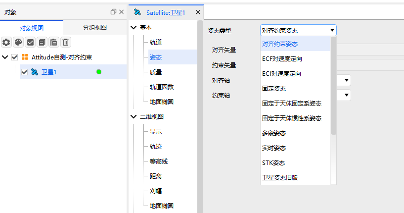
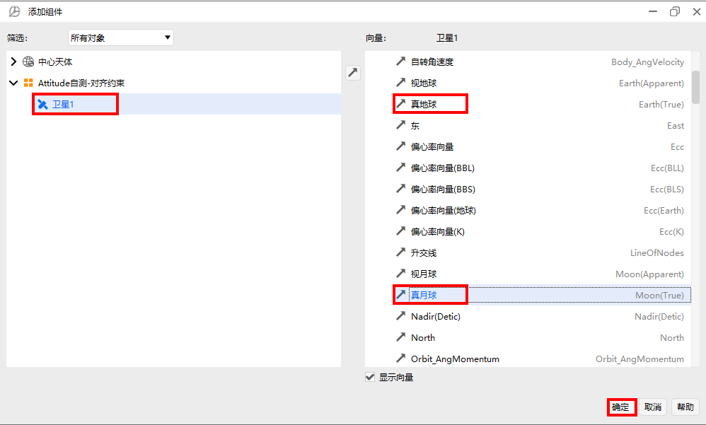
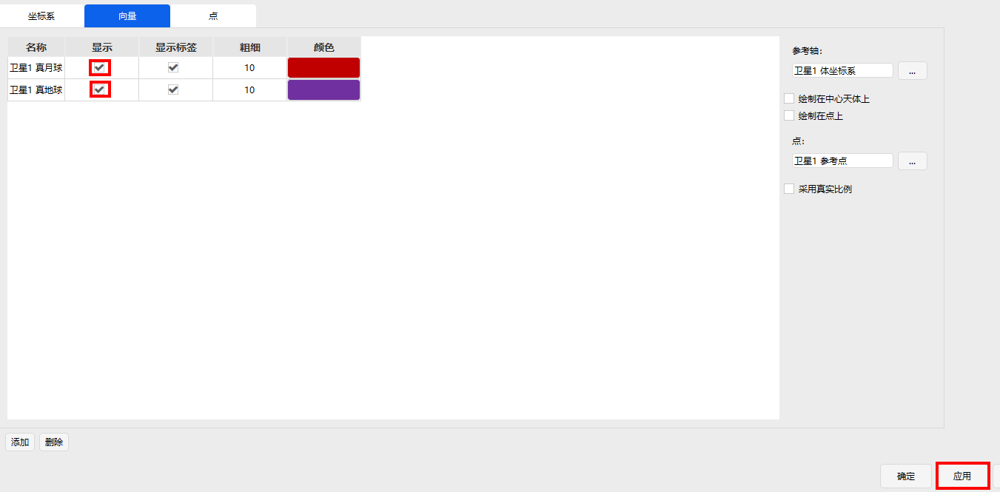

# Aligned Constrained Attitude

## Definition

Attitude under alignment and constraint.

## Introduction

This defines an attitude control method of "primary axis alignment + secondary axis constraint". It allows the user to specify a body axis to align with a target vector (e.g., align to the True Moon vector), and specify a second body axis to be constrained (e.g., keep aligned as closely as possible to the True Earth vector). ATK automatically computes the third axis to ensure a consistent right‑handed coordinate system.

## Tutorial

### Selecting the Attitude Operation

Open the satellite's **Properties**, select **Attitude**, and choose **Aligned Constrained Attitude** as the attitude type.

### Configuring Parameters

1. **Aligned Vector**: The axis to which the attitude is aligned.
2. **Constrained Vector**: The axis to which the attitude is constrained.
3. **Aligned Axis**: Select X, Y, Z, -X, -Y, or -Z as the alignment axis.
4. **Constrained Axis**: Select X, Y, Z, -X, -Y, or -Z as the constraint axis.

Using Satellite 1's Y‑axis aligned to the True Moon and Z‑axis constrained to the True Earth as an example, configure the parameters as shown below:

## Attitude Report

1. **Open Data Report**

Right-click **Satellite1**, select **Report**, and choose **Satellite1**.

2. **Create a New Report**

Click **New**, select the newly created **New Style1**, and click **Properties** to configure it.

3. **Configure Properties**

Locate **Attitude Quaternions in Select Axes**, select qs, qx, qy, qz, and click the right arrow **→**.

4. **Generate the Report**

Select the configured data report style **New Style1** and click **Generate**.

5. **Select the Reference Frame**

Using Earth Central Body Inertial as an example, select **Earth** as the central body, choose **Central Body Inertial Axes**, and click **OK**.

6. **Display the Report**

The attitude report is generated.

## Visualization

1. **Add a Coordinate System**

Click **Satellite1**, select **Vector**, click **Add** to add a coordinate system for Satellite1.

2. **Select the Coordinate System**

In the added component, select **Satellite1** as the object, choose **Body Axes**, and click **OK**.

3. **Coordinate System Configuration**

Check **Show** and click **Apply**.

4. **Add Vectors**

Select **Vector**, click **Add**.

5. **Select Vectors**

Select **Satellite1**, click **True Earth** and **True Moon** respectively, and click **OK** to add them.

6. **Vector Configuration**

Check **Show** and click **Apply** or **OK**.

7. **3D Visualization**

In the main menu, click **3D View**, select **View From/To**, choose the **Satellite1** viewpoint, and click **▶** to play the animation. The satellite's Y‑axis will point to the True Moon, and the constrained vector (True Earth) will lie within the aligned‑constrained plane (YZ plane).

