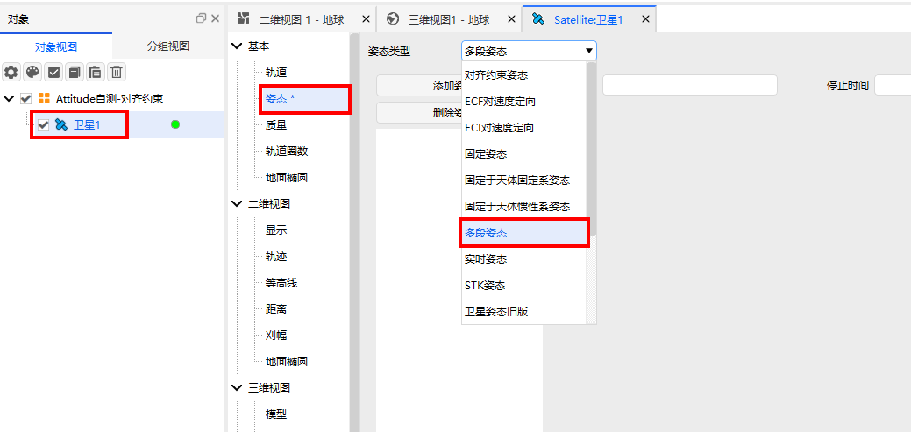
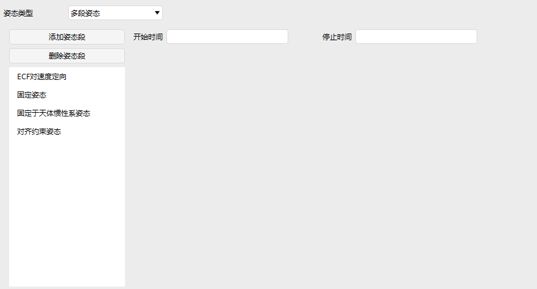

# 多分段姿态

## 定义
组合多段姿态

## 介绍
由多个姿态段组成，每一段可以使用不同的姿态类型。

## 使用方法

###  选择姿态操作

点击卫星【属性】，选择【姿态】，选择姿态类型为【多段姿态】

### 配置参数

1. 添加姿态段：添加不同类型的姿态段

2. 删除姿态段：选中添加的姿态段，点击后删除

3. 开始时间：该姿态段开始的时间

4. 停止时间：该姿态段结束的时间

