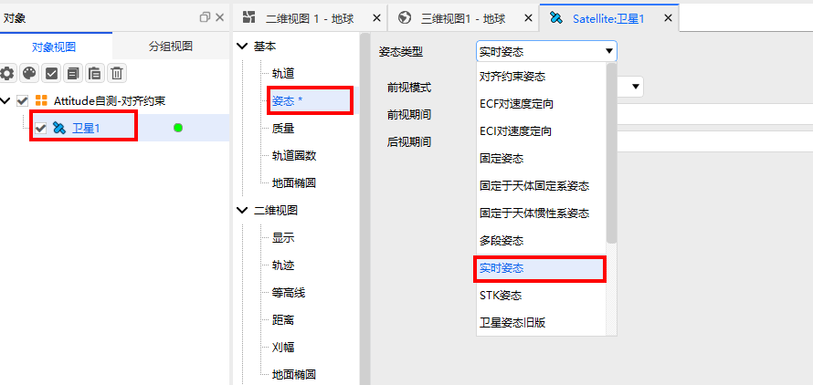
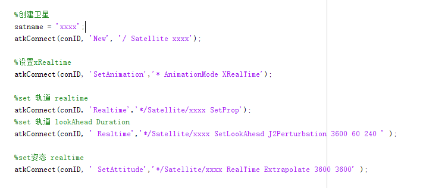
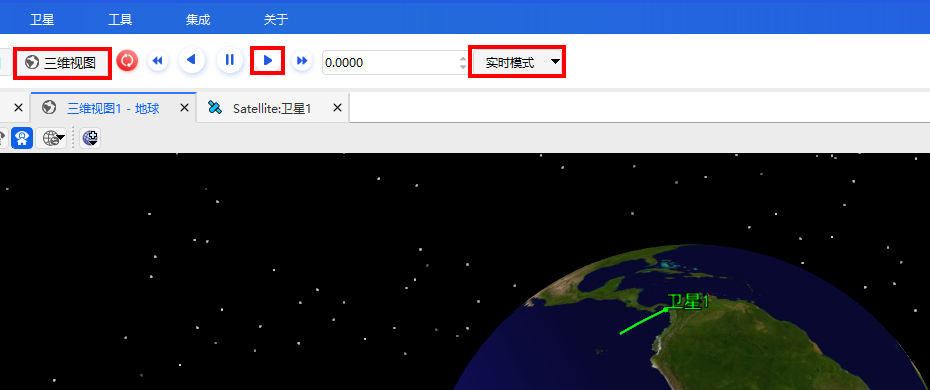

# Real Time Attitude

## Definition

Real Time Attitude Propagator.

## Introduction

Receives real-time data via Connect commands and propagates based on the real-time data.

## Usage

### Selecting the Attitude Operation

Open the satellite's **Properties**, select **Attitude**, and choose **Real Time Attitude** as the attitude type.

### Configuring Parameters

1. **LookAheadMethod**: Specifies the prediction method (linear, extrapolation, etc.).
2. **LookAheadDuration**: Allows prediction of future attitude from the current time.
3. **LookBehindDuration**: Allows smoothing of attitude using past data.

### Connect Commands

Use Connect commands to configure parameters and write real-time data.

### Visualization

Select **RealTime Mode**, click **▶**, and then click **3D View**. This sets the scenario time to the current actual time and plays the animation.

