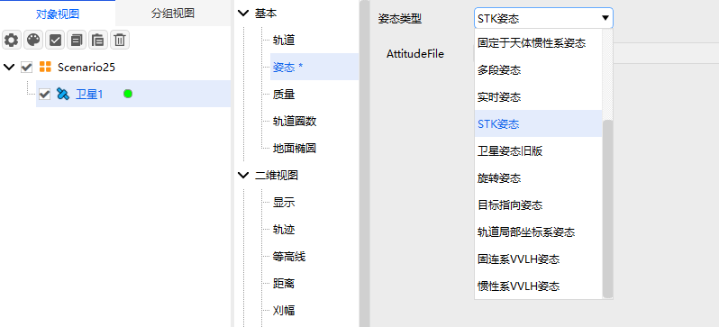

# STK Attitude

## Definition

Reads time-series attitude data from an STK attitude file.

## Introduction

The attitude is provided by an external `.a` file, which records time, quaternions, and other data. The attitude is computed by interpolating over time.

## Tutorial

### Selecting the Attitude Operation

Open the satellite's **Properties**, select **Attitude**, and choose the **Attitude Type**.

### Configuring Parameters

**AttitudeFile**: Click **...** to open the folder and select an STK file.