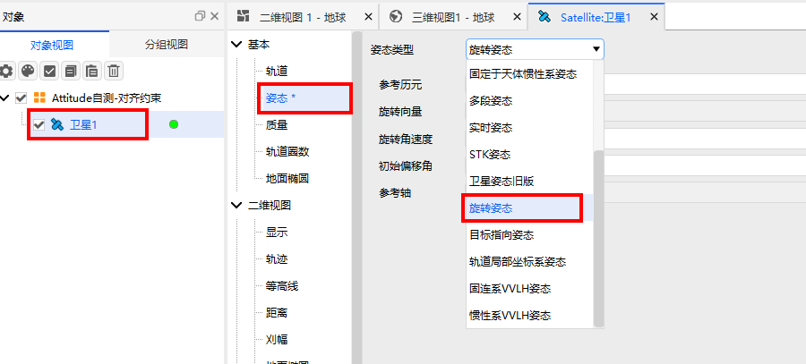

# Spinning Attitude

## Definition

Attitude after rotation.

## Introduction

Defines the attitude after rotation about a specified axis.

## Usage

### Selecting the Attitude Operation

Open the satellite's **Properties**, select **Attitude**, and choose **Spinning Attitude** as the attitude type.

### Configuring Parameters

1. **Rotation Epoch**: The reference time at which rotation begins.
2. **SpinVector**: Specifies the direction of the rotation axis.
3. **RotationRate**: The angular velocity of the object about the rotation axis.
4. **RotationOffset**: The initial offset angle of the object about the rotation axis.

