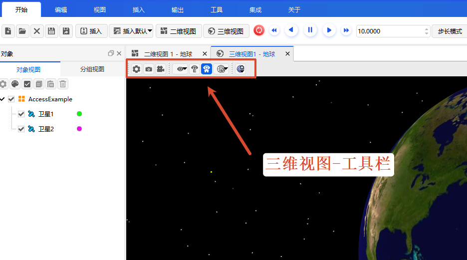

# Toolbar Position

> [!NOTE]
> All 3D toolbar functions apply only to the current 3D view window and do not affect the state configuration of other views or the scenario.

The 3D map view provides an immersive celestial simulation and space scene display. The toolbar is located at the top of the window, offering core functions such as view control, scene recording, viewpoint management, and terrain configuration.

