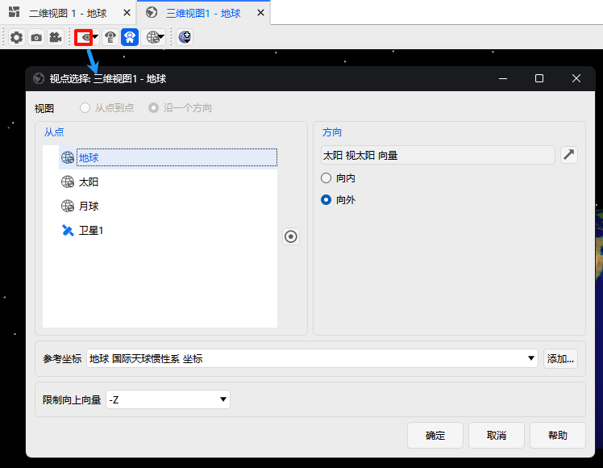
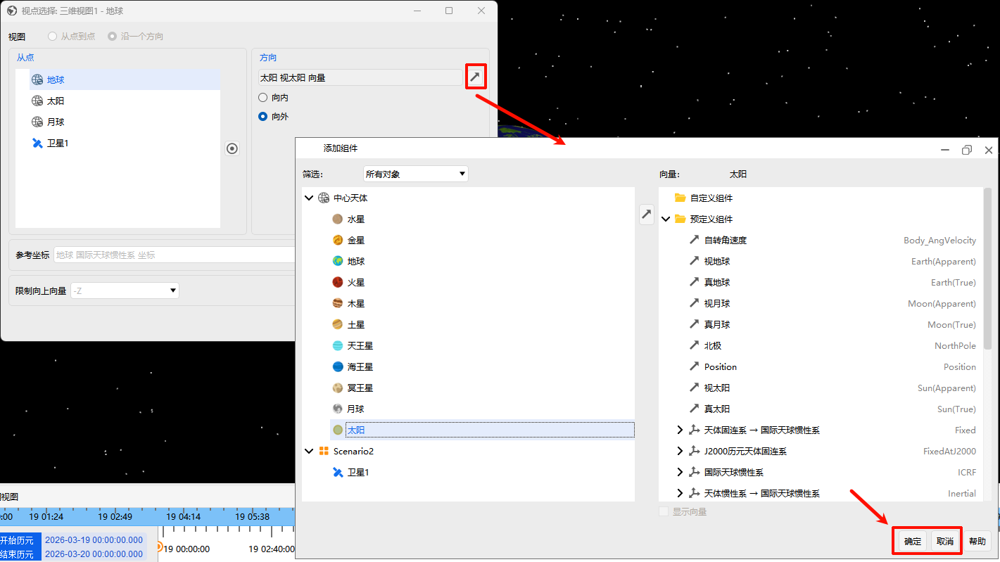
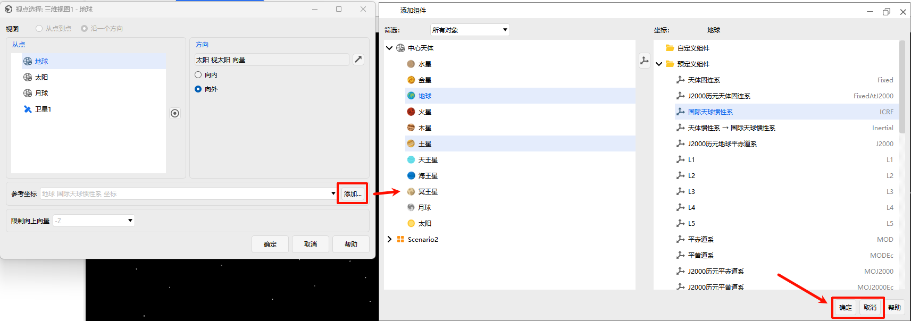

# View Along a Direction

## Overview

The **View Along a Direction** function allows you to precisely position the viewpoint (camera) in the 3D view at a specific direction from a reference point. By specifying the reference object, direction vector, and related parameters, you can quickly set the view to the desired position, for example, viewing the star field from Earth's center outward, or observing Earth from a satellite along the orbital normal.

## Procedure

- In the 3D view window, click the **Local View**  button in the toolbar to open the **View Selection Window** for configuration.

- In the view selection window, select "Along a Direction" to enter the **View Along a Direction** settings area, which contains the following configurable items:

## Configuration Details

### From Point (Reference Point)

- **Definition**: Select the celestial body or object to serve as the position reference. The final viewpoint position will be obtained by moving a distance from the object's center along the specified direction.
- **Available Objects**:
  - **Built-in celestial bodies**: Earth, Sun, Moon, etc., can be selected directly.
  - **Vehicle objects**: All satellites, aircraft, and other objects in the current scenario.
- **Purpose**: This defines the "start point." For example, selecting Earth as the from point means the viewpoint will be calculated from Earth's center.

### Direction

- **Vector Selection**: You need to specify a direction vector to define the offset direction of the viewpoint relative to the **From Point**. Click the  button next to the input box to open the **Add Component** window and select a vector.

  

- **Outward / Inward**:
  - **Outward**: The viewpoint moves away from the reference point along the vector direction. Use this to look outward from the reference point (e.g., from Earth toward deep space).
  - **Inward**: The viewpoint moves toward the reference point along the opposite vector direction. Use this to look toward the reference point (e.g., from space toward Earth).

### Reference Frame

- **Definition**: Specifies the coordinate system in which the direction vector is defined. The same vector may point to completely different spatial directions in different coordinate systems. For example, if you want to look along the X-axis from Earth's center, the X-axis points differently: in the Earth-fixed frame, it points toward the Greenwich meridian and equator intersection; in the Earth inertial frame, it points toward the vernal equinox. Without the correct coordinate system, the final viewpoint position may be entirely wrong.

- **Default Behavior**: When you select a "From Point," the system automatically switches the reference frame to that object's default coordinate system, e.g.:
  - Earth selected → default coordinate systems available are "Earth Central Body Inertial Axes" and "Earth Central Body Fixed Axes."
  - Satellite1 selected → default coordinate system is "Satellite1 ICR Axes."

- **Custom Coordinate System**: If the default coordinate system does not meet your needs, click the **Add** button to select other coordinate systems from the list (e.g., ICRF, Central Body Inertial Axes, etc.).

### Constrained "Up" Vector

- **Definition**: Locks the camera's "up" direction to prevent the view from tilting or flipping during movement. You can select one of six directions as the fixed world up vector: **+X, -X, +Y, -Y, +Z, -Z**.
- **Purpose**:
  - Maintains a stable view, avoiding disorientation or dizziness caused by viewpoint rotation.
  - Ensures you always observe the scene with a fixed "up" direction (e.g., keeping Earth's north pole always pointing upward).