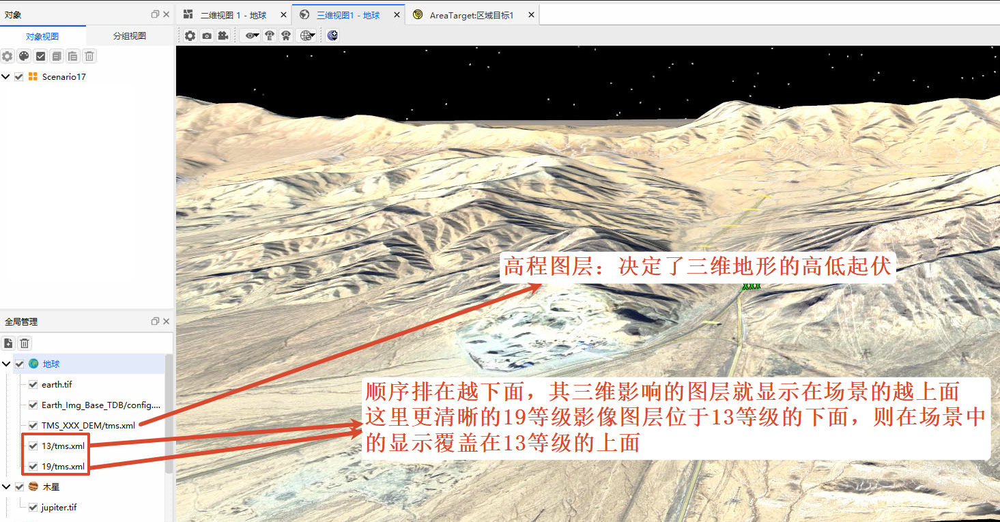

# Layer Core Concepts

## Layer Types

| Type | Purpose | Example Effect |
| :--- | :------ | :------------- |
| Imagery Layer | Covers the celestial body surface with actual imagery textures, controlling the visual appearance. | After loading Earth satellite imagery, it displays the true colors and outlines of continents and oceans. |
| Elevation Layer | Defines terrain elevation variations, controlling the 3D stereoscopic effect. | After loading lunar elevation data, it presents realistic terrain features such as craters and maria. |

## Layer Priority Rules

### Core Rule

In the [Globe Manager] list, **layers arranged lower in the list have higher display priority in the 3D scene**. Layers rendered later will cover the overlapping areas of previously rendered layers. Both imagery and elevation layers follow this priority rule: when multiple elevation layers are overlaid, the terrain relief of the lower elevation layer will override that of the upper layer.

### Rule Interpretation

The software traverses and renders the layer list from top to bottom. Layers positioned lower in the list are drawn after those above them, so they overlay or cover the upper layers.

As shown below, the Level 19 high‑resolution imagery layer is below the Level 13 layer and will overlay it in the 3D scene.

### Application Recommendations

- **Place base data at the top**: Low‑resolution base maps and global elevation data should be placed higher in the list to ensure fast scene loading and global display.
- **Place detailed data at the bottom**: High‑resolution local imagery and fine elevation data should be placed lower in the list, overlaid on top of the base layers to achieve detail enhancement while avoiding being obscured by base layers.