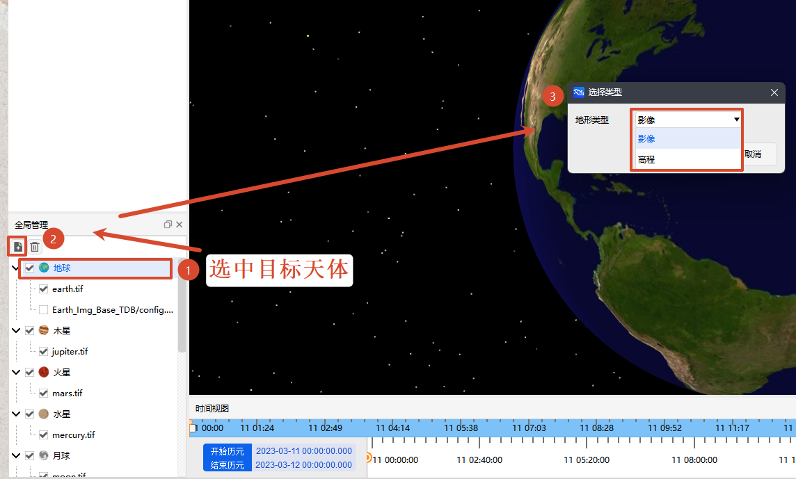

# Adding a Layer

## Preparation

Ensure that the terrain data for the target celestial body is ready. The following formats are supported:

- `.tif`: Single-file TIFF format imagery/elevation data
- `.xml`: TMS tile service configuration file
- `.tdb`: TDB format tile database file

## Procedure

1. In the [Globe Manager] interface, select the target celestial body (e.g., "Earth").

2. Click the <kbd>Add</kbd> button in the upper-left corner of the interface to open the [Select Type] dialog.

3. In the dialog, select the layer type:
   - To add imagery texture → select <kbd>Imagery</kbd>
   - To add terrain elevation → select <kbd>Elevation</kbd>

   | Type | Purpose | Example Effect |
   | :--- | :------ | :------------- |
   | Imagery | Covers the celestial body surface with actual imagery textures, controlling the visual appearance. | After loading Earth satellite imagery, it displays the true colors and outlines of continents and oceans. |
   | Elevation | Defines terrain elevation variations, controlling the 3D stereoscopic effect. | After loading lunar elevation data, it presents realistic terrain features such as craters and maria. |

4. In the [File Selection] dialog, select the terrain data file in the corresponding format.

5. After confirmation, the layer will be automatically added to the target body's layer list and take effect in the 3D scene.

   