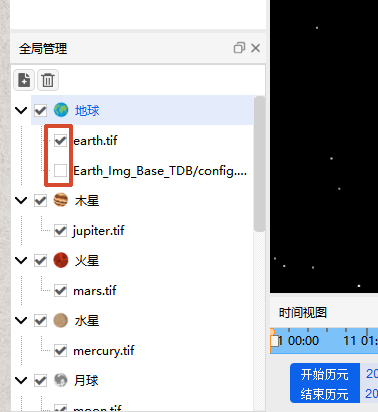

# Layer Visibility

You can quickly control the display state of a layer by checking or unchecking the checkbox next to it in the layer list:

- ✅ Layer checked: The imagery/elevation effect of that layer will take effect and be displayed in the scene.
- ☐ Layer unchecked: The effect of that layer will be hidden.
  - Unchecking an **Elevation Layer**: The corresponding terrain will switch from realistic relief to a flat surface.
  - Unchecking an **Imagery Layer**: The corresponding area will revert to the celestial body's default texture.

