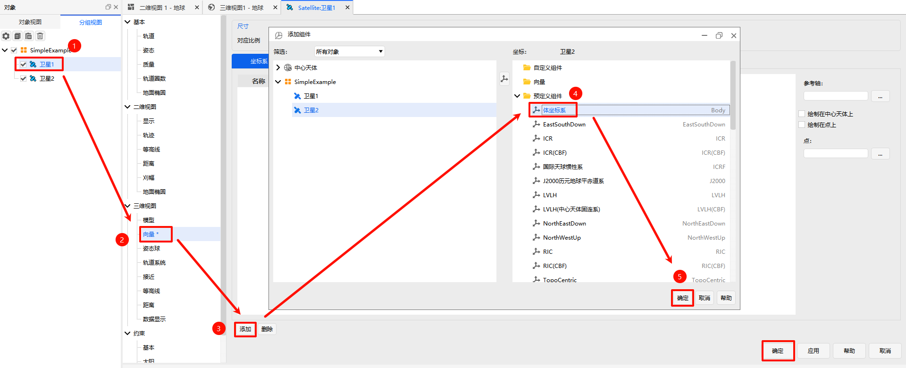

# Coordinate System Vectors

## Overview

- Controls the display of vectors and geometric elements (such as coordinate axes and angles) related to central bodies like Earth in the 3D graphics window.
- Controls the display of vectors and geometric elements related to the selected object (e.g., a satellite).

## Usage

1. **Open Object Properties**
   Select the target object (for example, "Satellite 1") and open its property settings via either of the following methods:
   - Right-click the object and select "Properties" from the context menu.
   - Double-click the object.
2. **Navigate to Vector Settings**
   In the left navigation tree of the property settings page, expand **3D Graphics** > **Vector** to enter the vector display settings interface.
3. **Add a Vector Component**
   Click the **Add** button to open the "Add Component" window.
4. **Select a Predefined Component**
   In the "Predefined Components" list, select **Body Axes**.
5. **Confirm Creation**
   Click **OK** to complete the addition of the body axes vector.

6. **Configure Display Properties**
   After adding, the following configurations can be made in the vector list:
   - **Show/Hide Vector**: Check or uncheck the "Show" column checkbox to control the visibility of the vector in the view.
   - **Show/Hide Text Label**: Check or uncheck the "Show Label" column checkbox to control the display of axis labels.
   - **Adjust Thickness**: Double-click the value in the "Thickness" column and enter the line width in pixels for the coordinate axes.
   - **Adjust Color**: Click the color swatch in the "Color" column and customize the coordinate axis color in the color picker that appears.

7. **Apply and Finalize**

   Once all configurations are complete, click **OK** to apply the settings and close the window. If you need to continue editing other properties, click **Apply** to save the current settings without closing the window. You can return to this interface at any time to modify the added vector configurations.

