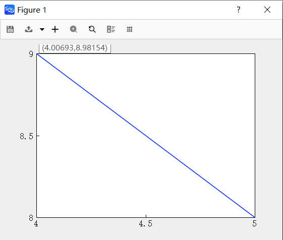
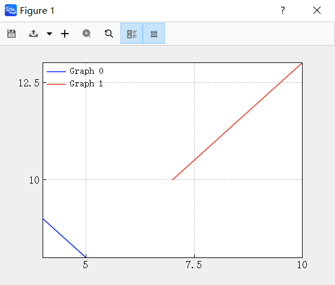

# 客户端绘图

## 功能介绍

- 实现客户端-绘图工具栏，导出、移动、放大、恢复、网格、数据游标、图列等功能

## 使用方法

点击与“ATK.exe”同一路径下的“ATKConsole.exe”，弹出客户端绘图命令窗口：

输入命令：

```atks
 plot([4,5],[9,8])
 ```

此命令会创建横轴范围为4-5,纵轴范围为8-9的二维图形窗口，并直线连接点(4,9)与点(5,8)



输入命令：

```atks
 hold ("on")
 ```

此命令会让后续的绘图命令在前一个绘图的基础上继续执行



输入命令：

```atks
 plot([7,8,9,10],[10,11,12,13])
 ```

此命令会创建横轴范围为7-10,纵轴范围为10-13的二维图形窗口，并直线连接点(7,10)与点(10,13)

## 窗口介绍


| 功能按钮       | 功能说明                                       |
| ------------- | ----------------------------------------------- |
| 保存           | 可保存生成窗口                                 |
| 输出           | 可输出.csv文件，支持以行/以列为基础导出        |
| Move           | 选中后可用鼠标拖动窗口图形                     |
| Zoom in        | 可放大图形                                     |
| Reset          | 恢复图形窗口原始格式                           |
| Show Legend    | 显示图例                                       |
| Show Grid      | 显示网格线                                     |
