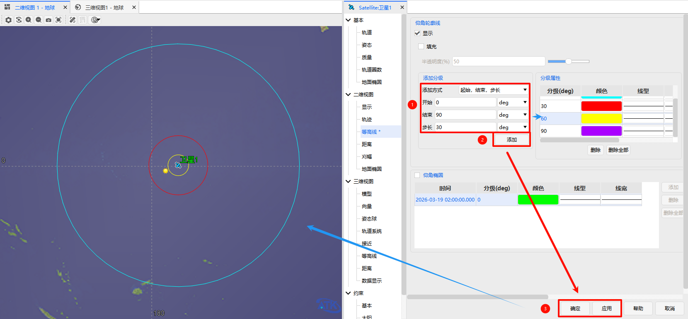
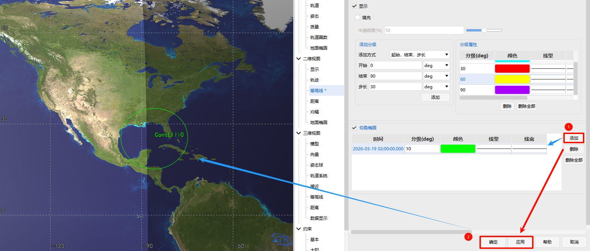

# 等高线

## 功能概述

等高线功能用于在二维和三维视图中，直观展示飞行器（如卫星、飞机等）相对地面的**仰角覆盖范围**。

- **仰角轮廓线**：将地面上能够以**相同仰角值**观测到飞行器的所有点连接起来，形成的闭合曲线。例如，卫星仰角为30°的轮廓线，就是地面上所有能看到该卫星且仰角恰好为30°的位置点所连成的线。
- **仰角椭圆**：由于地球近似球体，且飞行器信号波束通常呈圆锥形，其与地球表面的交线在平面地图上往往呈现为椭圆形。本功能支持设置特定时刻的仰角椭圆，用于精确分析信号覆盖区域。

## 使用方法

### 1. 打开等高线设置界面

#### 打开对象属性

在场景中选中目标对象（如“卫星1”），通过以下任一方式进入其属性设置：

- 右键单击对象，选择 **“属性”**。
- 直接左键双击对象。

#### 进入等高线设置界面

在属性窗口左侧的导航树中，依次展开 **二维视图** > **等高线** 即可进入设置界面。

界面主要包含两个配置区域：**仰角轮廓线** 和 **仰角椭圆**。

### 2. 设置仰角轮廓线

#### 启用显示

- 勾选 **“显示”** 复选框，轮廓线即可在视图中呈现。

#### 添加分级

系统提供两种添加仰角分级的方式：

- **批量添加（按起始/结束/步长）**
  输入起始值、结束值和步长后，点击 **“添加”**，系统将自动生成一系列等间隔的分级（如 10°、20°、30°……）。
- **单点添加（指定值）**
  直接输入具体的角度值，点击 **“添加”**，即可添加单个分级。

#### 配置分级样式

添加完成后，所有分级会显示在列表中。您可以对每个分级进行个性化设置：

- **修改角度值**：双击列表中的数值进行编辑。
- **设置颜色**：单击颜色块，从调色板中选择颜色。
- **调整线型与线宽**：通过下拉菜单选择线型（如实线、虚线），输入数值调整线宽（单位：像素）。
- **控制标签显示**：勾选或取消 **“显示标签”**，控制分级标签的可见性。

#### 填充区域

如需填充轮廓线内部的区域，勾选 **“填充”** 复选框即可。

### 3. 设置仰角椭圆

#### 启用功能

勾选 **“仰角椭圆”** 前的复选框，激活该功能。

#### 管理仰角椭圆

- **添加**：点击 **“添加”**，在列表中新增一行。双击可编辑该椭圆对应的**时间**和**分级角度**；单击可修改其颜色、线型、线宽。
- **删除**：选中列表中的某一行，点击 **“删除”** 可移除该椭圆；点击 **“删除全部”** 可移除所有椭圆。

### 4. 保存与应用

- 点击 **“确定”**：保存当前所有设置并关闭属性窗口。
- 点击 **“应用”**：使设置生效，但不关闭窗口，便于继续调整其他参数。