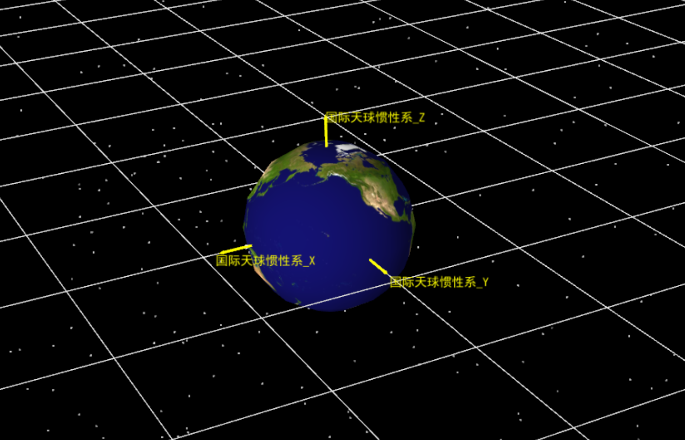
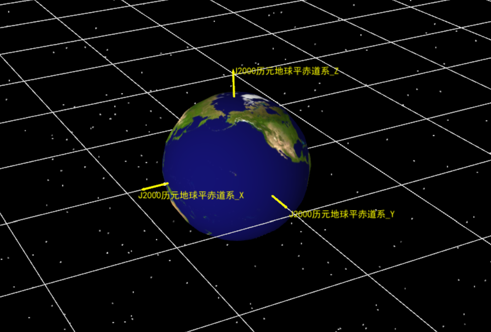
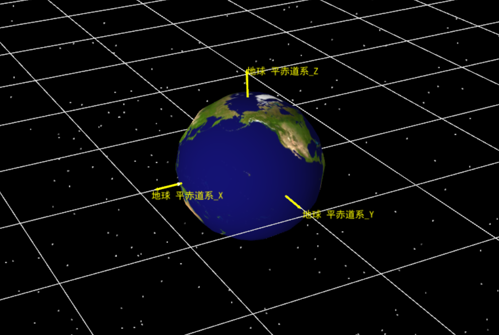
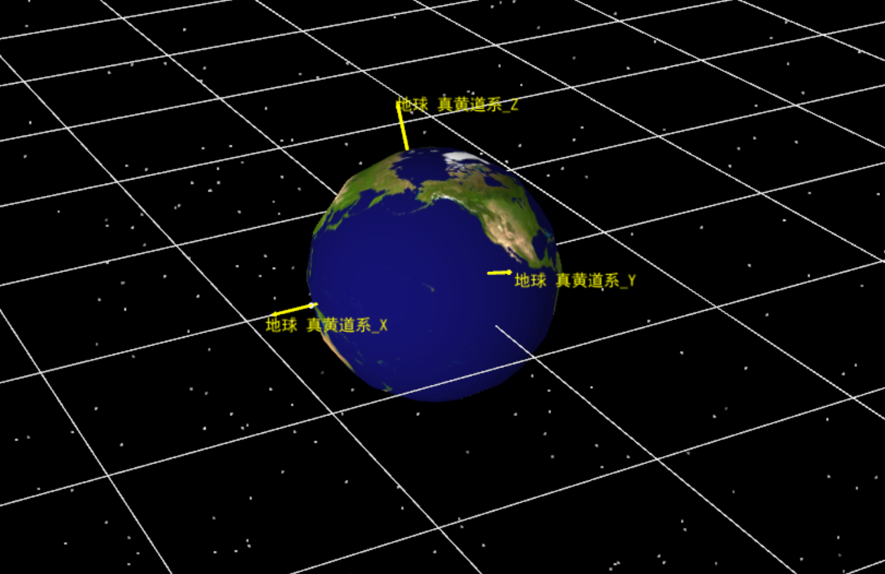
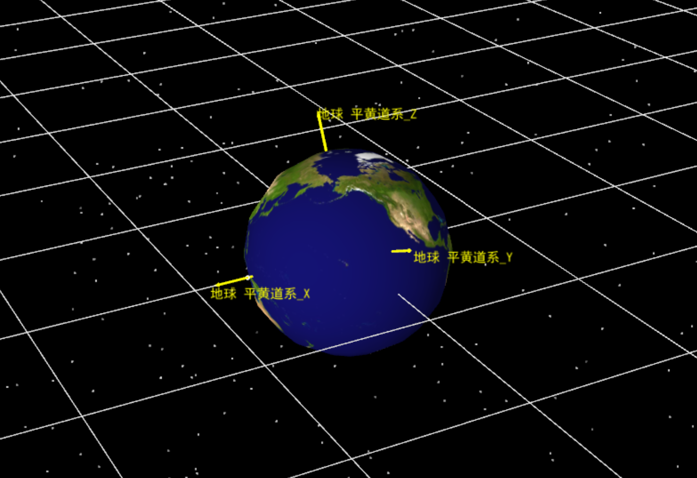

# Central Body Reference Coordinate Systems

This chapter covers the commonly used reference coordinate systems defined with respect to central bodies in ATK. These systems are used to describe the attitude of celestial bodies in inertial space, fixed positions on their surfaces, and time-dependent reference frames.

## Inertial / Celestial Reference Frames

These frames do not rotate (or rotate extremely slowly) with the central body's rotation, and are used to describe orbital motion.

### ICRF (International Celestial Reference Frame)

- **Full Name**: International Celestial Reference Frame.
- **Definition**: The axes of the ICRF are defined based on the Barycentric Celestial Reference Frame (BCRF) in the framework of general relativity at the Solar System Barycenter (SSB). The IAU (International Astronomical Union) is the authoritative body for its definition. The ICRF is the closest realization to an ideal inertial frame constructed to date.
- **Relationship to J2000**: The ICRF and the J2000 frame are very close but not identical. The J2000 frame rotates very slowly with respect to the ICRF over time.
- **Applicable Objects**: All central bodies.

### J2000 (J2000.0 Geocentric Inertial Frame)

- **Full Name**: Mean Equator and Mean Equinox of J2000.0 epoch.
- **Definition**: This frame corresponds to the mean equator and mean equinox at the J2000.0 epoch (JD 2451545.0 TDB, i.e., 2000 January 1 12:00:00.000 TDB). Before the development of the ICRF, it was considered the best realized inertial frame.
- **Applicable Objects**: All central bodies.

### Body Inertial Frame

Each central body (except Earth and the Sun) defines its own dedicated inertial frame.

## Body-Fixed Frames

These frames are rigidly attached to the central body and rotate with it, used to describe surface features and relative positions.

### Body-Fixed Frame (Central Body Fixed)

- **Definition**: A coordinate system used to express topographic features of the central body. For gas giants, the `Body-Fixed` frame identifies its magnetic field.
- **Applicable Objects**: All central bodies.

## Epoch and Date-Dependent Frames

These frames are associated with specific points in time or time-varying epochs.

### True Equator Frame (TrueOfDate)

- **Definition**: The Z-axis is aligned with the Z-axis of the `Body-Fixed` frame, and the X-axis is aligned with the vector computed as `ICRF Z-axis × Body-Fixed Z-axis` at the current time.
- **Special Definition for Earth**: It represents the "true equator, true equinox". The Z-axis is Earth's rotation axis (ignoring polar motion), and the X-axis points to the true equinox. Nutation values are used in the transformation.
- **Applicable Objects**: All central bodies.

### Mean Equator Frame (MeanOfDate)

- **Definition**: Computed similarly to `TrueOfDate`, but **periodic terms in the Fourier series are ignored** when computing the Z-axis of the `Body-Fixed` frame.
- **Special Definition for Earth**: It represents the "mean equator, mean equinox". The Z-axis is Earth's mean rotation axis, and the X-axis points to the mean equinox. The transformation uses polynomial coefficients from the 1976 IAU precession theory.
- **Applicable Objects**: All central bodies.

### True Equator Mean Equinox Frame (TEMEOfDate)

- **Full Name**: True Equator Mean Equinox of Date/Epoch (TEMEOfDate).
- **Definition**: This frame is an intermediate coordinate system in the transformation from Earth's `MeanOfDate` to `TrueOfDate`. Its **Z-axis is aligned with the Z-axis of TrueOfDate**, while its X-axis is close to (but not exactly) the X-axis of MeanOfDate.
- **Applicable Objects**: Earth only.

### Epoch-Based Frames

Epoch-based frames are reference frames that are aligned with the corresponding time-varying frame at a specified epoch and then "frozen", facilitating precision analysis or historical comparison in inertial space.

1. **Common Characteristics**

   - Epoch dependence: a specific epoch $t$ must be specified upon creation
   - Time-invariance: the axes remain fixed in inertial space
   - Instantaneous alignment: exactly coincides with the corresponding time-varying frame at the specified epoch
   - Right-handed orthogonal: maintains right-handed orthogonal properties

2. **AlignmentAtEpoch**

   - **Definition**: A constant rotation of the ICRF axes, aligned with the central body's Fixed frame at the specified epoch
   - **Mathematical Expression**:

     $$
     F_{AE}(t) = F_{Fixed}(t_0), \quad \forall t
     $$

   - **Applications**: Surface orientation maintenance, surveying, long-term maintenance of ground-based reference directions

3. **MeanOfEpoch**

   - **Definition**: Mean equator and mean equinox frame at the specified epoch
   - **Non-Earth**: The MeanOfDate frame computed at the specified epoch, no rotation relative to the Inertial frame
   - **Earth**: The Earth MeanOfDate frame computed at the specified epoch, no rotation relative to J2000
   - **Applications**: Mean equator orbit analysis, ephemeris generation, nutation removal

4. **TrueOfEpoch**

   - **Definition**: True equator and true equinox frame at the specified epoch
   - **Non-Earth/Non-Moon**: The TrueOfDate frame computed at the specified epoch, no rotation relative to ICRF
   - **Earth**: The TrueOfDate frame computed at the specified epoch
   - **Moon**: The TrueOfDate frame computed at the specified epoch
   - **Applications**: True equator analysis, epoch-frozen orbit pointing, historical data comparison

5. **TEMEOfEpoch**

   - **Definition**: Earth's TEME frame at the specified epoch
   - **Applicable Objects**: Earth only
   - **Characteristics**: True Equator Mean Equinox, computed at the specified epoch, no rotation relative to J2000
   - **Applications**: TLE data processing, legacy near-Earth orbit algorithms, compatibility with older TEME systems

## Other Central Body Coordinate Systems

Ecliptic frames are defined with respect to the ecliptic plane and are widely used for interplanetary missions and solar-system-scale analysis.

- Mean Ecliptic: Nutation ignored
- True Ecliptic: Nutation included
- Obliquity of the ecliptic:

$$
\varepsilon_{true} = \varepsilon_{mean} + \Delta\varepsilon
$$

$\Delta\varepsilon$ is the nutation in obliquity.

### True Ecliptic Frame (TrueEclpDate)

- **Definition**: The true ecliptic frame computed at each given time. The true ecliptic plane is defined by rotating the J2000 XY plane about its X-axis by the true obliquity of the ecliptic (according to the FK5 IAU76 theory).
- **Applicable Objects**: Sun system only.

### Mean Ecliptic Frame (MeanEclpDate)

- **Definition**: The mean ecliptic frame computed at each given time. The mean ecliptic plane is defined by rotating the J2000 XY plane about its X-axis by the mean obliquity of the ecliptic (according to the FK5 IAU76 theory).
- **Applicable Objects**: Sun system only.

- **TrueEclpJ2000**: True ecliptic at J2000 epoch
- **TrueEclpDate**: True ecliptic at current time, Sun system only

### J2000 Mean Ecliptic Frame (MeanEclpJ2000)

- **Definition**: The mean ecliptic frame at the J2000 epoch. The mean ecliptic plane is defined by rotating the J2000 XY plane about its X-axis by the mean obliquity of the ecliptic (according to the FK5 IAU76 theory).
- **Applicable Objects**: Sun system only.
- **MeanEclpJ2000**: Mean ecliptic at J2000 epoch
- **MeanEclpDate**: Mean ecliptic at current time
- **J2000_Ecliptic**: Mean ecliptic at J2000 epoch, equivalent to MeanEclpJ2000

|            Frame             |   Alignment/Reference   |  Rotation Property  |        Primary Application         |
|:----------------------------:|:-----------------------:|:-------------------:|:----------------------------------:|
|            ICRF              |        None (inertial)   |     inertial        | General inertial reference         |
|            J2000             |          ICRF           |   slow rotation     | Central body inertial analysis     |
|            Fixed             |        body-fixed       | rotates with body   | Surface, magnetic field analysis   |
|         TrueOfDate           |      Fixed → ICRF       |     time-varying    | True equator analysis              |
|         MeanOfDate           |      Fixed → ICRF       |     time-varying    | Mean equator analysis              |
|      AlignmentAtEpoch        |         Fixed           |   epoch-frozen      | Epoch orientation maintenance      |
|         MeanOfEpoch          |      MeanOfDate         |   epoch-frozen      | Mean equator analysis              |
|         TrueOfEpoch          |      TrueOfDate         |   epoch-frozen      | True equator analysis              |
|         TEMEOfEpoch          |      TEMEOfDate         |   epoch-frozen      | TLE data compatibility             |
| MeanEclpJ2000 / J2000_Ecliptic|         J2000           |      mean ecliptic  | Interplanetary orbit design        |
|        TrueEclpJ2000         |         J2000           |      true ecliptic  | Precision orbit analysis           |
|        MeanEclpDate          |        current          |      mean ecliptic  | Long-term orbital evolution        |
|        TrueEclpDate          |        current          |      true ecliptic  | Precision pointing, Sun system only|