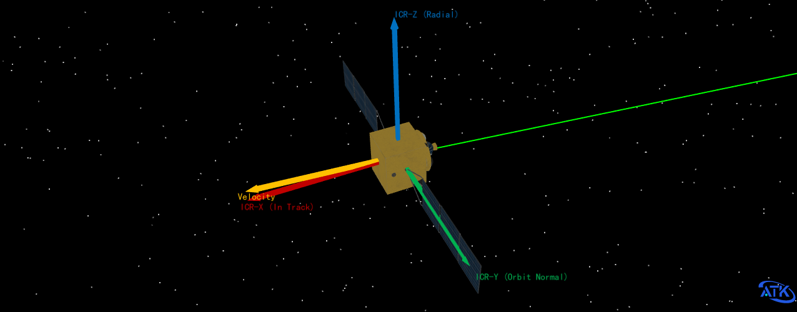
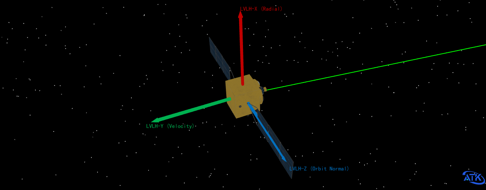
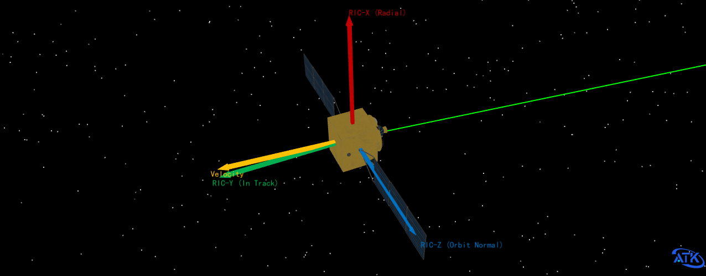
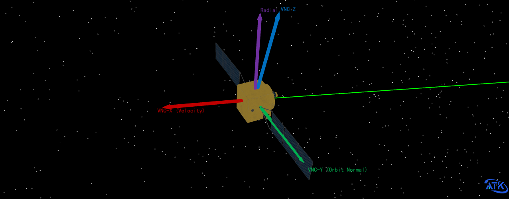
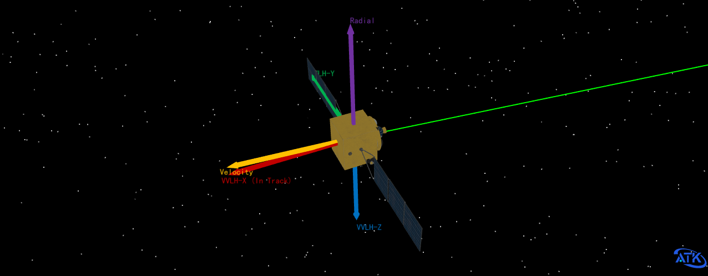

# Trajectory-Based Reference Frames

This chapter describes the trajectory-based reference frames in ATK that are defined based on the orbital motion state of a single object (spacecraft). The axis orientations of these frames depend on the object's position and velocity vectors and vary in real time with its orbital motion. Their origin is by default at the object's center of mass.

## ICR Frame

- **Full Name**: In-track / Cross-track / Radial
- **Axis Definition**: Z-axis is along the position vector, pointing outward; Y-axis is along the orbital normal; X-axis is defined by the cross product of Y and Z, pointing in the flight direction within the orbital plane.
- **Mathematical Expression**: Let the spacecraft's position vector in the inertial frame be $\vec{r}$ and the velocity vector be $\vec{v}$:
  - $Z: \frac{\vec{r}}{|\vec{r}|}$ (radial)
  - $Y: \frac{\vec{r} \times \vec{v}}{|\vec{r} \times \vec{v}|}$ (orbital normal)
  - $X: Y \times Z$ (in-track, flight direction within the orbital plane)

## LVLH Frame

- **Full Name**: Local-Vertical Local-Horizontal
- **Axis Definition**: X-axis is along the position vector, pointing outward (zenith); Y-axis points in the direction of the inertial velocity vector; Z-axis is defined by the cross product of X and Y, always along the orbital normal.
- **Mathematical Expression**:
  - $X: \frac{\vec{r}}{|\vec{r}|}$ (radial)
  - $Y$: Points in the direction of the inertial velocity vector.
  - $Z: X \times Y$ (orbital normal)

## RIC Frame

- **Full Name**: Radial / In-track / Cross-track
- **Axis Definition**: X-axis is along the position vector; Y-axis points in the direction of the inertial velocity vector; Z-axis is defined by the cross product of X and Y, along the orbital normal.
- **Mathematical Expression**: Its mathematical expression is similar to LVLH, belonging to the same set of basis vector definitions.
  - $X: \frac{\vec{r}}{|\vec{r}|}$
  - $Y$: Points in the direction of the inertial velocity vector.
  - $Z: X \times Y$ (orbital normal)

## VNC Frame

- **Full Name**: Velocity / Normal / Co-Normal
- **Axis Definition**: X-axis is along the inertial velocity vector; Z-axis points in the direction of the position vector; Y-axis is defined by the cross product of Z and X.

## VVLH Frame

- **Full Name**: Vehicle Velocity Local Horizontal
- **Axis Definition**: Z-axis is opposite to the position vector (pointing toward the central body, i.e., "down"); X-axis points in the direction of the inertial velocity vector; Y-axis is defined by the cross product of Z and X.
- **Mathematical Expression**:
  - $Z: -\frac{\vec{r}}{|\vec{r}|}$ (pointing toward the central body)
  - $X$: Points in the direction of the velocity vector.
  - $Y: Z \times X$ (satisfies the right-hand rule)

