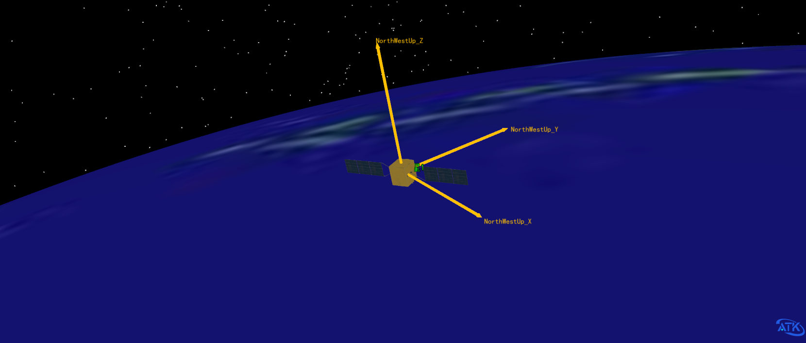
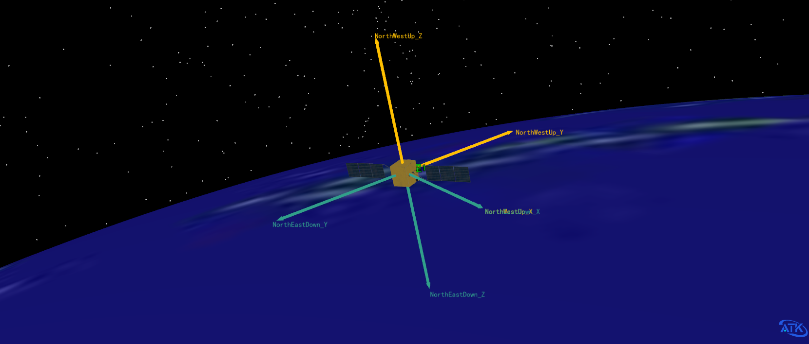
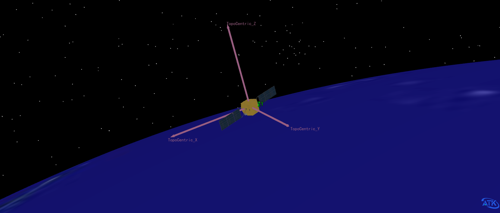
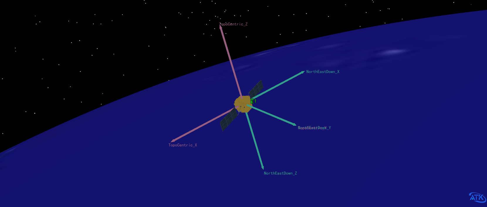

# Surface-Based Reference Frames

Surface-based reference frames are defined with their origin at a reference point on the surface of a central body (the Detic Subpoint) and establish local reference directions at that point. These frames are commonly used in ground station observations, lander attitude determination, spacecraft relative position analysis, and sensor coverage analysis.

## Basic Concepts

### Subpoint

The origin of a surface-based reference frame is typically chosen as the intersection of the spacecraft's position vector with the surface normal of the celestial body, i.e., the **Detic Subpoint**:

**Detic Subpoint**: A point on the body's surface whose surface normal passes through the spacecraft position.
**Note**: The tangent plane at this point defines the horizontal plane of the local frame, and the normal direction defines the zenith direction.

### Local Direction Definitions

Local basis vectors defined at the subpoint:

| Direction | Definition |
| :--- | :--- |
| **North** | Direction in the tangent plane pointing toward the body's North Pole |
| **East** | Direction in the tangent plane orthogonal to North, pointing eastward |
| **Zenith / Up** | Along the ellipsoid normal pointing outward |
| **Nadir / Down** | Opposite to the zenith direction, pointing toward the body's center |

North and East span the **tangent plane**, while Zenith/Nadir is perpendicular to it. The coordinate system follows the right-hand rule.

---

## NorthEastDown Frame (NED)

**North East Down Coordinate System**

### Axis Definition

| Axis | Direction |
| :--- | :--- |
| **X-axis** | North |
| **Y-axis** | East |
| **Z-axis** | Down (toward the body's center) |

### Geometric Interpretation

The three axes of the NorthEastDown frame are determined as follows:

1. **Z-axis**: The negative direction of the surface normal at the subpoint (Nadir)
2. **X-axis**: Points toward true north in the tangent plane
3. **Y-axis**: Points east in the tangent plane, forming a right-handed system with X and Z

### Application Scenarios

- Ground station antenna pointing calculations
- Aircraft navigation (NED is commonly used in aviation)
- Lander descent trajectory design
- Spacecraft surface-relative positioning

---

## NorthWestUp Frame (NWU)

**North West Up Coordinate System**

### Axis Definition

| Axis | Direction |
| :--- | :--- |
| **X-axis** | North |
| **Y-axis** | West |
| **Z-axis** | Zenith (Up) |

- **X-axis**: Along local north
- **Y-axis**: Along local west (opposite to east)
- **Z-axis**: Along the ellipsoid normal (Up, pointing to zenith)

### Relationship with NorthEastDown

| Frame | X-axis | Y-axis | Z-axis |
|-------|--------|--------|--------|
| NED   | North  | East   | Down   |
| NWU   | North  | West   | Up     |

The Z-axis of NWU points opposite to NED, and the Y-axis is also reversed.

### Application Scenarios

- Scenarios where the "Up" direction must explicitly point to zenith
- Astronomical pointing observations
- Standard definitions in certain navigation algorithms

---

## TopoCentric Frame

**Topocentric Coordinate System**

### Axis Definition

| Axis | Direction |
| :--- | :--- |
| **X-axis** | South |
| **Y-axis** | East |
| **Z-axis** | Zenith (normal outward) |

### Geometric Interpretation

1. **Z-axis**: Surface normal direction
2. **X-axis**: Points to local south in the tangent plane
3. **Y-axis**: Determined by the right-hand rule (eastward in the tangent plane)

### Relationship with NorthEastDown

The main differences between TopoCentric and NED are:

- TopoCentric's X-axis points **south**, while NED's X-axis points **north**
- TopoCentric's Z-axis points **up**, while NED's Z-axis points **down**

### Application Scenarios

- Astronomical observations (telescope pointing)
- Radar and optical tracking stations
- Satellite ground station communication link analysis
- Spacecraft visibility computations

---

## Summary of Coordinate Frame Comparison

| Frame | X-axis | Y-axis | Z-axis | Characteristics |
|-------|--------|--------|--------|-----------------|
| **NorthEastDown** | North | East | Down (toward center) | Aviation standard, Z points down |
| **NorthWestUp** | North | West | Up (zenith) | Z points to zenith |
| **TopoCentric** | South | East | Up (zenith) | Astronomical standard, Z points up |

## Mathematical Expressions

Let the spacecraft's geodetic coordinates be latitude $\phi$, longitude $\lambda$, and altitude $h$. The local basis vectors can be expressed as:

### NEU (North-East-Up) Basis Vectors

$$
\begin{aligned}
\hat{N} &= \begin{bmatrix} -\sin\phi\cos\lambda \\ -\sin\phi\sin\lambda \\ \cos\phi \end{bmatrix} \\[10pt]
\hat{E} &= \begin{bmatrix} -\sin\lambda \\ \cos\lambda \\ 0 \end{bmatrix} \\[10pt]
\hat{U} &= \begin{bmatrix} \cos\phi\cos\lambda \\ \cos\phi\sin\lambda \\ \sin\phi \end{bmatrix}
\end{aligned}
$$

### NED to NWU Transformation

$$
\begin{bmatrix} X \\ Y \\ Z \end{bmatrix}_{NWU} = \begin{bmatrix} 1 & 0 & 0 \\ 0 & -1 & 0 \\ 0 & 0 & -1 \end{bmatrix} \begin{bmatrix} X \\ Y \\ Z \end{bmatrix}_{NED}
$$

### Transformation from ECEF to TopoCentric

Let the ground station's ECEF coordinates be $\vec{R}_s$ and the spacecraft's ECEF coordinates be $\vec{r}$. Then:

$$
\vec{\rho} = \vec{r} - \vec{R}_s
$$

The components in the TopoCentric frame are:

$$
\begin{bmatrix} x \\ y \\ z \end{bmatrix}_{topo} = \begin{bmatrix} \hat{S}^T \\ \hat{E}^T \\ \hat{U}^T \end{bmatrix} \vec{\rho}
$$

where $\hat{S} = -\hat{N}$ is the southward unit vector.

## Application Example: Ground Station Observation Geometry

When analyzing ground station observations of a satellite, the TopoCentric frame is typically used:

- **Azimuth**: Measured clockwise from north to the projection of the direction onto the horizontal plane
- **Elevation**: Measured upward from the horizontal plane to the target direction
- **Range**: Straight-line distance to the target

Computed from TopoCentric coordinates $(x, y, z)$:

$$
\begin{aligned}
\text{Range} &= \sqrt{x^2 + y^2 + z^2} \\[5pt]
\text{Elevation} &= \arcsin\left(\frac{z}{\text{Range}}\right) \\[5pt]
\text{Azimuth} &= \arctan2(y, -x) \quad \text{(measured from south toward east)}
\end{aligned}
$$

To measure azimuth from north, use $\arctan2(y, x)$ and adjust the quadrant accordingly.

## Applications in ATK

In ATK's Vector Geometry Tool (VGT), surface-based reference frames are primarily used for:

- Defining the position and pointing of ground stations and observation sites
- Computing spacecraft visibility and access times
- Analyzing sensor coverage of ground targets
- Designing landing and descent trajectories

When selecting a coordinate frame, note the following:

- **NorthEastDown** is suitable for aviation and certain navigation scenarios
- **NorthWestUp** is suitable for scenarios requiring an explicit "Up" direction
- **TopoCentric** is suitable for astronomical observations and ground station analysis