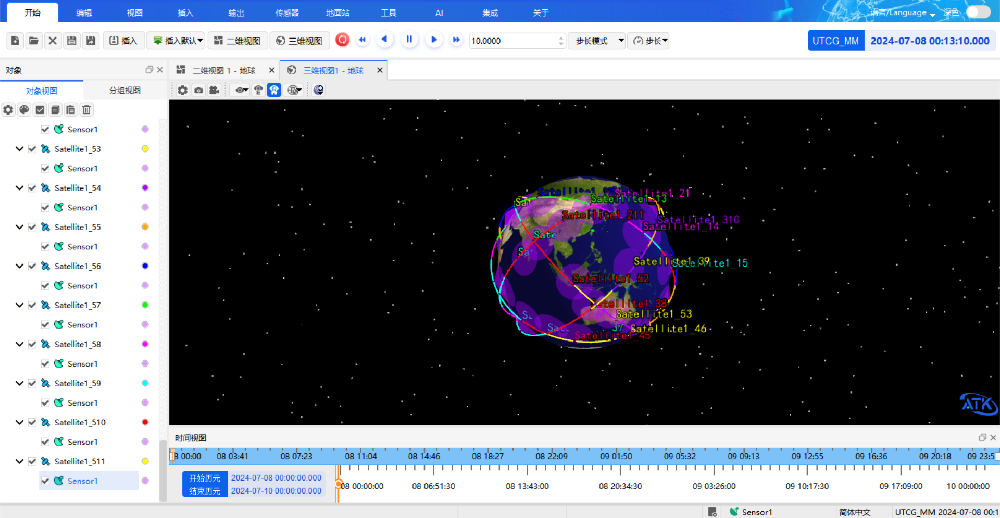

# Input Examples

The following examples show how to control the ATK aerospace simulation software with natural language, covering typical use cases such as scenario and object management, maneuver planning, and access analysis.

## Basic Scenario and Object Operations

Covers creating, deleting, renaming, and querying scenarios and objects.

::: details open **Batch create objects**
```
Create 20 satellites, 10 rockets, and 5 missiles for me.
```
:::

::: details open **Delete by type**
```
Delete all missiles for me.
```
:::

::: details open **Batch rename**
```
Rename sat1-5 to satellite1-5 for me.
```
:::

::: details open **Query current scenario status**
```
Summarize the current scenario information for me.
```
:::

## Maneuver Planning · Fast Transfer Example

> Create a scenario with a simulation time from November 5, 2022 to November 7, 2022. Insert a satellite, set the orbit propagator to maneuver planning, set the initial segment coordinate system to Earth and J2000, with the coordinate type set to classical orbital elements (semi-major axis 6700000 m, eccentricity 0, inclination 0°, right ascension of the ascending node 0°, argument of periapsis 0°, true anomaly 0°). Insert a propagation segment, set the gravity model to the Sun, and set the stopping condition to duration with a trigger value of 7200 seconds. Insert a targeting sequence with the JGM3 gravity model, check atmospheric drag perturbation and solar radiation pressure, and check the Moon for third-body gravity. Under this targeting sequence, insert a maneuver segment, set its constraint configuration to apoapsis radius, set the thrust coordinate axes to VNC, set the velocity increment Vx as a design variable, and set the differential correction of the targeting sequence with Vx and apoapsis radius checked and an apoapsis radius trigger value of 84328394 m.
>
> After the targeting sequence, continue to insert a propagation segment with the same settings as the previous one. Set the stopping condition to distance to central body with a trigger value of 42164197 m. Then insert another targeting sequence, create a maneuver segment under it, set the constraint configuration to eccentricity, set the thrust coordinate axes to VNC, check Vx and Vz as design variables, and set the differential correction of the targeting sequence with control variables Vx and Vz checked, both maximum step sizes changed to 300, and the eccentricity constraint checked with a convergence tolerance of 0.001. Finally, after this targeting sequence, insert a propagation segment with the same settings as the previous one, with the stopping condition set to duration and a trigger value of 172800. Finally, run the maneuver planning for me.


## Access Scenario Generation Example

> Create a new scenario and set the simulation time from 2024-07-08 00:00:00.000 to 2024-07-10 00:00:00.000. Insert the Taipei ground station (latitude 25.05, longitude 121.5), insert a coverage definition for the Taiwan Strait area (longitude range 117.5-122, latitude 22-26.5), and insert coverage definitions for the Malacca area (95-104.5, 1.3-5.5) and the Great Lakes region (-92 to -76, 41-49). Create a satellite, use the orbit wizard to set a repeating ground track orbit with an approximate altitude of 412400 m, an inclination of 45 degrees, 15.537 orbits per repeat cycle, and a first ascending node longitude of 0. Under this satellite, create a conical sensor with an angle of 63. Using this satellite as the seed satellite, create a constellation with 5 orbital planes, 11 satellites per plane, and an inter-plane phase increment of 4. Reset the scenario simulation state.


