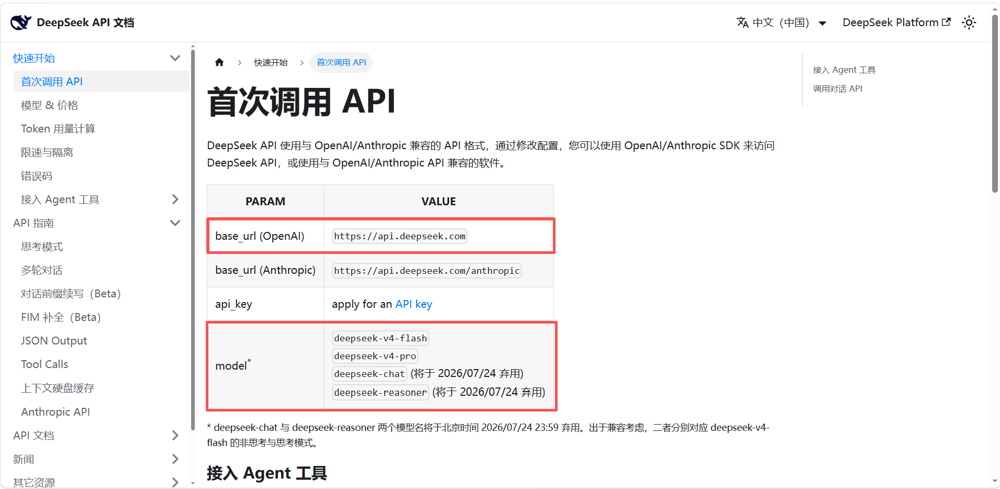
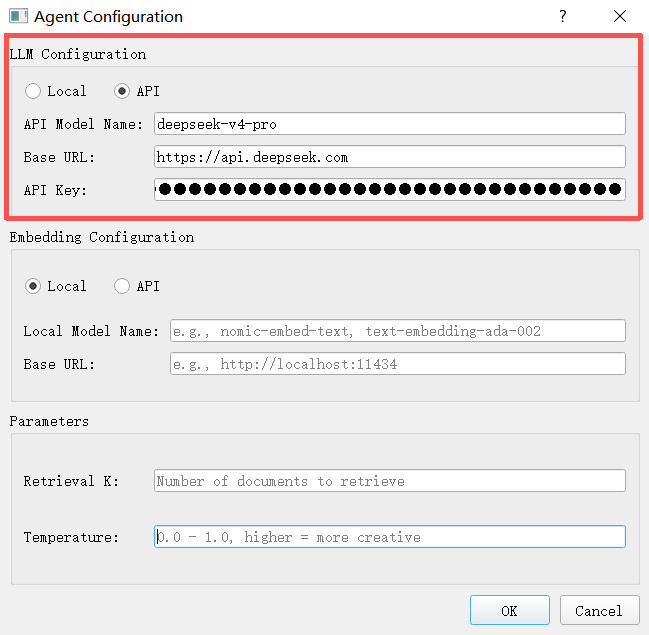
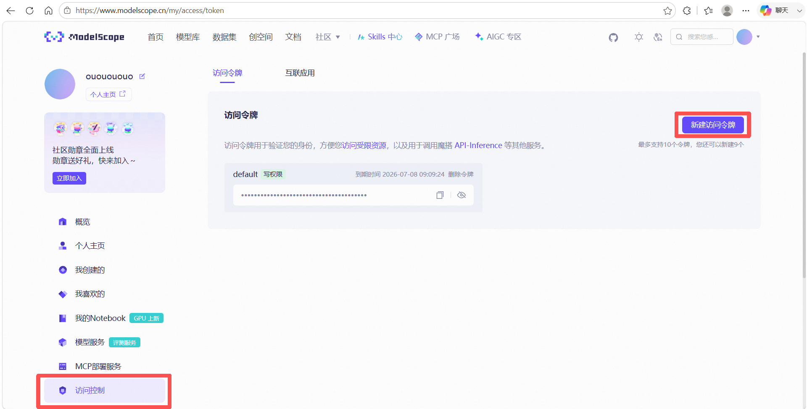
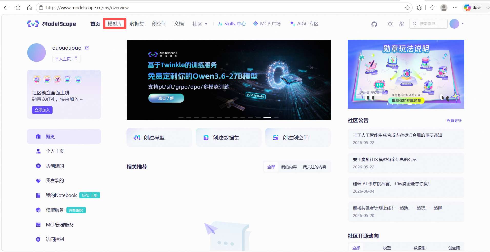
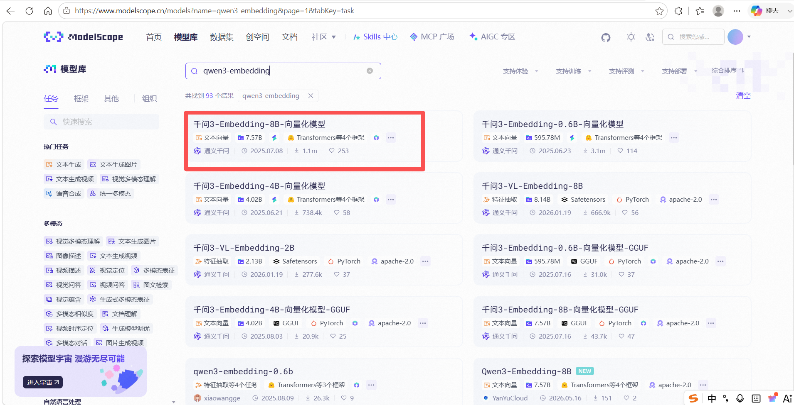
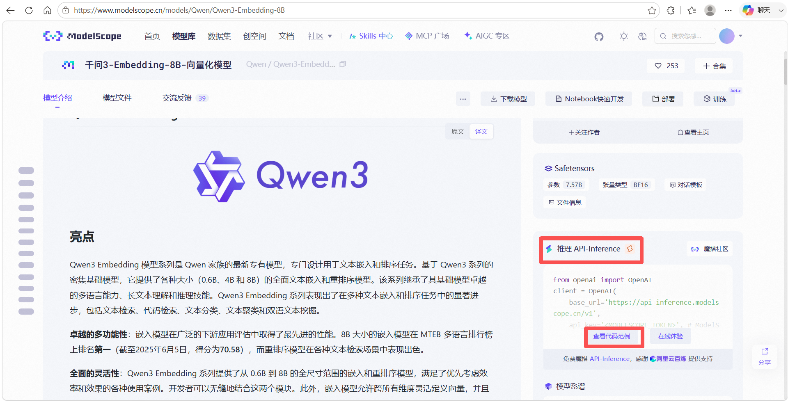
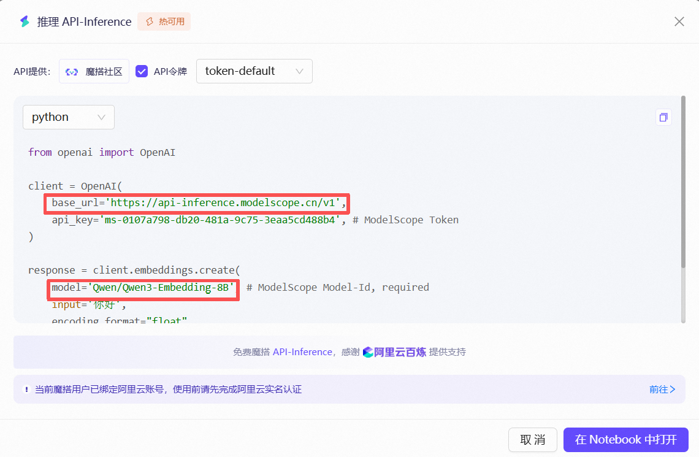
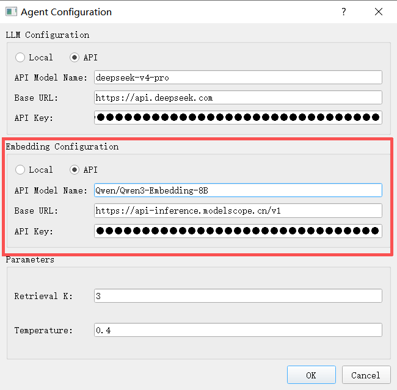

# API Model Configuration

No local GPU is needed — models are called through API interfaces provided by cloud service providers. You need to obtain **API Key**, **Base URL**, and **Model Name**, then fill them into ATK.

## Large Language Model Configuration

Using **DeepSeek** as an example.

### Obtaining an API Key

Go to the [DeepSeek official website](https://www.deepseek.com/) and click **API Open Platform**.

Create an API key on the **API keys** page.

::: warning Before You Start
The API service is billed by usage, so you need to top up your account before using it.

:::

### Obtaining Base URL and Model

Click **API Documentation** to view the `base_url` and `model` parameters.

### Filling in the Model Configuration

Fill in **model_name**, **base_url**, and **api_key** in order in the ATK model configuration interface.

## Embedding Model Configuration

Using **Qwen3-Embedding-8B** as an example.

### Obtaining an API Key

Go to the [ModelScope community](https://www.modelscope.cn/my/overview), click **Access Control**, and create an access token to obtain `api_key`.

::: warning Before You Start
You must complete real-name verification on the Alibaba Cloud Bailian platform before using the API service.
:::

### Selecting the Model

After entering the ModelScope community, search for the corresponding model in the **Model Library**.

### Obtaining Base URL

On the model detail page, click **API-Inference** and view the code example to obtain `base_url`.

### Filling in the Model Configuration

Fill in **model_name**, **base_url**, and **api_key** in order in the ATK model configuration interface.

