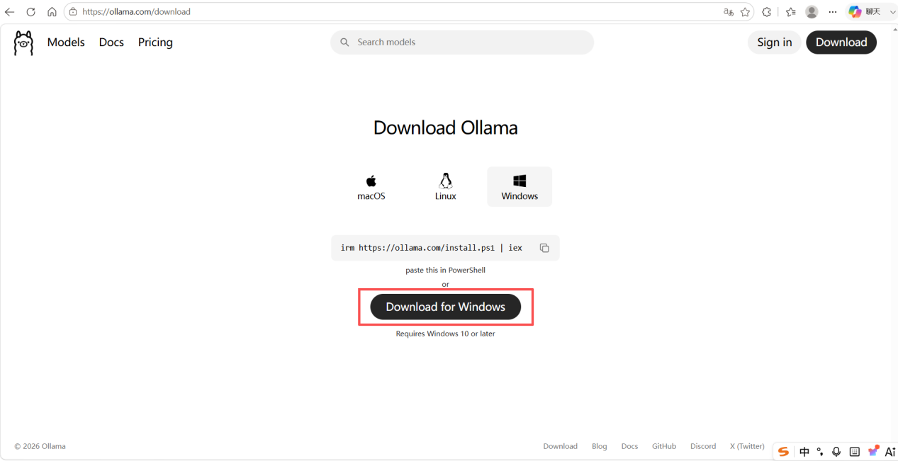
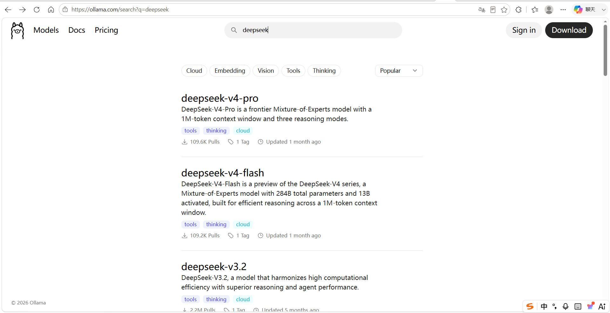
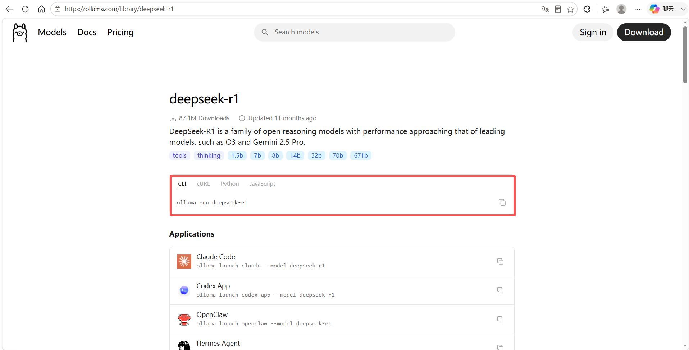
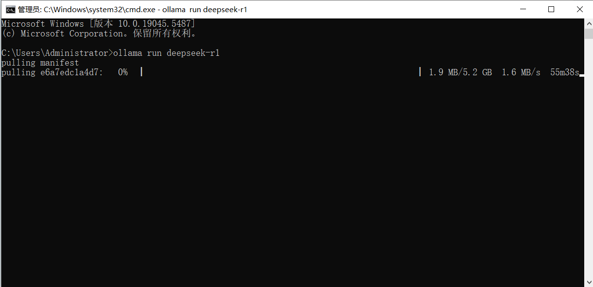
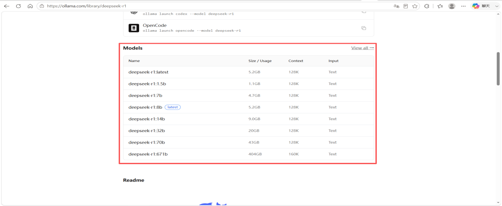
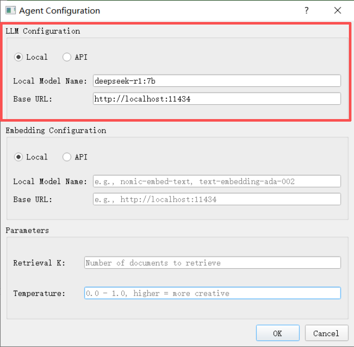
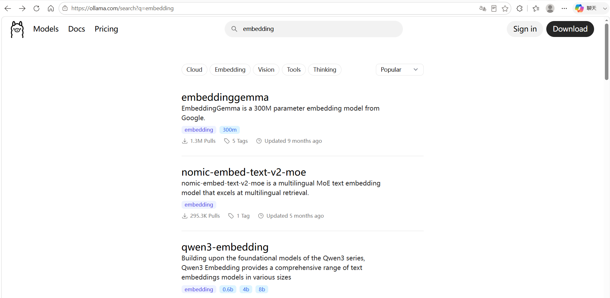
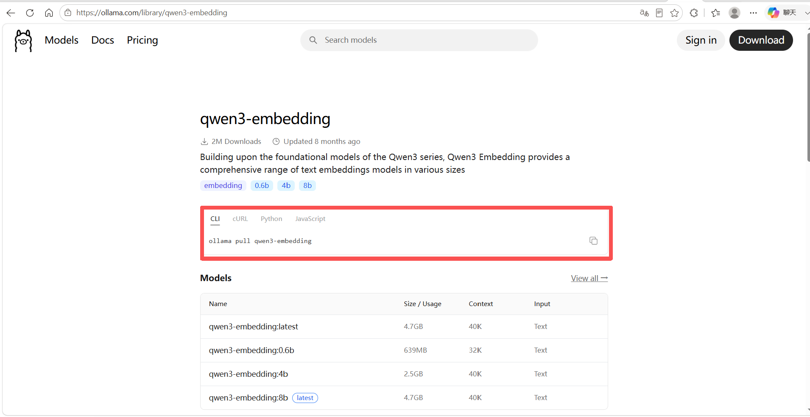
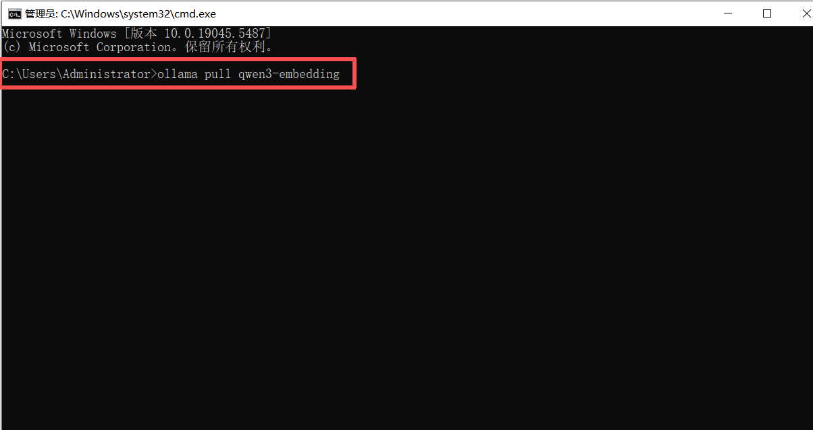
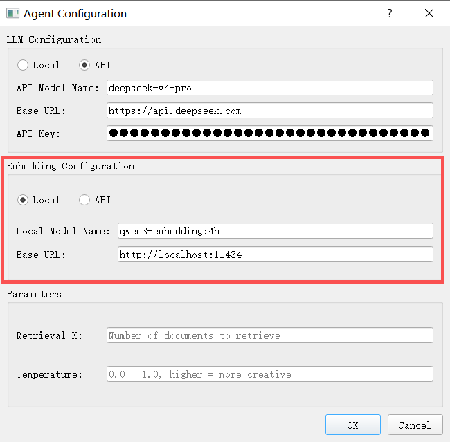

# 本地模型配置

本地部署使用 [Ollama](https://ollama.com/) 在本地运行模型，大语言模型和嵌入模型的操作流程一致：先安装 Ollama，再下载对应模型，最后在 ATK 中填写配置。

## 大语言模型配置

以 **DeepSeek-R1** 为例。

### 安装 Ollama

访问 [Ollama 官网](https://ollama.com/) 下载并安装 Ollama。



### 下载模型

在 [Ollama](https://ollama.com/) 界面搜索需要的模型，点击模型即可看到下载命令。





使用 <kbd>Win + R</kbd> 打开命令窗口，粘贴命令后回车开始下载。例如下载 `deepseek-r1`：

```bash
ollama run deepseek-r1
```



::: tip 选择不同参数规模
如需下载 7B 版本，将命令替换为 `ollama run deepseek-r1:8b` 即可。


:::

### 填写模型配置

在 ATK 的模型配置界面中：

- **Local model Name**：输入下载的模型名，如 `deepseek-r1:7b`
- **Base URL**：填入 `http://localhost:11434`



## 嵌入模型配置

与大语言模型操作一致，只需在 Ollama 中搜索嵌入类模型即可。以 **Qwen3-Embedding** 为例。

### 模型选择与下载

在 [Ollama](https://ollama.com/) 搜索嵌入模型（如 `qwen3-embedding`），下载方式与大语言模型相同。







### 填写模型配置

在 ATK 的模型配置界面中：

- **Local model Name**：输入下载的模型名，如 `qwen3-embedding:4b`
- **Base URL**：填入 `http://localhost:11434`


