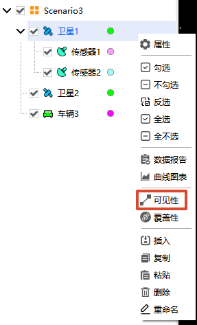
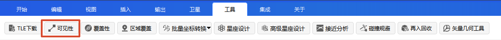

# 可见性工具

## 功能概述

ATK 可见性工具用于判定**空间两点间是否存在无遮挡的直接可视路径**，并求解**特定时间段内满足多约束条件的连续可见时段列表及对应报告、图表**。

在卫星通信、目标观测、指令发送等任务中，“可见”不仅指物理视线通视，还可代表特定的几何构型、服务效能或时间条件。工具支持卫星、舰船、导弹、车辆、雷达、地面站、飞机等多类型对象，能够纳入方位角、视线约束、视场约束、光照约束、通信约束等多种条件，适配陆、海、空、天、电多域场景下的分析需求。

::: tip 可见性分析的核心作用
可见性分析是卫星通信、导航、遥感等任务的基础核心技术，用于明确“能否看见”的空间关系，解决任务“能否执行”、“何时执行”的核心问题。
:::

## 功能入口

### 对象窗口调用

在场景中任意对象上右键单击，选择 <kbd>可见性</kbd> 工具。

### 工具栏调用

在 ATK 工具栏中点击 <kbd>工具</kbd> - <kbd>可见性</kbd>按钮，打开【可见性分析】界面。

## 界面区域说明

主界面分为四大核心区域：

### 对象操作区域

用于设置可见性分析的访问对象（发起方）与目标对象。**支持同时选择多个访问对象和目标对象**，减少多对象可见关系的重复操作。**分析结果仍以单个对象为单位存储和展示。**

|     元素     |                                   说明                                   |                                                      操作                                                      |
|:------------:|:------------------------------------------------------------------------:|:--------------------------------------------------------------------------------------------------------------:|
| **访问对象** |                               可见性发起方                               |                              点击 <kbd>选择对象...</kbd> 从当前想定对象列表中选取                              |
|   **更新**   | 同步场景配置变更，将时间设置与分析步长重置为场景默认信息，更新可视化视图 | 场景属性修改后点击； 希望可见性分析时段重置为场景默认时间时使用； **对象属性修改保存后自动更新，无需点击** |
|   **清除**   |               移除选中的单个目标对象，清除其可视化显示效果               |                                                 选中对象后点击                                                 |
| **全部清除** |                清空当前访问对象下所有目标对象的可视化结果                |                       直接点击，仅清除当前访问对象的分析结果及显示（不影响其他访问对象）                       |
|   **计算**   |           执行可见性计算，生成可见时段数据并在二三维视图中展示           |                                     配置完成后点击，完成后对象名前显示 `*`                                     |
| **显示过滤** |                            按类型筛选对象列表                            |                                           点击下拉框后勾选（默认：所有对象）                                           |
| **对象列表** |                           显示可添加的目标对象                           |                                               按住 `Ctrl` 可多选                                               |

::: warning 及时清理结果释放内存
未清除的结果会占用内存，建议用完及时清理。
:::

### 时间设置区域

设定可见性分析的时间区间、计算步长及光延迟选项。

|      元素      |                   说明                   |                                  操作                                 |
|:--------------:|:----------------------------------------:|:---------------------------------------------------------------------:|
| 开始历元 (UTCG_MM) |               分析起始时间               |                    格式：`YYYY-MM-DD HH:MM:SS.000`                    |
| 结束历元 (UTCG_MM) |               分析结束时间               |                    格式：`YYYY-MM-DD HH:MM:SS.000`                    |
|    分析步长    |               报告时间间隔               |                         可切换单位（默认：秒）                        |
|   使用光延迟   | 考虑光线传播时间延迟，修正对象间相对位置 | 近地轨道常规分析可不勾选； 地月通信、深空探测等远距离场景建议勾选 |

::: warning 分析时间范围限制
分析时间范围必须在平台仿真时间段内，否则将因无法获取对应状态数据导致分析失败。
:::

::: tip 光延迟说明
勾选 **使用光延迟** 时，默认**分析对象为接收信号的一方**，计算会修正信号传播期间对象的位置变化。该效应在卫星通信、深空测控等任务中需重点考虑。
:::

### 报告输出区域

支持 **数据报告** 和 **图表报告** ，操作逻辑一致：

1. 点击 <kbd>更多...</kbd> 查看所有模板（除 **通信明细** 报告）
2. 选择模板后点击 <kbd>创建</kbd>
3. 支持自定义模板：点击 <kbd>更多...</kbd> - <kbd>自定义</kbd>，勾选需显示的参数后，点击 <kbd>确定</kbd>
4. 报告或图表窗口打开后，均可点击 <kbd>刷新</kbd> 按钮重新输出结果；对象属性修改并重新计算后，也可通过 <kbd>刷新</kbd> 更新已打开的报告或图表

::: tip 报告刷新与步长设置
部分逐时刻输出数据的报告支持在报告窗口中重新设置输出步长。修改步长后，点击 <kbd>刷新</kbd> 按钮即可按新的步长重新生成结果。
:::

#### 报告

::: details 展开查看 14 种数据报告模板

|             模板名称             |                                             含义                                             | 报告 | 图表 |
|:----------------------------:|:--------------------------------------------------------------------------------------------:|:----:|:----:|
|           可见时段           |          给出目标与对象之间满足约束条件的可见时间段，包括开始时间、结束时间和持续时长          |  √  |  √  |
|     可见时段（相对时间）     |             以仿真场景开始历元为计时零点，采用相对秒表示可见时段，便于分析时间偏移             |  √  |  √  |
|           **视线参数**        |              给出可见时段内方位角、俯仰角和视线距等参数，可用于分析观测几何关系              |  √  |  √  |
|       **视线参数变化率**      | 给出可见时段内视线角速率、方位角速率、俯仰角速率和视线距变化率，用于分析视线变化快慢和跟踪难度 |  √  |  √  |
|          不可见时段          |          给出目标与对象之间不满足约束条件的不可见时间段，包括开始时间、结束时间和持续时长      |  √  |  √  |
|    不可见时段（相对时间）    |             以仿真场景开始历元为计时零点，采用相对秒表示不可见时段，便于分析中断情况           |  √  |  √  |
|        不可见视线参数        |              给出不可见时段内方位角、俯仰角和视线距等参数，用于分析不可见阶段的几何关系        |  √  |  √  |
|          可见性统计          |       统计最小、最大、平均和总可见时长，以及平均不可见时长；图表可显示各可见时段占比等信息     |  √  |  √  |
|    可见性统计（相对时间）    |                以相对秒形式统计可见时长和不可见时长，便于与任务起始时刻进行对比              |  √  |      |
|        视线参数统计          |              统计最小、最大和平均俯仰角，以及最小、最大和平均视线距等视线参数特征            |  √  |      |
|          不可见统计          |                    统计最小、最大、平均和总不可见时长，用于评估可见性中断情况                |  √  |      |
|    不可见统计（相对时间）    |                以相对秒形式统计不可见时长，便于分析任务周期内不可见区间的分布情况            |  √  |      |
|          距离变化率          |             统计每个可见时段内最大、最小和平均距离变化率及对应时间，用于分析距离变化特征      |  √  |  √  |
|      俯仰角/方位角曲线       |               单独显示可见时段内俯仰角或方位角随时间变化情况，便于分析角度变化规律            |      |  √  |
|          视线距曲线          |                    单独显示可见时段内视线距随时间变化情况，便于分析目标距离变化              |      |  √  |
|    俯仰角-方位角极坐标图     |              以极坐标形式显示可见时段内方位角和俯仰角关系，便于分析空间指向分布              |      |  √  |
|      可见时段百分比饼图      |                    显示各可见时段占总可见时长的比例，用于比较不同可见窗口贡献              |      |  √  |
|    全任务周期可见百分比饼图  |                    显示总可见时长占整个计算时间段的比例，用于评估整体可见性水平            |      |  √  |
|          通信明细            |              给出可见时段内通信对象、链路状态和传输速率等通信相关明细信息                  |  √  |      |

:::

#### 自定义报告可选参数

自定义报告支持根据分析需求选择输出参数。常用可选参数包括：

方位角、俯仰角、方位角变化率、俯仰角变化率、距离、距离变化率、视线角变化率、高度、太阳高度角、月球高度角、太阳视线规避角、月球视线规避角、视线约束、当地时、当地太阳时。

当 **传感器** 作为访问对象时，自定义报告还支持选择以下参数：

太阳视轴规避角、月球视轴规避角、视场约束。

#### 数据动态显示

1. 点击 <kbd>可视化显示...</kbd> 按钮
2. 左侧勾选需显示的数据，右侧设置文字颜色、位置、背景及边框
3. 点击 <kbd>确定</kbd>，数据将在二维/三维视图中动态显示

::: tip 字体显示调整
字体显示效果与场景背景相关，可灵活调整字体样式与背景边框设置以保证清晰可读。
:::

### 数据返回区域

配置可见性分析结果在视图中的可视化效果。

|     元素     |                                                          说明                                                          |
|:------------:|:----------------------------------------------------------------------------------------------------------------------:|
| 显示静态轨迹 |             二维视图中，当访问对象或目标对象为卫星、车辆等可移动对象时，以**静态加粗线条**持续展示其全部可见时段的轨迹投影，不随时间推进而变化             |
| 显示动态连线 | 二维、三维视图中，当进入可见时段时，动态绘制**访问对象与目标对象之间的连线**，离开时连线消失；仅反映当前时刻的可见状态 |

::: tip 静态轨迹与动态连线区别
- **静态轨迹**适合快速浏览全时段覆盖情况，可以看出可见时段占总时段的大致比例
- **动态连线**适合时序推演场景，逐帧观察可见关系的建立与中断
- 两者可同时勾选，互不冲突
:::

## 完整操作流程

### 设置约束条件

如需限制可见条件（如仰角范围、视线遮挡、光照约束等），双击对象进入 **属性** - **约束** 选项卡进行配置。详见 [约束配置](05-约束配置/)。

### 选择访问对象

在对象操作区域，点击 <kbd>选择对象...</kbd>，从当前想定对象列表中选取可见性分析的**发起方**。支持同时选择多个访问对象。

### 添加目标对象

在对象列表中勾选需分析的目标对象（按住 `Ctrl` 或按住鼠标左键并滑动可多选），点击 <kbd>计算</kbd>。支持同时添加多个目标对象，分析结果以**单个对象**为单位分别存储。

### 配置分析时段

在时间设置区域设定开始历元、结束历元及分析步长。分析时段必须在场景仿真时间范围内；若对象为车、船、导弹等生命周期短于仿真时间的对象，实际分析时段取对象生命周期与设置时段的**交集**。

### 执行计算

点击 <kbd>计算</kbd>，完成后目标对象名前显示 `*` 标识。  
对象属性修改保存后，可见性结果将**自动更新**，无需重复点击计算。

### 查看结果

- **数据报告**：点击报告区域相应按钮，或 <kbd>更多...</kbd> 选择模板后 <kbd>创建</kbd>
- **图表报告**：点击图表区域相应按钮，或 <kbd>更多...</kbd> 选择模板后 <kbd>创建</kbd>
- **自定义报告**：点击 <kbd>更多...</kbd> - <kbd>自定义</kbd>，勾选需显示的参数后，点击 <kbd>确定</kbd>
- **刷新结果**：报告或图表窗口打开后，可点击 <kbd>刷新</kbd> 按钮重新输出；部分逐时刻输出数据的报告还可重新设置步长后再刷新

### 配置可视化显示（可选）

在报告输出区域点击 <kbd>可视化显示...</kbd>，勾选需动态显示的数据项并设置文字样式等，即可在二三维视图中实时展示。

### 清除结果

分析完成后，点击 <kbd>清除</kbd> 移除单个目标对象的结果，或点击 <kbd>全部清除</kbd> 清空当前访问对象下的所有结果。未清除的结果将持续占用内存。

::: tip 多对象分析结果隔离
多对象批量分析时，不同访问对象的分析结果相互独立，<kbd>全部清除</kbd> 仅影响当前选中的访问对象。
:::

## 相关案例

- [可见性工具案例](../../02-案例教程/2-可见性工具案例.md)