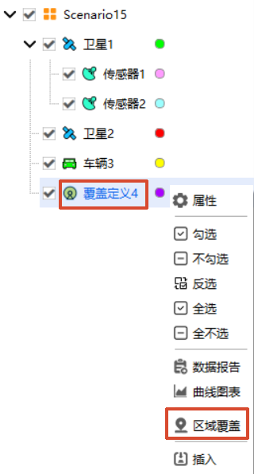
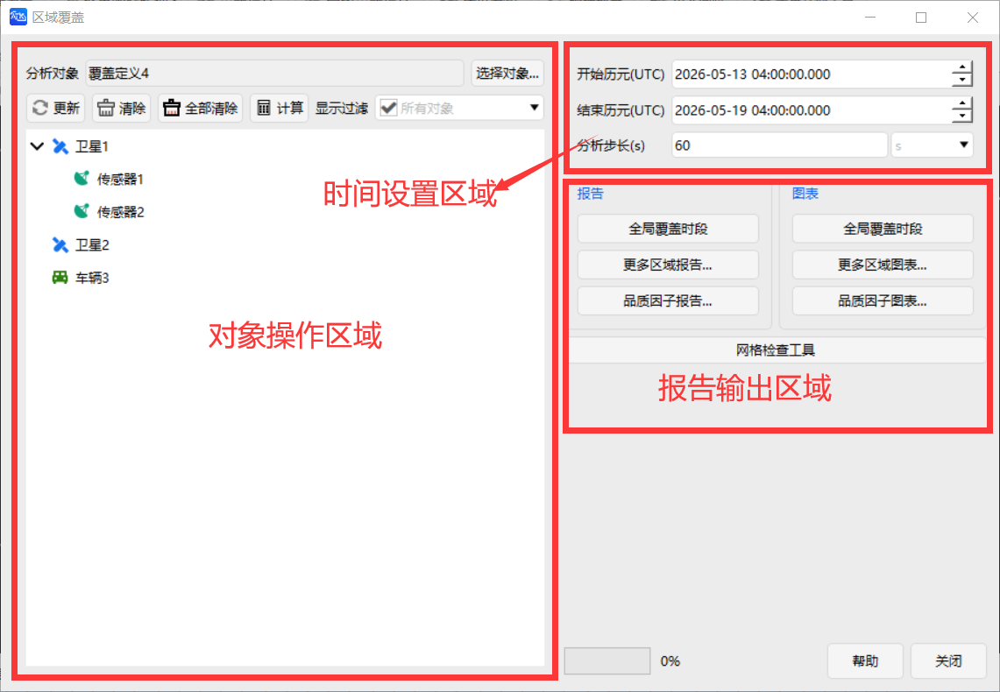
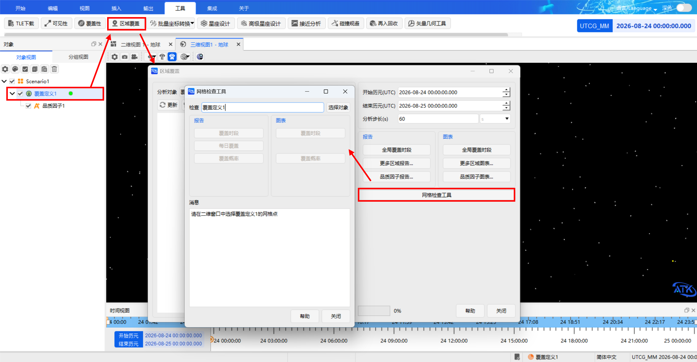

# Regional Coverage Tool

## Functional Overview

The Regional Coverage Tool is used to evaluate the coverage capability of one or more coverage resources (such as satellites, sensors, etc.) over the entire globe or a specified region. During the analysis, object visibility constraints can be comprehensively considered to obtain a more accurate coverage performance assessment.

## Function Entry

### Object Browser Invocation

In the Object Browser, select the **Coverage Definition** object, right‑click, and the Regional Coverage Tool can be found.

### Toolbar Invocation

Click the <kbd>Tools</kbd> - <kbd>Regional Coverage</kbd> icon in the ATK toolbar to open the **Regional Coverage** analysis window. The exact location is shown below:

## Interface Area Descriptions

The tool interface is divided into three areas: **Object Operations Area**, **Time Settings Area**, and **Report Output Area**. The overall layout is shown below:

### Object Operations Area

Used to select the analysis object, generate regional coverage analysis data, and update or clear the data. It sets the access object (initiator) and resource objects for the regional coverage analysis. Only one analysis object can be selected per analysis, but multiple resource objects can be selected simultaneously.

|       Element       |                                    Description                                    |                                                               Operation                                                               |
|:-------------------:|:---------------------------------------------------------------------------------:|:-------------------------------------------------------------------------------------------------------------------------------------:|
| **Coverage Object** |                      The initiator of the regional coverage analysis                      |                                 Click <kbd>Select Object…</kbd> to choose from the current scenario object list                                 |
|     **Update**      | Synchronizes scenario configuration changes, resets time settings and analysis step to scenario defaults, and updates the visualization view. | Click after modifying scenario properties; Use when you want to reset the regional coverage analysis period to the default scenario time; **Updates automatically after saving object property changes; no manual click needed.** |
|     **Clear**       |                  Removes the selected resource object and clears its regional coverage analysis data.                 |                                                   Click after selecting the target object                                                   |
|   **Clear All**     |           Clears all regional coverage analysis data for resource objects under the current access object.          |                       Click directly. Only clears the results and displays for the current coverage object (does not affect other coverage objects).                      |
|    **Compute**      |           Executes the regional coverage analysis computation and generates regional coverage analysis data.          |                                    Click after configuration is complete. An `*` appears before the object name upon completion.                                   |
|   **Show Filter**   |                           Filters the object list by type                          |                                          Dropdown selection (default: All Objects)                                          |
|   **Object List**   |                          Resource objects participating in the regional coverage computation, such as satellites, sensors, or other objects with coverage capability.                         |                                              Hold `Ctrl` for multiple selection                                              |

::: tip Computation Status Indicator
The status symbol `*` appears before the object name to quickly identify whether the regional coverage analysis computation has been completed.
:::

::: warning Clear Results in Time to Free Memory
Undeleted results occupy memory. It is recommended to clear them promptly after use.
:::

### Time Settings Area

The analysis time settings area defines the time range used for the regional coverage analysis computation. Regional coverage analysis results are closely related to the time settings: a longer time range and a finer analysis step generally result in a larger computational load.

Common configurations are as follows:

|       Element       |      Description      |               Operation               |
|:-------------------:|:---------------------:|:-------------------------------------:|
|  Start Time (UTCG)  |  Analysis start time  | Format: `YYYY-MM-DD HH:MM:SS.000` |
|   Stop Time (UTCG)  |  Analysis end time  | Format: `YYYY-MM-DD HH:MM:SS.000` |
|     Step Size       |  Report time interval  |      Unit can be switched (default: seconds)      |

::: warning Analysis Period Restrictions
The analysis period must be within the scenario's simulation time range; otherwise, the analysis will fail due to the inability to obtain the corresponding state data.
:::

::: tip Step Size Recommendations
Under the premise of ensuring analysis accuracy, you may increase the step size appropriately to improve computational efficiency.
:::

### Report Output Area

The result outputs of the Regional Coverage Tool are mainly divided into two categories:

- **Regional Coverage Results**: Describe coverage intervals, gap intervals, regional coverage percentage, global coverage status, and grid point coverage.
- **Figure of Merit Results**: Describe statistical results of coverage quality metrics, such as FOM maximum, minimum, mean, percentage of satisfied area, etc. For details on FOM types and statistics, see [Figure of Merit](04-品质因子/).

Both categories support **Data Reports** and **Chart Reports** with consistent operation logic:

1. Click <kbd>Regional Reports…</kbd> / <kbd>Regional Graphics…</kbd> / <kbd>FOM Reports…</kbd> / <kbd>FOM Graphics…</kbd> to view all templates.
2. Select a template and click <kbd>Create</kbd>.

#### Regional Coverage Results

Regional coverage results are mainly used to describe the coverage of each grid point within the analysis region by the coverage resources, including coverage intervals, gap intervals, partial coverage, global coverage, regional coverage percentage, and latitude coverage statistics.  
Coverage intervals, gap intervals, partial coverage intervals, and global coverage intervals are primarily used to analyze the temporal distribution of coverage results; regional coverage percentage and latitude coverage results are primarily used to analyze the spatial distribution; Figure of Merit results are used for further evaluation of coverage quality.

::: details Expand to view regional coverage report/chart templates

|              Name             |                                                                     Meaning                                                                    | Report | Chart |
|:-----------------------------:|:----------------------------------------------------------------------------------------------------------------------------------------------:|:------:|:-----:|
|        Coverage Intervals         |             Provides statistics on coverage intervals for each grid point in the region, used to analyze the duration of coverage for each grid point over the analysis period.            |   √    |   √   |
|         Coverage Gaps          |           Provides statistics on coverage gaps for each grid point in the region, used to analyze the un‑covered duration between adjacent coverage intervals.           |   √    |   √   |
|      Partial Coverage Intervals      |             The union of coverage intervals over all grid points, representing the time periods when at least one grid point in the analysis region is covered.            |   √    |   √   |
| Partial Coverage Intervals (Elapsed Time) |               Represents partial coverage intervals in elapsed time, facilitating observation of coverage changes from the start of the analysis.              |   √    |   √   |
|       Global Coverage Intervals       |             The intersection of coverage intervals over all grid points, representing the time periods when all grid points in the analysis region are covered simultaneously.             |   √    |   √   |
| Global Coverage Intervals (Elapsed Time) |               Represents global coverage intervals in elapsed time, facilitating analysis of the duration of simultaneous full‑region coverage.              |   √    |   √   |
|       Gaps in Global Coverage       |                Represents the time periods when the analysis region fails to achieve global coverage, i.e., when at least one grid point is not covered.                |   √    |   √   |
| Gaps in Global Coverage (Elapsed Time) |                    Represents gaps in global coverage in elapsed time, facilitating analysis of global coverage interruptions.                   |   √    |   √   |
|        Grid Point Information        |          Provides basic information for each grid cell, including the grid center point latitude/longitude, grid point altitude, grid area, and the latitude/longitude extent of the grid region.         |   √    |       |
|     Grid Point Visible Assets    |                      Provides the names of resource objects that have coverage relationships with each grid point during the analysis period.                     |   √    |       |
|        Percent Coverage        |          Provides statistics on the regional coverage percentage and cumulative coverage at each time instant. Coverage percentage typically represents the proportion of the covered grid area to the total region area.         |   √    |   √   |
|   Coverage By Assets Report  |        Provides statistics on the coverage capability of each individual coverage resource over the analysis region, including minimum, maximum, mean, and cumulative coverage percentages.       |   √    |       |
|       Coverage By Latitude       |           Provides coverage statistics for grid points by latitude, used to analyze the average covered interval percentage and average total coverage duration for different latitude bands.          |   √    |   √   |

:::

#### Figure of Merit Results

Figure of Merit results are generated based on the regional coverage analysis results and are used for further evaluation of coverage quality. Figures of Merit can describe coverage performance from temporal, spatial, and statistical perspectives, such as grid FOM statistics over time, percentage of satisfied area, and FOM values by latitude or longitude.

::: tip Reference Documentation for Figures of Merit
For detailed definitions, property configurations, and statistical descriptions of Figures of Merit, see [Figure of Merit](04-品质因子/).
:::

::: details Expand to view Figure of Merit report/chart templates

|              Name             |                                                                     Meaning                                                                    | Report | Chart |
|:-----------------------------:|:----------------------------------------------------------------------------------------------------------------------------------------------:|:------:|:-----:|
|     Grid Stats Over Time      |                At each time instant, provides statistics (typically maximum, minimum, and mean) of the instantaneous FOM values across all grid points in the region.                |   √    |   √   |
|       Grid Stats Report       |                      Provides statistics (typically maximum, minimum, and mean) of the static FOM values across all grid points in the region.                      |   √    |       |
|     Percent Satisfied Report  |              Provides the percentage of the grid area for which the static FOM values satisfy the satisfaction condition relative to the total region area.             |   √    |       |
|     Satisfied by Time Report  |                At each time instant, provides the percentage of the grid area for which the FOM values satisfy the satisfaction condition relative to the total region area.               |   √    |   √   |
| Value By Grid Point At Time   |                     At a specified UTC time, outputs the instantaneous FOM value for each grid point.                    |   √    |       |
|     Value By Grid Point       |                    Outputs the static FOM value for each grid point, used to analyze the spatial distribution of FOM values across the grid.                   |   √    |       |
|     Value By Latitude         |                  Provides latitude‑wise statistics (maximum, minimum, and mean) of static FOM values for grid points at each latitude.                 |   √    |   √   |
|     Value By Longitude        |                 Provides longitude‑wise statistics (maximum, minimum, and mean) of static FOM values for grid points at each longitude.                |   √    |   √   |

:::

::: tip Prerequisite for FOM Report Generation
Before generating Figure of Merit reports or charts, ensure that the corresponding Figure of Merit has been configured under the Coverage Definition object and that the regional coverage computation has been completed. If no FOM is configured, or if the coverage analysis result is empty, the related FOM reports and charts may not produce valid data.
:::

#### Grid Inspector

To obtain coverage analysis data for a specific grid point, ATK's Regional Coverage Analysis tool provides a **Grid Inspector**.

- In the **Regional Coverage** interface, locate and click the <kbd>Grid Inspector</kbd> button to enter the tool interface. First, confirm the name of the Coverage Definition object being analyzed; you can switch between different coverage definitions by selecting the object.
- Open the 2D view and click on the desired grid point in the view to capture the coverage information for that point. After successful selection, the **Message** panel of the tool will display the location, size, and coverage proportion statistics for the selected grid point.

The tool also provides corresponding report and chart functions. Click the appropriate buttons to generate coverage analysis reports for that specific grid point. The report content is identical to the single‑object coverage analysis report and will not be repeated here.

::: warning Prerequisite for Using the Grid Inspector
Before using the **Grid Inspector**, ensure that the coverage computation for the desired analysis object has been completed (i.e., the `*` marker appears before the object name). This tool supports viewing detailed coverage information for specific grid points, which helps identify areas with poor coverage.
:::

## Complete Workflow

### Add a Regional Coverage Analysis Object

- Click <kbd>Insert</kbd>, select **Scenario Objects → Coverage Definition**, then select **Insert Method → Insert Default Type**.
- Click <kbd>Insert</kbd>, select **Scenario Objects → Figure of Merit**, then select **Insert Method → Insert Default Type**. In the pop‑up **Insert Figure of Merit** window, select the **Coverage Definition** and click <kbd>OK</kbd>.

### Set Analysis Object Properties

- Configure the grid and constraint properties of the **Coverage Definition** object according to mission requirements.
- Select the definition type for the **Figure of Merit** object and set its statistical parameters.

### Select Coverage Object

In the Object Operations area, click <kbd>Select Object…</kbd> to choose the **initiator** of the regional coverage analysis from the current scenario object list.

### Add Resource Objects

In the object list, check the resource objects to analyze (hold `Ctrl` or click and drag with the left mouse button to multi‑select), then click <kbd>Compute</kbd>. Multiple resource objects can be added simultaneously; analysis results are stored separately for **each individual object**.

### Configure Analysis Period

In the Time Settings area, set the start time, stop time, and analysis step. The analysis period must be within the scenario's simulation time range.

### Execute Computation

Click <kbd>Compute</kbd>. Upon completion, an `*` appears before the resource object's name.  
After saving object property changes, old regional coverage analysis results are **automatically cleared**; you need to click Compute again to update the results.

### View Results

After the regional coverage analysis is complete, results can be viewed in the **Reports** or **Graphics** sections. **Reports** generate data tables or textual reports related to regional coverage; **Graphics** generate visual curves of the regional coverage results. Through the <kbd>Regional Reports…</kbd> or <kbd>Regional Graphics…</kbd> functions, you can choose to generate different types of regional coverage statistical results.

### Clear Results

After the analysis is complete, click <kbd>Clear</kbd> to remove the results for an individual resource object, or click <kbd>Clear All</kbd> to clear all results under the current coverage object. Undeleted results will continue to occupy memory.

## Related Case Studies

- [Regional Coverage Case Study](../../02-案例教程/11-区域覆盖案例.md)