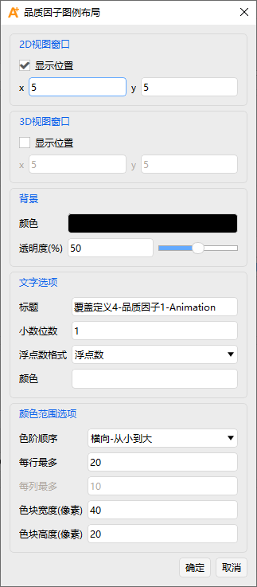

# Figure of Merit

The Figure of Merit (FOM) is the core mechanism of coverage analysis, used to quantitatively evaluate the effectiveness of coverage, access, navigation, communication, and other mission aspects. ATK supports 16 types of Figures of Merit, covering **Coverage Time**, **System Response**, **Navigation and Positioning**, and **Access Constraints**, all configured through a unified property interface.

Figures of Merit are applicable to both the **Coverage Tool** and the **Regional Coverage Tool**.

## Basic Properties

The basic property configuration of a Figure of Merit consists of four parts:

|      Parameter      |                      Description                      |
|:-------------------:|:-----------------------------------------------------:|
|    **Definition**   | Selects the FOM type, statistical parameter type, and type‑specific parameters. |
| **Satisfaction Condition** | Further filters valid coverage windows on top of visibility constraints. |
| **Invalid Data Indicator** | Assigns a specified invalid value when certain conditions are not met. |
| **Valid Value Limits** | Applies additional upper and lower bounds to the computation results. |

### Definition

The Definition tab is used to select the Figure of Merit type and specify computation parameters. The main configuration items are:

- **Type**: Selects from the 16 Figure of Merit types.
- **Statistical Parameter Type**: Selects the statistic to compute; different FOM types offer different statistic options.
- **Type‑Specific Parameters**: Some types require additional settings, for example:
  - Revisit Time: sets the minimum multiplicity.
  - Dilution of Precision: selects the sub‑method and computation type.

### Satisfaction Condition

The Satisfaction Condition is used to further filter coverage windows on top of visibility constraints.

For example, if you need to analyze periods when "at least 2 resources cover simultaneously," set the **Type** to "Multiple Coverage," enable the Satisfaction Condition, and set it to "Greater Than" a valid value of "2."

### Invalid Data Indicator

Some Figures of Merit require specific conditions to be computable. When these conditions are not met, the system assigns a specified invalid value to distinguish "invalid" from "zero coverage."

For example, GDOP computation requires at least 3‑fold coverage. For periods with fewer than 3 resources, the FOM value will always display the set invalid value.

### Valid Value Limits

Valid Value Limits provide additional constraints beyond the computation model. When the coverage satisfies the FOM computation model but the result falls outside the defined **Valid Value Limits**, the value is treated as invalid.

::: tip FOM Result Output
After analysis, Figure of Merit results can be output via **Data Reports** and **Chart Reports**. Some types also support display in 2D/3D views as **Contour Maps** or **Dynamic Data**.
:::

## Visualization Parameter Configuration

In the object list, right‑click on the **Figure of Merit** and go to the property settings page. Under the **2D Graphics** category, you can configure **Dynamic** and **Static** image settings.

At the top of the Dynamic image settings is the master FOM display control. Checking **Show** displays the coverage area in the 2D/3D views.

The difference between **Dynamic** and **Static** images is that Dynamic shows the real‑time coverage area, while Static shows the coverage area over the entire analysis period. The settings pages for both are identical, but their parameters must be configured independently.

### Contour Map Property Settings

1. **Grid Point Translucency**
0 is opaque, 100 is fully transparent. The text box and slider are linked.

    

2. **Display Metric Settings**
Satisfaction area display supports **Uniform Color** and **Levels Color**. The former only requires specifying the color for the satisfied area. The latter requires configuring leveling method, level attributes, color method, and legend layout.

- **Add Levels**: You can either specify individual levels, or specify "Start, Stop, Step". Note: step size cannot be 0, and the total number of levels cannot exceed 100.
- **Color Method**: Choose "Color Ramp" or "Explicit". The former automatically generates a gradient that varies uniformly with levels; the latter allows independent color assignment for each level.
- **Level Attributes**: Displays the currently added levels. The total number cannot exceed 100. When the color method is "Explicit," a level color column appears. Each grid cell is filled with the color of the highest level whose FOM value it meets.  
  In **Level Attributes**, the checkbox **Do not show areas where FOM value exceeds max contour level** controls whether grids with FOM values above the maximum level are filled. By default, grids with FOM values below the minimum level are not filled.
- **Legend**: Click the <kbd>Legend…</kbd> button to open the **Figure of Merit Legend Layout** dialog. You can set display position, background color, and other parameters for 2D and 3D views.  
  **Display Position**: Set the legend position via pixel values, with the upper‑left corner of the view as the origin (x increases to the right, y increases downward).  
  **Background**: Set the background color and translucency of the legend box (0 opaque, 100 fully transparent).  
  **Text Options**: Supports custom titles; the default is auto‑generated from the object name. You can set the number of decimal digits and floating‑point format, supporting decimal or scientific notation. The text color also sets the legend border color.  
  **Range Color Options**: You can set the color order, number of rows/columns, and color square width/height.

  

3. **Contour Interpolation**

- **Contour Interpolation**: Applies natural neighbor interpolation to the contour lines. Four computation methods are supported:  
  - **Coarse Sampling** – long edge interpolated to 128 cells.  
  - **Medium Sampling** – long edge interpolated to 512 cells.  
  - **Smooth Sampling** – long edge interpolated to 1024 cells.  
  - **Custom** – each grid cell of the bounding latitude/longitude region is subdivided into n×n cells.  
- **Show lines at level boundaries**: Displays boundary lines between different levels; line width and color can be set. By default, this is unchecked, and higher‑level grid colors are used. When checked, all boundaries display in the specified color.