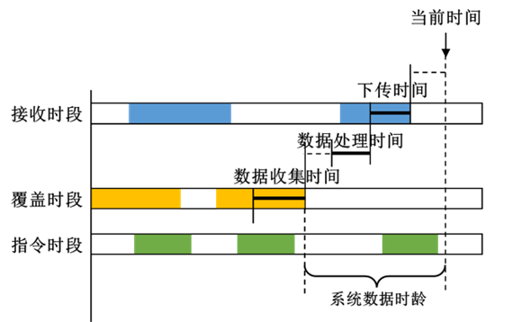

# System Data Age

## Definition

System Data Age represents the time elapsed from the end of the last data collection interval that satisfies task sequence requirements such as data downlink to the current time.

::: tip Note
The System Data Age calculation requires a complete data collection process, but this metric only represents the interval from the end of data collection to the current moment.
:::

## Specific Parameters

- **System Assets**: Command Object, Receive Object, Allow Crosslink
- **Phase Duration Parameters**: Command Prep Time, Commanding Time, Pre‑Collection Time, Collection Time, Post‑Collection Time, Downlink Time, Time Step

## Statistics

|      Name     |                                                                                   Meaning                                                                                   |
|:-------------:|:---------------------------------------------------------------------------------------------------------------------------------------------------------------------------:|
|    **Mean**   |    The mean System Data Age over the entire analysis period. This value is obtained by sampling at a specific step, which is consistent with the analysis step. If the current time cannot find a complete data cycle backward, no further sampling is performed.    |
|  **Maximum**  |    The maximum System Data Age over the entire analysis period.    |
|  **Minimum**  |    The minimum System Data Age over the entire analysis period. When all delay times are set to 0 and the phases are seamlessly connected, this value is 0.    |