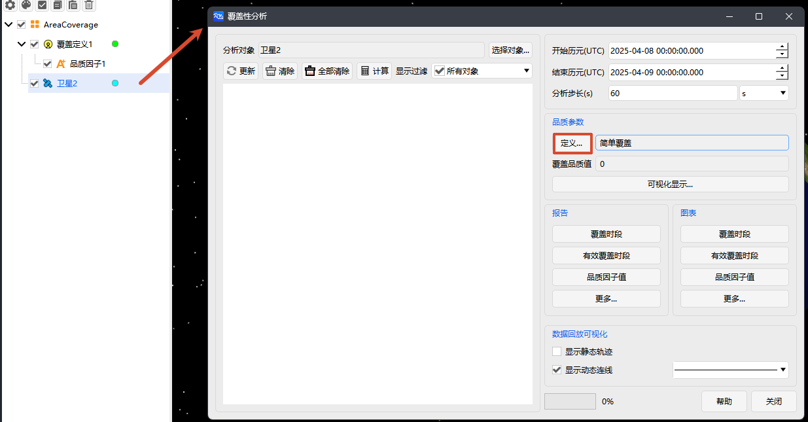
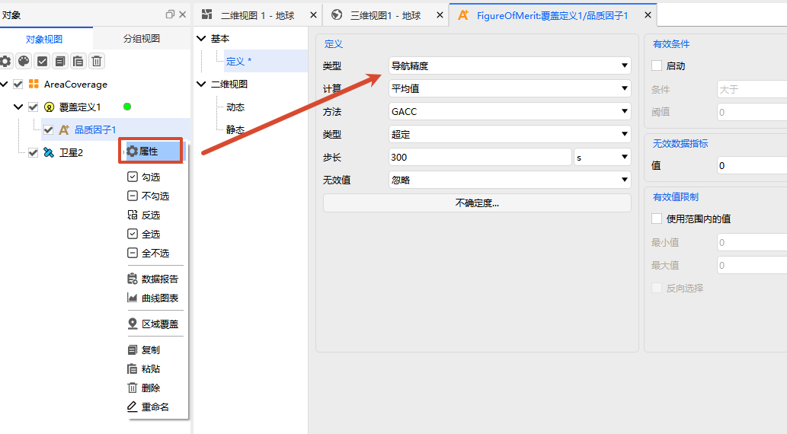
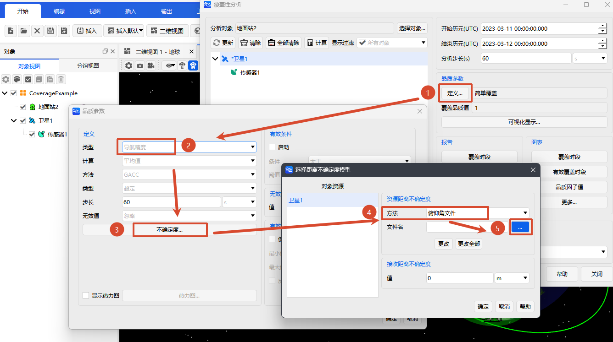

# Navigation Accuracy

## Definition

Evaluates the uncertainty of the navigation solution based on **one‑way range measurements** from a set of transmitters.

Navigation Accuracy quantifies the uncertainty in the receiver’s navigation solution. Unlike Dilution of Precision (DOP), which only reflects the number and geometric configuration of positioning resources, Navigation Accuracy further incorporates the uncertainty in each transmitter’s one‑way ranging observation, known as the User Equivalent Range Error (UERE). Therefore, Navigation Accuracy is affected by both the resource geometry and the ranging errors. Larger DOP or UERE values lead to larger Navigation Accuracy values, indicating poorer positioning performance; smaller values indicate a more accurate navigation solution.

In Navigation Accuracy computations, transmitters are typically carried by satellites or other positioning resources. When a receiver has line‑of‑sight to four or more transmitters simultaneously, the receiver’s three‑dimensional position and the clock bias between the receiver and the transmitter system clock can be solved.

The one‑way ranging uncertainty can be set either as a common fixed value for all transmitters, or individually based on each transmitter’s elevation angle relative to the receiver. Navigation Accuracy computations generally assume that the one‑way ranging errors of different transmitters are independent.

## Computational Principle

Navigation Accuracy is calculated similarly to Geometric Dilution of Precision, but additionally accounts for the User Equivalent Range Error (UERE) of each positioning resource. Let the observation matrix be $H$ and the weight matrix be $W$. The covariance matrix of the navigation solution is:

$$
Q=(H^{T}WH)^{-1}
$$

where:

$$
Q=
\begin{bmatrix}
\sigma_x^2 & \sigma_{xy} & \sigma_{xz} & \sigma_{xt} \\
\sigma_{yx} & \sigma_y^2 & \sigma_{yz} & \sigma_{yt} \\
\sigma_{zx} & \sigma_{zy} & \sigma_z^2 & \sigma_{zt} \\
\sigma_{tx} & \sigma_{ty} & \sigma_{tz} & \sigma_t^2
\end{bmatrix}
$$

The diagonal elements represent the error variances of the navigation solution in the $x$, $y$, $z$, and time directions, respectively, while the off‑diagonal elements represent covariances between different error components.

The weight matrix $W$ is a diagonal matrix whose diagonal elements are determined by the one‑way ranging uncertainty of each positioning resource. For the $i$‑th resource, if the transmitter error and receiver error are independent, the total ranging uncertainty is:

$$
\sigma_{\mathrm{total},i}
=
\sqrt{
\sigma_{\mathrm{satellite},i}^{2}
+
\sigma_{\mathrm{receiver}}^{2}
}
$$

where $\sigma_{\mathrm{satellite},i}$ is the ranging error of the $i$‑th transmitter, and $\sigma_{\mathrm{receiver}}$ is the receiver ranging error.

The weight corresponding to the $i$‑th resource is:

$$
\omega_i=\frac{1}{\sigma_{\mathrm{total},i}^{2}}
$$

Thus, the full weight matrix is:

$$
W=
\operatorname{diag}
\left(
\omega_1,\omega_2,\ldots,\omega_N
\right)
$$

Smaller ranging uncertainty yields larger weight; larger uncertainty yields smaller weight. Weighted computation reduces the impact of low‑quality measurements on the navigation solution.

## Specific Parameters

|      Parameter      |                                      Description                                      |
|:-------------------:|:-------------------------------------------------------------------------------------:|
|    **Method**       | Selects the Navigation Accuracy component to evaluate, e.g., GACC, PACC, HACC, VACC, TACC. |
|    **Type**         | Specifies the transmitter selection strategy for the navigation solution, e.g., Over‑Determined, Best‑4, Best‑N, etc. |
|    **Step**         | Specifies the time interval for sampling dynamic Navigation Accuracy.                 |
| **Invalid Value**   | When insufficient transmitters are available, specifies whether to ignore or include that sample. |
|  **Uncertainty**    | Sets the one‑way ranging uncertainty, including Asset Range Uncertainty and Receiver Range Uncertainty. |

## Method

Select the specific Navigation Accuracy metric in **Definition > Method**. Different methods correspond to uncertainties in different parts of the navigation solution.

|        Method        |      Name      |                                    Description                                     |
|:--------------------:|:--------------:|:----------------------------------------------------------------------------------:|
|      **GACC**        | Geometric Accuracy | Measures the uncertainty of the full navigation solution, including both position and clock‑related components. |
| **PACC / PACC(3)**   | Position Accuracy  | Measures only the uncertainty of the position part of the navigation solution.      |
| **HACC / HACC(3)**   | Horizontal Accuracy| Measures the uncertainty of the horizontal position components (latitude and longitude directions). |
| **VACC / VACC(3)**   | Vertical Accuracy  | Measures the uncertainty of the vertical position component (altitude direction).  |
|      **TACC**        | Time Accuracy      | Measures the uncertainty of the time or clock‑bias part of the navigation solution. |

::: tip Note
- Methods without `(3)` typically require enough transmitters for a full navigation solution.
- Methods with `(3)` allow computation of position‑related accuracy when only 3 navigation sources are available.
- When using `(3)` methods and only 3 sources are available, the clock component is ignored.
- When 4 or more sources are available, the clock component is re‑included.
:::

## Type

**Type** specifies the selection strategy for coverage resources used in Navigation Accuracy computation. Similar to DOP, a full Navigation Accuracy computation typically requires at least 4 coverage resources. For PACC(3), HACC(3), and VACC(3), the requirement can be relaxed to 3 resources because the time component is ignored. When more resources are available, the reliability of the Navigation Accuracy computation generally improves.

|         Type        |                                      Description                                     |              Application Scenario              |
|:-------------------:|:------------------------------------------------------------------------------------:|:----------------------------------------------:|
| **Over‑Determined** | Uses all currently available coverage resources. Requires at least 3 resources. With exactly 3, only PACC(3), HACC(3), and VACC(3) can be computed. | Suitable for assessing overall accuracy when all resources participate. |
|   **Best‑4**        | Selects the best 4 resources based on the specified DOP metric, and computes ACC using these 4. | Suitable for selecting the optimal 4‑resource combination based on geometric precision. |
|   **Best‑N**        | Selects the best N resources based on the specified DOP metric, and computes ACC using the selected resources. | Suitable for limiting the number of resources and studying the impact of different N. |
| **Best‑4 by Accuracy** | Selects the best 4 resources based on the specified ACC metric, and computes ACC using these 4. | Suitable for directly selecting the optimal 4 resources based on navigation accuracy. |
| **Best‑N by Accuracy** | Selects the best N resources based on the specified ACC metric, and computes ACC using the selected resources. | Suitable for selecting a specified number of optimal resources based on navigation accuracy. |

::: tip Note
- With **Over‑Determined**, at least three coverage resources are required. If only three are available, only PACC(3), HACC(3), and VACC(3) can be computed, and the resulting accuracy factors have temporal uncertainty.
- For **Best‑N** or **Best‑N by Accuracy**, you must additionally specify the value of **N**, which should generally be ≥ 4.
- For **Best‑N**, when using PACC(3), HACC(3), or VACC(3), and the DOP metric used for resource selection is not GDOP or TDOP, N can be set to 3.
- For **Best‑N by Accuracy**, when using PACC(3), HACC(3), or VACC(3), and the ACC metric used for resource selection is not GACC or TACC, N can be set to 3.
- The Type configuration affects both dynamic and static Navigation Accuracy results.
:::

## Step

**Step** specifies the time interval for sampling dynamic Navigation Accuracy over the coverage time period.

|   Parameter   |                             Description                             |
|:-------------:|:-------------------------------------------------------------------:|
|   **Step**    | Sampling interval for dynamic results used in static Navigation Accuracy computation. |

::: tip Note
- A smaller step yields denser sampling and typically finer static statistics, but increases computation.
- A larger step speeds up computation but may miss short‑term accuracy variations.
- When resource visibility changes frequently, a smaller step is recommended.
- When only long‑term average trends are needed, a larger step can be used.
:::

## Invalid Value

At some time samples, insufficient transmitters may be available, making the navigation solution impossible to compute. The **Invalid Value** setting specifies how the system handles such samples.

| Invalid Value Action |                                     Description                                    |
|:--------------------:|:----------------------------------------------------------------------------------:|
|     **Include**      | Assigns the samples where navigation solution cannot be computed a specified invalid data indicator, and includes them in statistical calculations. |
|     **Ignore**       | Ignores samples where navigation solution cannot be computed, and performs statistics only on samples where the solution is successfully computed. |

::: tip Note
- If you need to reflect the impact of coverage gaps or navigation unavailability on overall metrics, choose **Include**.
- If you only want to assess accuracy during periods when navigation is available, choose **Ignore**.
- When using **Include**, set the invalid data indicator appropriately to avoid distorting statistical results such as mean or maximum values.
:::

## Uncertainty

Navigation Accuracy computation requires setting the one‑way ranging uncertainty. Uncertainty can come from the transmitter side or the receiver side.

|                        Type                       |                                     Description                                     |
|:-------------------------------------------------:|:-----------------------------------------------------------------------------------:|
|   **Asset Range Uncertainty**   | Sets the ranging uncertainty for each transmitter. Can be constant or vary with elevation angle. |
| **Receiver Range Uncertainty** | The white‑noise ranging error introduced by the receiver hardware, applied uniformly across all geometries and transmitters. |

## Statistics

|             Name            |                                           Meaning                                           |
|:---------------------------:|:-------------------------------------------------------------------------------------------:|
|      **Mean**               | Computes the average Navigation Accuracy uncertainty over the entire coverage period for each grid point. |
|      **Maximum**            | Computes the maximum uncertainty ever observed over the coverage period for each grid point. |
|      **Minimum**            | Computes the minimum uncertainty ever observed over the coverage period for each grid point. |
| **Percent Below** | Computes an uncertainty threshold such that the Navigation Accuracy is below that value for a specified percentage of the time. An additional percentage level must be specified. |

::: tip Note
- This configuration affects only **static Navigation Accuracy** results.
- Dynamic Navigation Accuracy represents the instantaneous result at the current time.
- Static Navigation Accuracy is obtained by sampling the dynamic results at the specified step and applying the selected statistical method.
- The results are influenced by the combined effects of Method, Type, Step, and Invalid Value handling.
:::

## Elevation Angle Uncertainty File Import Instructions

This document describes the import method, file specifications, and format requirements for elevation angle uncertainty files (`.re`).

::: danger Prerequisite
This property can only be configured after the target object has completed regional coverage or coverage analysis.
:::

### Operation Steps

#### Open Figure of Merit Configuration

Choose either of the following two methods:

- **Method 1**: Select the target object → Enter the [Coverage Analysis] page → Click <kbd>Define...</kbd> in the [Figure of Merit] area.

  

- **Method 2**: Right-click the [Figure of Merit] object in the left object tree → Select <kbd>Properties</kbd>.

  

#### Set Parameter Type

In the Figure of Merit configuration page, set the [Type] to [Navigation Accuracy].

#### Import File

1. Click <kbd>Uncertainties...</kbd> to open the configuration dialog.
2. In the [Method] for the Receiver Range Uncertainty, select [By Elevation Angle].
3. Click the <kbd>...</kbd> button next to the file name to select and upload a `.re` file.



### File Specifications

A `.re` file consists of two parts: the **declaration section** (optional) and the **data section** (required):

```text :no-line-numbers
BEGIN RangeUncertainty            ← File start marker (required)
    [DistanceUnitAbrv <unit>]      ← Optional declaration
    [NumberOfPoints <count>]       ← Optional declaration
    [AzEl Unit <angle unit>]       ← Optional declaration
    Begin ElevationRange<type>     ← Data section start marker (required)
        <elevation> <value>        ← One point per line, space-separated
        ...
    END ElevationRange<type>       ← Data section end marker (required)
END RangeUncertainty              ← File end marker (required)
```

#### Unit and Parameter Declarations

Located before the data section; all are optional (default values are used when omitted).

| Keyword | Meaning | Allowed Values | Default |
|---------|---------|----------------|---------|
| `DistanceUnitAbrv` | Distance unit | `km` / `m` / `dm` / `cm` / `mm` | `m` |
| `NumberOfPoints` | Number of valid data rows | Any positive integer | Read all |
| `AzEl Unit` | Angle unit | `0` (radian) / `1` (degree) | `1` (degree) |

Example:

```text
DistanceUnitAbrv m
NumberOfPoints 10
AzEl Unit 1
```

#### Data Formats

The data section **must use only one of the following formats**; mixing is not allowed.

| Format | Data Section Identifier | Meaning Per Line |
|--------|-------------------------|------------------|
| Standard Deviation | `Begin ElevationRangeStdDev` … `END ElevationRangeStdDev` | `elevation angle distance standard deviation` |
| Variance | `Begin ElevationRangeVariance` … `END ElevationRangeVariance` | `elevation angle distance variance` |

#### Read Termination Conditions

Reading stops when **any** of the following conditions is met:

1. The `END` marker of the data section is encountered;
2. The number of rows read reaches the `NumberOfPoints` setting;
3. The end of the file is reached.

### Examples

#### Elevation Angle vs. Distance Standard Deviation

```text title="RangeStdDev.re"
BEGIN RangeUncertainty

    DistanceUnitAbrv   m
    NumberOfPoints     10
    AzEl Unit          1

    Begin ElevationRangeStdDev
        0.0       24.0
        10.0      19.0
        20.0      16.0
        30.0      14.0
        40.0      13.0
        50.0      12.0
        60.0      11.5
        70.0      11.0
        80.0      10.5
        90.0      10.0
    END ElevationRangeStdDev

END RangeUncertainty
```

#### Elevation Angle vs. Distance Variance

```text title="RangeVariance.re"
BEGIN RangeUncertainty

    DistanceUnitAbrv   m
    NumberOfPoints     10
    AzEl Unit          1

    Begin ElevationRangeVariance
        0.0       576.0
        10.0      361.0
        20.0      256.0
        30.0      196.0
        40.0      169.0
        50.0      144.0
        60.0      132.25
        70.0      121.0
        80.0      110.25
        90.0      100.0
    END ElevationRangeVariance

END RangeUncertainty
```