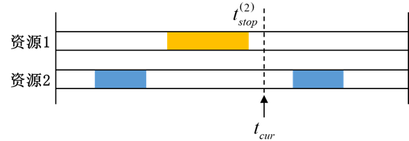

# 数据时龄

## 1. 定义

数据时龄表示当前时刻距离上一次有效覆盖结束时刻的时间间隔。

当分析对象处于有效覆盖时段内时，可认为当前能够获得最新数据，数据时龄为 $0$；当覆盖结束后，数据时龄随时间持续增加，直到下一次有效覆盖开始时重新归零。因此：

- 数据时龄越小，表示距离最近一次有效覆盖的时间越短，数据更新越及时；
- 数据时龄越大，表示长时间未获得新的有效覆盖，数据实时性越差。

> **说明**
>
> 数据时龄的量纲为时间。若设置了最少重数 $N$，则只有满足 $N$ 重及以上覆盖的时段才被视为有效覆盖，数据时龄表示当前时刻距离上一次满足该重数要求的覆盖时段结束时刻的间隔。

## 3. 计算统计值

设当前时刻为 $t_{\mathrm{cur}}$，最近一次有效覆盖的结束时刻为 $t_{\mathrm{stop}}^{\mathrm{last}}$，则当前时刻位于覆盖间隙内时，数据时龄为：

$$
V_{\mathrm{age}}
=
t_{\mathrm{cur}}
-
t_{\mathrm{stop}}^{\mathrm{last}}
$$

当当前时刻处于有效覆盖时段内时：

$$
V_{\mathrm{age}}=0
$$

由此，数据时龄随覆盖过程呈现“覆盖期间为零、覆盖结束后逐渐增大、下一次覆盖开始时重新归零”的变化规律。

数据时龄支持以下统计值：

| 统计方式 | 含义 |
|---|---|
| 平均值 | 整个分析时段内数据时龄的时间平均值 |
| 最大值 | 整个分析时段内的数据时龄最大值，该值等于分析时段内的最大覆盖间隙长度 |
| 最小值 | 整个分析时段内的数据时龄最小值；当分析对象存在有效覆盖时刻时，该值为 $0$ |
| 百分比低于 | 设置比例为 $X\%$，输出值为 $V$，表示在整个分析时段内，数据时龄有 $X\%$ 的时间不大于 $V$ |
| 间隔时间百分比低于 | 设置比例为 $X\%$，输出值为 $V$，表示仅在覆盖间隙内，数据时龄有 $X\%$ 的时间不大于 $V$ |

设总分析时长为 $T$，数据时龄随时间的变化函数为 $V_{\mathrm{age}}(t)$，则平均数据时龄可表示为：

$$
\overline{V}_{\mathrm{age}}
=
\frac{1}{T}
\int_{t_{\mathrm{start}}}^{t_{\mathrm{end}}}
V_{\mathrm{age}}(t)\,\mathrm{d}t
$$

“百分比低于”按整个分析时段进行统计，而“间隔时间百分比低于”仅在覆盖间隙内进行统计，两者的统计时间范围不同。
