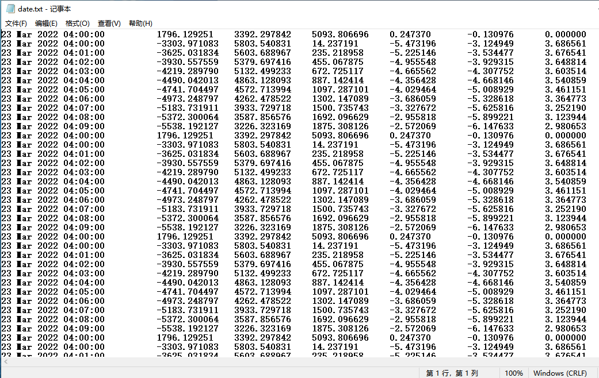
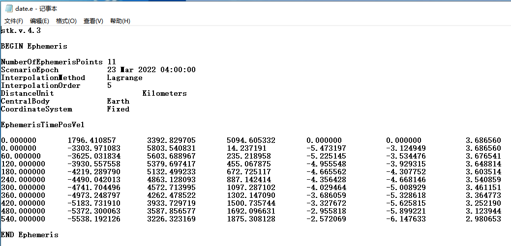
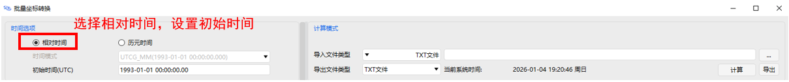
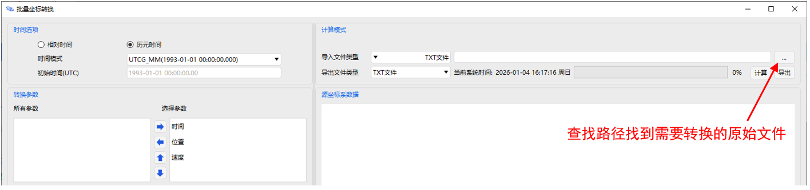
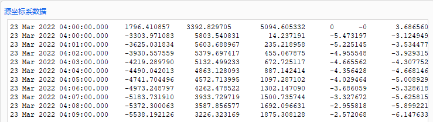
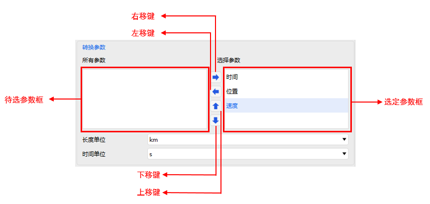
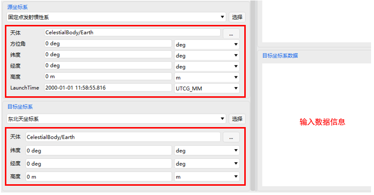
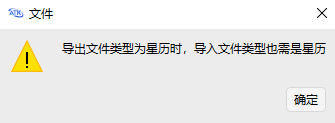

# 批量坐标转换工具  

## 功能介绍

批量坐标转换工具（以下简称 Crdn）主要用于进行不同坐标系下数据文件的批量坐标转换功能。

主要功能包括：

（1）实现包括地球 天体固连系，地球 J2000历元地球平赤道系，组装系统，东北天坐标系，固定点发射坐标系，固定点发射惯性系等坐标系之间数据的批量坐标转换。

（2）适应灵活的输入格式，包括空格、逗号、分号等间隔，数据顺序、数据项内容可定制。

（3）输入、输出数据文件可选择为 txt 或星历格式。

### 功能位置

打开主界面，点击任务栏中的【工具】，即可找到【批量坐标转换工具】。（下包含旧版批量坐标转换）

### 界面介绍

批量坐标转换界面从左到右依次是时间选择区、转换参数区、源坐标系区、目标坐标系区、计算模式区、源坐标系数据区、目标坐标系数据区。具体功能如下表所示。

批量坐标转换页面区域功能

| 区域             | 功能                                         |
| ---------------- | -------------------------------------------- |
| 时间选项区       | 选择数据的参考历元，包含协调世界时与相对时间 |
| 计算模式区       | 选择导入、导出文件格式，txt 或星历文件       |
| 转换参数区       | 选择被指定转换的数据，一般为位置、速度与时间 |
| 源坐标系区       | 与导入批量数据的坐标系对应                   |
| 源坐标系数据区   | 与导入的批量数据对应                         |
| 目标坐标系区     | 与导出批量数据的坐标系对应                   |
| 目标坐标系数据区 | 与导出的批量数据对应                         |

在 ATK 的批量坐标转换中，txt 文件与星历文件（.e）内容格式如表、图所示。

坐标转换数据格式

| 数据格式 | 时间（单位）             | 状态量（单位） | 状态量（单位）   |
| -------- | ------------------------ | -------------- | ---------------- |
| TXT      | UTC（日-月-年-时-分-秒） | 位置矢量（km） | 速度矢量（km/s） |
| 星历     | 相对时间（秒）           | 位置矢量（km） | 速度矢量（km/s） |

 

导出的星历文件的表头说明如下表所示。

星历文件表头说明

| 表头               | 说明                 |
| ------------------ | -------------------- |
| STK 星历格式版本号 | stk.v.x.x            |
| 转换数据数量       | 11                   |
| 仿真场景时间       | 22 Mar 2022 04:00:00 |
| 插值方法           | 勒让德               |
| 插值展开阶数       | 5 阶                 |
| 距离单位           | km                   |
| 中心天体           | 地球                 |
| 坐标系类型         | 地固系               |

## 使用方法

### 选择时间模式

根据导入数据的时间信息，在**时间选项区**选择对应时间模式。

（1）设置初始时间，默认选择为【历元时间】，此时“初始时间(UTC)”为灰色不可编辑状态，导入的 txt 文档中时间信息应为“年-月-日 时-分-秒”。

（2）选择相对时间时，则“初始时间(UTC)”为可输入状态。文档中可输入时间数据信息，计算时将直接采用界面输入的初始时间框中的数据。此时， txt 文档中时间信息即为相对时间量，单位为秒，星历文件则直接默认为相对时间模式，初始时间信息直接从星历文件中获取。

### 导入要转换的数据

（1）选择导入数据类型。导入数据可以为 txt 或星历文件。界面数据根据星历文件配置自动读取，时间选项自动勾选【历元时间】，选取相应的源坐标系和目标坐标系。

（2）点击【…】按钮查找路径找到需要转换的原始文件，并导入。（注意，导入数据中的时间应与软件中时间模式相一致，传入数据的单位应一致为米或千米）。

（3）找到需要转换的数据文档所在路径，点击【打开】按钮。

（4）导入后的信息会显示到“源坐标系数据”框内。（注意文档中应包括参数的时间、坐标等相关信息）。

### 选择转换参数

转换参数区左侧为可供选择的参数类型，而右侧为选择好的参数类型。右侧默认选择了时间、位置、速度作为转换参数。（注意右侧框的参数项目的顺序应与对应输入数据的格式位置相对应，否则计算数据将会出现错误）。

### 坐标参数的参考系选择

（1）源坐标参数区的源坐标系可选项有：地球 天体固连系，地球 J2000历元地球平赤道系，组装系统，东北天坐标系，固定点发射坐标系，固定点发射惯性系。

（2）目标坐标系参数区的目标坐标系可选项有：地球 天体固连系，地球 J2000历元地球平赤道系，组装系统，东北天坐标系，固定点发射坐标系，固定点发射惯性系。

注意：当两个坐标系选定后，才会弹出相应参数输入框。如选择**固定点发射惯性系**
1、发射时间应该按选定的时间模式来输入数据。
2、发射经度和测控经度限定了 **+-180°** 以内的输入，超出数据无法输入。
3、发射纬度和测控纬度都是限定了 **+-90°** 以内的输入，超出数据无法输入。
4、发射点高度，测控点高度限定为 0 以上正实数

### 开始转换

输入数据，完成参数的选择、坐标系的选择填写后，点击【计算】按钮。目标坐标系数据区显示计算结果。

如未计算成功，会弹出相应提示信息。根据提示信息，可以查找错误产生的原因。

### 导出结果

（1）导出数据并保存相应格式文件。（根据选择的输出的.e 和.txt 格式类型来保存文件）

注意：选择【导出文件类型】为“星历文件”时，则转换前导入文件必须是星历文件，否则不可导出。

（2）输入数据，完成参数的选择、坐标系的选择填写后，点击【计算】。待转换的数据区会显示计算出的结果。然后选择导出到指定位置进行保存。

[批量坐标转换案例](../02-案例教程/5-批量坐标转换案例.md)