# 星座设计工具

## 功能介绍

星座设计模块可根据“种子”卫星在场景中添加 Walker 构型星座、玫瑰星座和花星座等。

## 功能位置

该功能位于 ATK 工具栏目中，具体打开位置如图所示。

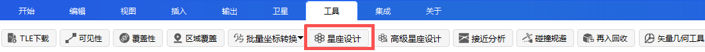

## 界面介绍

包括种子卫星参数设置区（左侧）和生成星座卫星列表展示区域（右侧），如图所示。

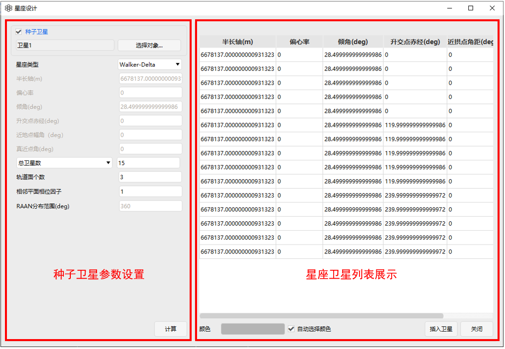

## 使用方法

### 创建场景

首先在 <kbd>开始</kbd> 中点击 <kbd>新建</kbd> ，创建场景，如图所示。

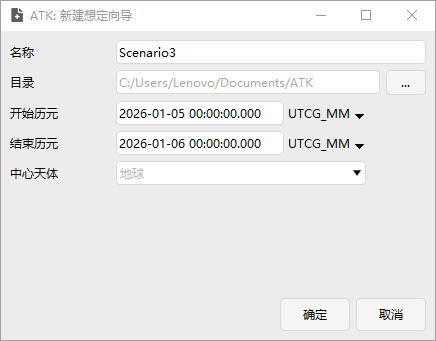

### 在场景中添加卫星

在场景中添加一颗卫星作为“种子”卫星，点击 <kbd>插入</kbd> ，选择 **卫星-插入默认类型** ，点击右下方 <kbd>插入...</kbd> ，如图所示。

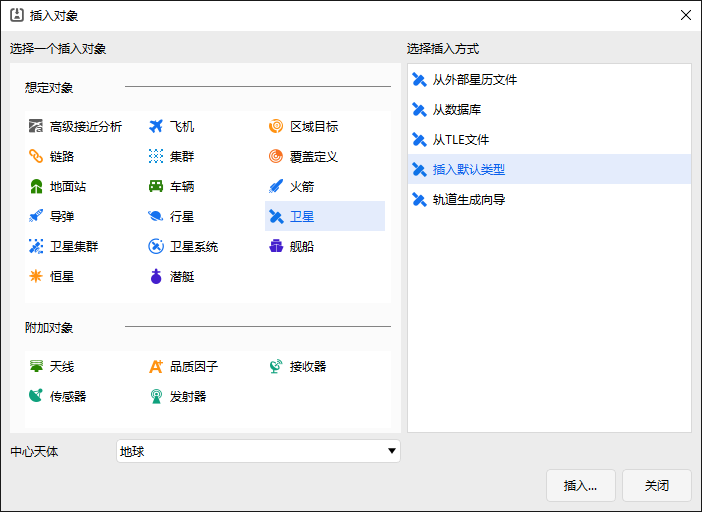

场景中如图所示。

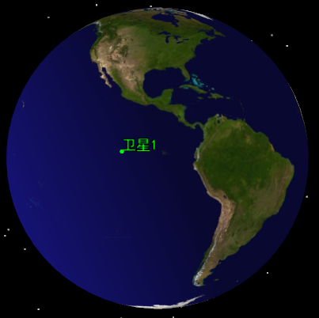

### 设置星座参数

在顶部工具栏 <kbd>工具</kbd> 中选择 <kbd>星座设计</kbd> ，如图所示。

勾选左上方【种子卫星】，点击 <kbd>选择对象...</kbd> 后选择上步插入的【种子卫星】，点击 <kbd>确定</kbd> 后，刚刚创建的卫星1参数展示在窗口左侧区域，如图所示。

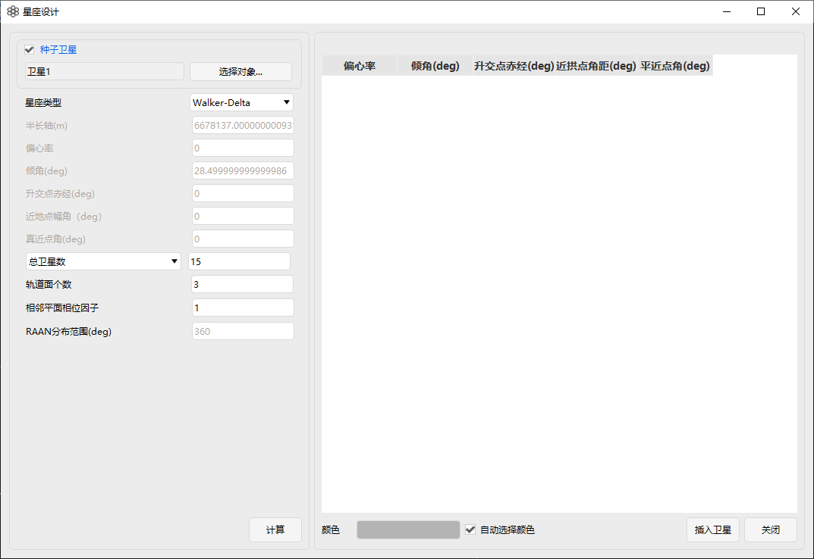

如不勾选【种子卫星】，则可以直接在左侧区域设置种子卫星参数，如图所示。

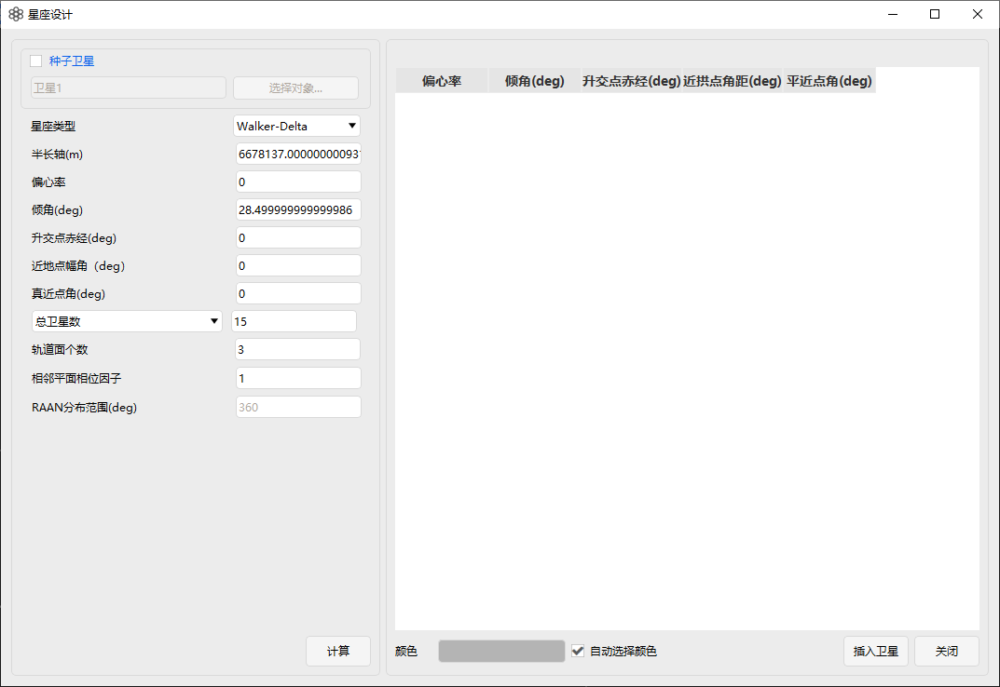

### 创建星座

在【星座类型列表】可以选择如图所示星座构型。

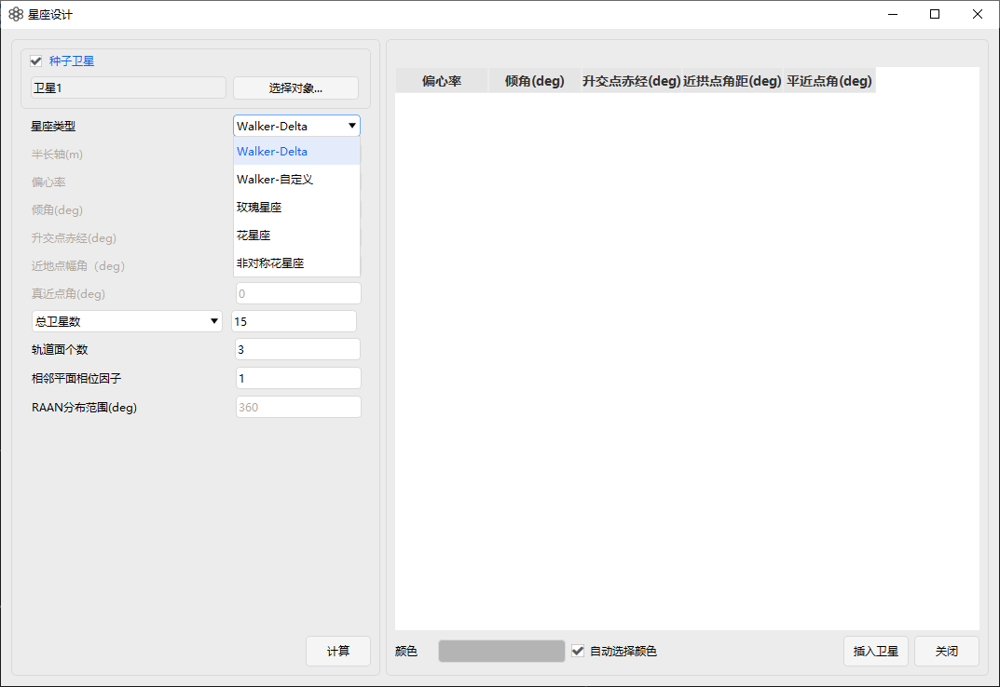

确定星座类型后（以Walker星座为例），输入下方星座参数，如总卫星数/每个轨道面内卫星个数、轨道面个数、相邻平面相位因子、RAAN 分布范围，点击 <kbd>计算</kbd> ，右侧列表出现星座所有卫星参数，如图所示。

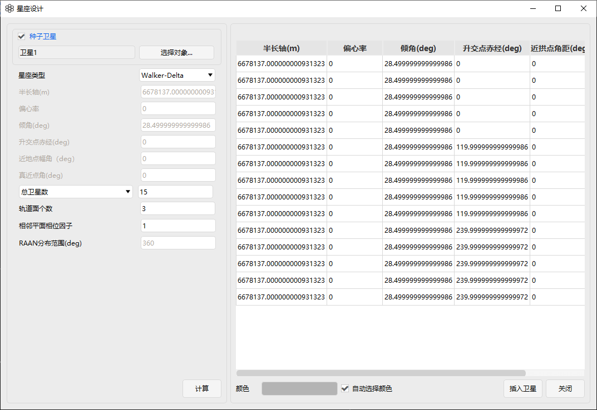

点击 <kbd>插入卫星</kbd> ，星座创建完成，如图所示。

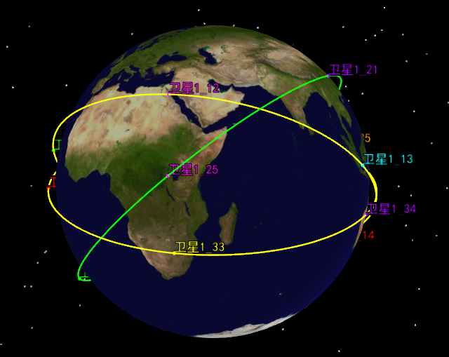

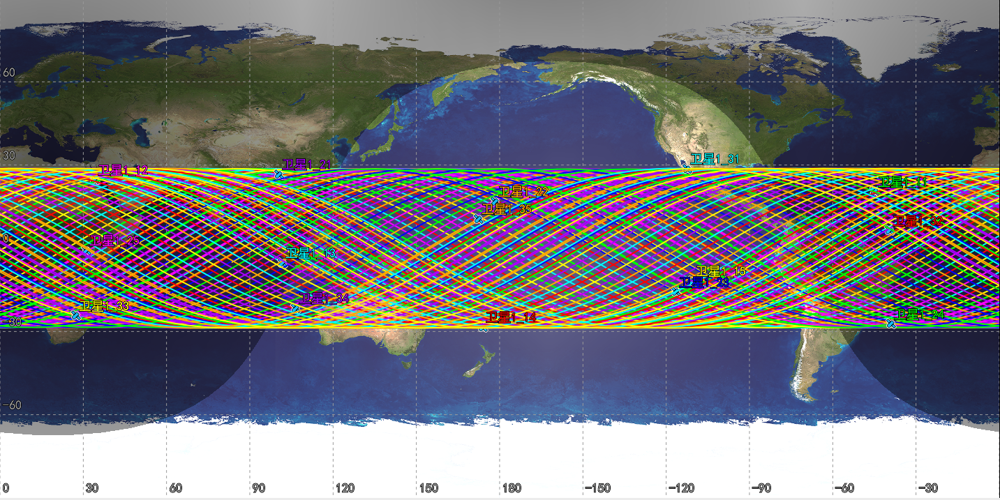
