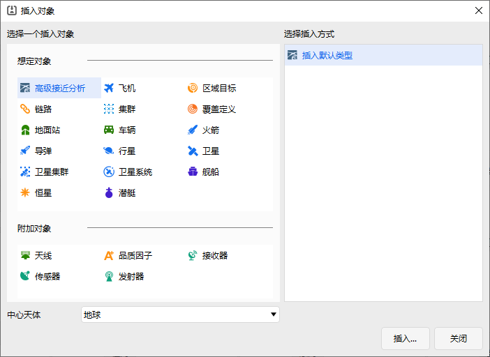
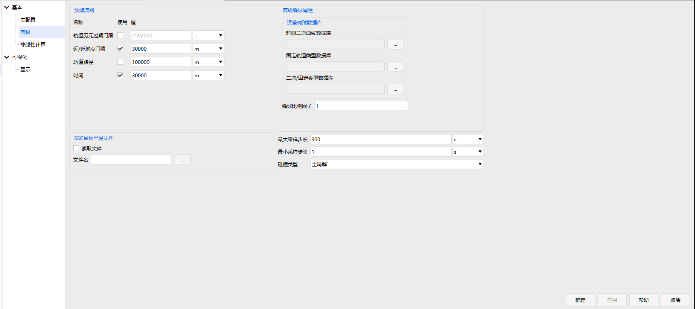

# Advanced Close Approach Analysis

## Functional Description

The Advanced Close Approach Analysis module is a further extension of the Close Approach Analysis tool. It adds the computation of risk metrics such as ellipsoid separation and collision probability, taking orbital uncertainties into account, and supports more flexible selection of primary and secondary targets for many‑to‑many analyses. After applying user‑selected filters, the module performs close approach analysis between primary targets (e.g., satellites owned or monitored by the user) and secondary targets (objects with potential collision risk), and outputs results under different risk metrics.

### Function Location

The Advanced Close Approach Analysis is integrated into the software as an object. Select **Advanced Close Approach** when inserting an object. The specific location is shown in the figure.

## Interface Introduction

### Main Configuration Interface

The interface includes the analysis period, primary target list, secondary target list, threshold settings, toggle for using range measure, compute button, and report display button, as shown below.

**Analysis Period**: The time interval for the analysis. By default, **Use Scenario Interval** is checked. When unchecked, the start and stop epochs can be set manually.

**Primary Target List**:

- The left panel is the display list. When the type is Satellite, it shows all satellite objects in the scenario. When the type is Library Target, it shows the added library target files (typically TLE files). Click the Add button to select files to add.
- The right panel is the selected list, i.e., the primary targets for the analysis. It includes the error ellipsoid type, three axis lengths, and hard‑body radius. The error ellipsoid type is a drop‑down list with options: "Fixed", "Orbit Class", "Quadratic", "Quad/Orbit", "Covariance".
- Below is the error ellipsoid information setting for the target, including the three axis lengths and the type.

Select a target on the left, click the right arrow, and the target along with the ellipsoid information set below will appear on the right.

**Secondary Target List**: Similar to the primary target list.

**Threshold**: The distance constraint between the error ellipsoids of the primary and secondary targets. When the distance between the primary and secondary error ellipsoids falls below this threshold, a close approach event is recorded.

**Use Range Measure**: When checked, the relative distance between the two objects, rather than the ellipsoid separation, is used as the criterion for close approach analysis.

**Compute**: Click this button to execute the analysis computation.

**Report**: Click this button to view data‑related reports.

### Advanced Interface

The interface includes pre‑filters, advanced ellipsoid properties, SSC hard‑body radius file, and sampling settings, as shown below.

**Pre‑Filters**: The filter settings, which are the same as those in the [Close Approach Analysis Tool](../5.专业使用指南/07-接近分析.md) for the analytical method.

**Advanced Ellipsoid Properties**: Here you can add the corresponding error ellipsoid data files and set the ellipsoid scaling factor.

**SSC Hard Body Radius File**: After checking **Use File**, select the corresponding file containing the hard‑body radii of space objects.

**Sampling Settings**: Sets the internal sampling step sizes and the corresponding conjunction type. Different conjunction types will show different results in custom reports.

### Nonlinear Computation Interface

The interface includes the Advanced Close Approach Analysis compute button, results display, parameter settings, and nonlinear computation, as shown below.

**Advanced Close Approach Analysis**: This button is active only when no analysis computation has been performed. Its effect is the same as the Compute button in the main configuration interface.

**Results Display**: This section shows the close approach events, dilution threshold, and maximum collision probability. The close approach events table has three columns: the primary target, the secondary target with collision risk relative to the selected primary, and the time of closest approach between the selected primary and secondary.

**Parameter Settings**: A total of seven parameters related to the linearity test and collision probability computation below.

**Nonlinear Computation**: Includes two parts: Linear Test and Nonlinear Collision Probability computation.

- **Compute Linearity Test**: Clicking this button will provide a linear/nonlinear judgment based on a comparison of relative velocities.
- **Compute Prob (Cylinders)**: Computes the collision probability using the Cylinders method under the long‑term encounter model.
- **Compute Prob (Bundles)**: Computes the collision probability using the Bundles method under the long‑term encounter model.

### Display Interface

The interface is shown below.

### Reports

Reports can be obtained from the following two places:

- (1) On the main configuration interface, click **Report** to view.
- (2) In the menu bar → **Output** → **Data Report** for custom report viewing.

[Advanced Close Approach Analysis Case Study](../02-案例教程/17-高级接近分析案例.md)