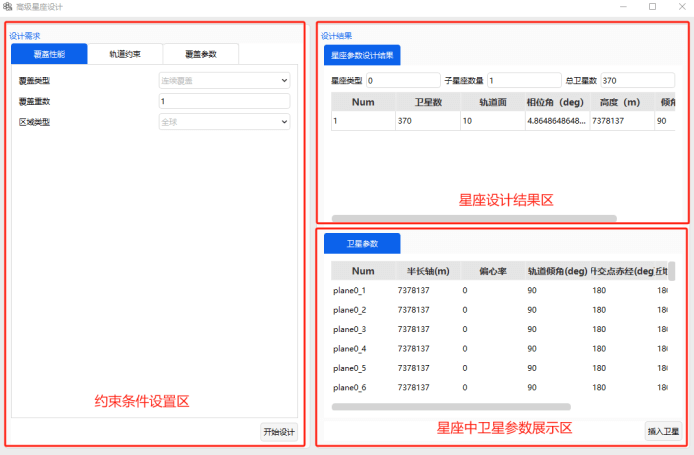
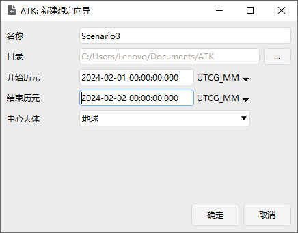
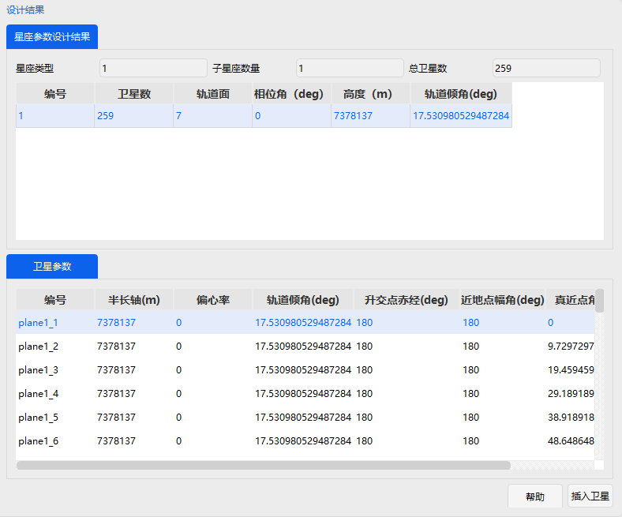
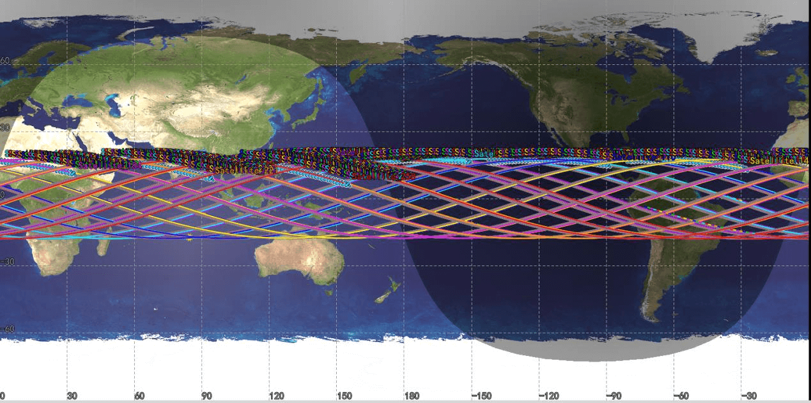

# Advanced Constellation Design Module

## Functional Description

The Advanced Constellation Design module is used to automatically design a Walker constellation that meets specified regional coverage requirements, based on user‑defined coverage needs and orbital constraints. Users can set the coverage region, coverage multiplicity, sensor field of view, and some orbital parameter constraints. The system then generates recommended constellation configuration parameters based on these inputs, and the generated satellites can be directly inserted into the current scenario for 3D visualization and further analysis.

This module is suitable for the following tasks:

- Regional continuous coverage constellation design.
- Constellation design for specified latitude bands.
- Constellation design for local regions or ground points.
- Preliminary Walker constellation configuration generation.
- Rapid scheme design before constellation coverage performance analysis.

Compared with manually setting orbital parameters, the Advanced Constellation Design module can automatically derive key parameters such as the number of satellites, number of orbital planes, orbital altitude, inclination, and phasing based on coverage requirements, improving the efficiency of constellation scheme design.

### Function Location

This function is located in the ATK Tools menu. The specific location is shown in the figure below.

### Interface Introduction

The interface consists of three areas: **Design Requirements**, **Design Result**, and **Satellite Parameters**, as shown below.

## How to Use

### Create a Scenario

First, click <kbd>New</kbd> under the <kbd>Home</kbd> tab to create a scenario, as shown below.

### Design the Constellation

Click **Advanced Constellation Design** from the **Tools** menu. The pop‑up window is shown below.

The design requirements are divided into three parts: **Coverage Requirement**, **Orbit Constraints**, and **Coverage Parameters**.

**Coverage Requirement**: The coverage type is **Continuous Coverage**. The coverage multiplicity is set by the user. The region types available are: Global, Latitude Band, Region, and Ground Point.

In this example, the coverage multiplicity is set to 2, the region type is Latitude Band, and the latitude range is ‑20 to 20 degrees, as shown below.

**Orbit Constraints**: These constrain some of the constellation satellite parameters, including the semimajor axis range, RAAN range, and argument of perigee range. The constellation type currently supports only **Walker‑Delta**. This example uses the default settings, as shown below.

**Coverage Parameters**: Includes three types: **Simple Cone**, **Ground Elevation Angle**, and **Rectangular**.

| Coverage Parameter Type | Parameters to Set | Meaning |
|---|---|---|
| Simple Cone | Cone Half‑Angle | Describes the half‑angle of the satellite payload coverage cone, used to approximate the circular coverage footprint of a single satellite. |
| Ground Elevation Angle | Minimum Value | Describes the minimum allowed elevation angle for a ground target observing the satellite; coverage is considered not satisfied below this angle. |
| Rectangular | Horizontal Half‑Angle, Vertical Half‑Angle | Describes the half‑angle extents of the payload field of view in the horizontal and vertical directions, representing a rectangular coverage model. |

This example selects **Simple Cone** with a **Cone Half‑Angle** of 45 degrees.

Click <kbd>Start Design</kbd>. The constellation design results appear on the right side of the window, including: number of satellites, number of orbital planes, phasing angle, orbital altitude, and inclination. Below that are the detailed parameters for each satellite.

Select all generated satellites in the lower right area, then click the <kbd>Insert Satellites</kbd> button below. The system will insert the design results into the current scenario. After insertion, the constellation configuration can be viewed in the 3D and 2D windows.

## Output Description

After inserting the satellites, the corresponding satellite objects should appear in the object tree on the left. Users can view, edit, or delete these satellites in the object tree. Users should be able to see the following in the view windows:

- 3D spatial distribution of the Walker constellation.
- Arrangement of multiple orbital planes.
- Phase distribution of satellites within each orbital plane.
- Ground tracks or coverage distribution on the 2D map.
- Coverage relationship of the constellation with the specified latitude band.

The 3D view is mainly used to check whether the constellation orbital configuration is reasonable. The 2D view is mainly used to observe the ground coverage effect of the constellation over the target area.

[Advanced Constellation Design Case Study](../02-案例教程/14-高级星座设计案例.md)