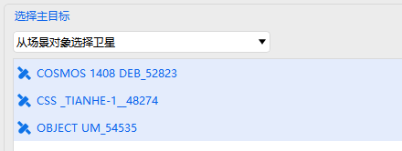
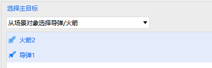
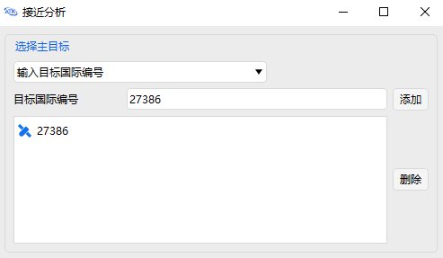
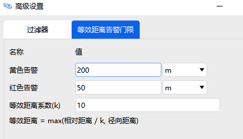

# Close Approach Analysis Tool

## Functional Description

The Close Approach Analysis tool enables analysis and assessment of the probability of a space object approaching other objects, providing information such as the time of closest approach and the corresponding relative position and velocity. Close approach analysis has become an important part of mission analysis.

## Function Location

ATK's Close Approach Analysis tool can analyze the close approach parameters between spacecraft and targets. This function is located in the **ATK Menu → Tools** section. The specific location is shown in the figure below.

## Interface Introduction

### Main Interface

The main interface includes primary target selection, target database selection, excluded SSC number list settings, simulation time settings, close approach constraint settings, and provides the <kbd>Advanced Settings</kbd> button, <kbd>Compute</kbd> button, and <kbd>Results</kbd> display button. The interface is described in the table below.

| Main Interface Option | Meaning |
| :---------------: | :----------------------------------------------------------: |
| Select Primary Target | Primary targets can be from either simulation scenario objects or TLE databases:       |
| Target TLE Database | TLE database files owned by the user or available in ATK, in the format:       |
| Excluded SSC Numbers | Used to exclude specific international satellite IDs from the TLE target database. |
| Simulation Time | Option to use the scenario interval. When unchecked, set the start and stop epochs separately. Default format is UTCG_MM:  |
| Close Approach Constraint | Relative distance constraint between the target spacecraft and the tracking spacecraft. |
| Advanced Settings | Includes filter constraints and equivalent distance alert thresholds. |

### Select Primary Target

There are multiple ways to select the close approach analysis object, switchable via the dropdown menu in the analysis object area of the main interface. Selection methods include:

#### Select Satellite from Scenario Objects

Supports multiple satellite selection:

#### Select Missile/LaunchVehicle from Scenario Objects

Supports multiple target selection:

#### Input Object SSC Number

First, select the target TLE database, then enter the object SSC number in the input box and click the <kbd>Add</kbd> button to add it. To delete an object from the list, click to select it and click the <kbd>Remove</kbd> button.

#### Enumerate All Catalog Objects

Select the target TLE database, and the computation will traverse all objects in the database for analysis.

### Excluded SSC Numbers

On the main interface, click the <kbd>Settings...</kbd> button next to **Excluded SSC Numbers** to open the settings dialog.

After opening the **Excluded Objects** dialog, you can add, delete, and view items.

::: warning Notes on Excluded Objects
**Excluded SSC Numbers** will exclude all corresponding primary and secondary targets from the analysis results. If the analysis result is empty, please check whether all primary targets have been excluded.
:::

### Advanced Settings Interface

Click the <kbd>Advanced Settings</kbd> button on the main interface. The **Advanced Settings** dialog includes **Filters** and **Equivalent Distance Alert Thresholds**.

#### Filters

The **Method** options under Filters include **Analytical Method** and **Numerical Method**. The specific settings are described in the table below.

| Setting Item | Meaning |
| :----------------: | :----------------------------------------------------------: |
| Max Element Set Age | Indicates the valid time range for object flight data. Events beyond this threshold are considered unreliable. |
| Apogee/Perigee Pad | The difference between apogee and perigee of the object must not exceed this threshold. |
| Orbit Path Filter Pad | The minimum distance between the two orbits must not exceed this threshold. |
| Time Filter Pad | The distance of the object's position from the other target's orbital plane must not exceed this threshold. |
| Simulation Step Size | The simulation step size for close approach analysis. |

Note that due to the orbital characteristics of rockets and missiles, the **Orbit Path Filter Pad** and **Time Filter Pad** settings are not applicable to them.

#### Equivalent Distance Alert Thresholds

Equivalent distance alert threshold settings: when the equivalent distance is less than the yellow alert threshold, the result is marked in yellow; when less than the red alert threshold, it is marked in red. **Equivalent distance** is defined as the larger value between the weighted relative distance and the radial distance, as shown in the figure below.

### Results Interface

Click the <kbd>Compute</kbd> button to output the computation results.

| Output Parameter | Parameter Description | Unit |
| :------: | :--------------------------: | :---------------: |
| Primary Target | Target spacecraft | |
| Secondary Target | Close approach space object | SSC |
| Time of Close Approach | Coordinated Universal Time (UTC) | YYYY-MM-DD-HH-MM-SS |
| Time In | Coordinated Universal Time (UTC) | YYYY-MM-DD-HH-MM-SS |
| Time Out | Coordinated Universal Time (UTC) | YYYY-MM-DD-HH-MM-SS |
| Equivalent Distance | Weighted close approach distance | km |
| Miss Distance | Relative distance | km |
| R-Dist | Radial distance (LVLH x‑axis) | km |
| T-Dist | Transverse distance (LVLH y‑axis) | km |
| N-Dist | Normal distance (LVLH z‑axis) | km |
| Close Approach Angle | Angle between the velocity vectors of the two objects at closest approach | deg |
| Relative Velocity | Relative velocity difference in the ICS frame | km/s |

On the **Close Approach Analysis** page, click the <kbd>Results…</kbd> button to reopen the results display interface.

[Close Approach Analysis Case Study](../02-案例教程/6-接近分析案例.md)