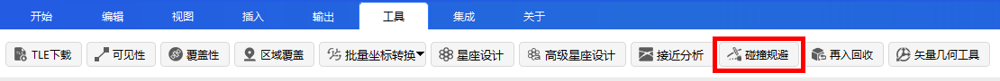
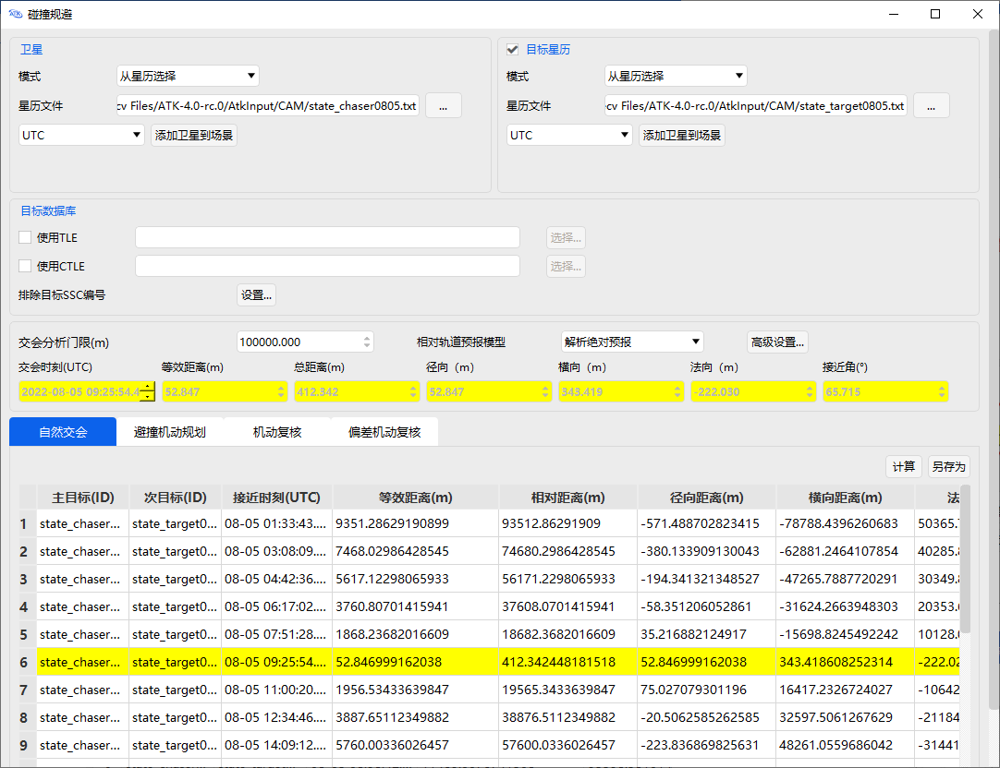
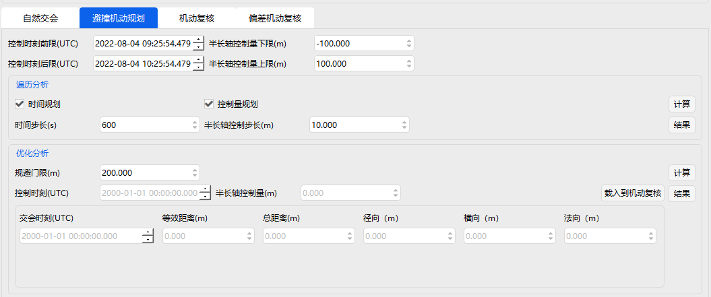
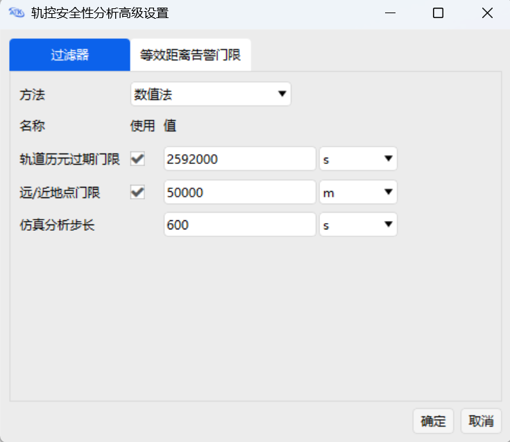
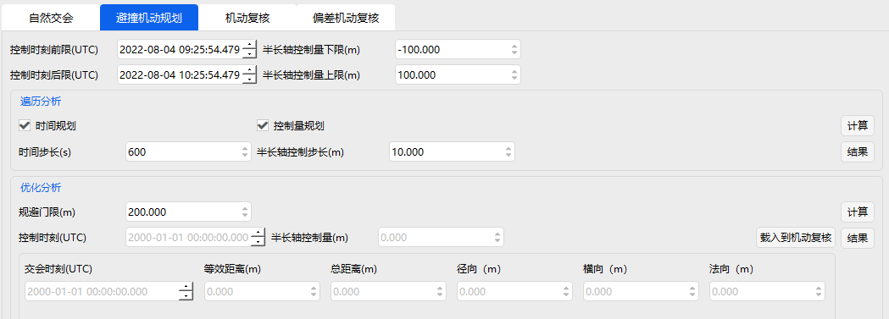
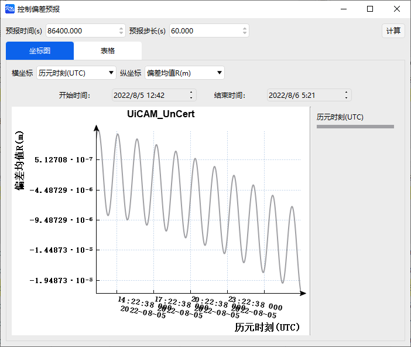
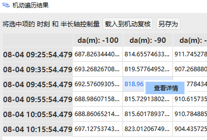
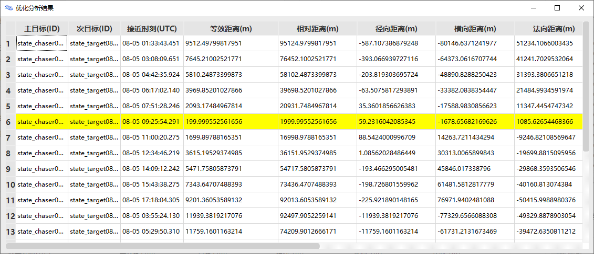

# Collision Avoidance Tool

## Functional Description

(1) After completing the collision avoidance data setup between spacecraft and space objects or other target catalogs, select the Close Approach Analysis interface to compute all data results between the primary and secondary targets under the constraints of the conjunction analysis threshold.

(2) Based on all data results from the close approach analysis and the spacecraft tracking and control plan, perform collision avoidance maneuver planning analysis. This function provides both enumeration and optimization analysis algorithms.

(3) Based on the results of the collision avoidance maneuver planning analysis, use the Maneuver Verification function to validate the correctness of the data results, ensuring the safety and reliability of the collision avoidance maneuver.

## Function Location

This function is located in the **ATK Menu → Tools** section. The specific location is shown in the figure below.

## Interface Introduction

### Main Interface

The main interface includes various basic settings (satellite, target ephemeris, target database, etc.), advanced settings, conjunction data table display, Close Approach Analysis module, Collision Avoidance Maneuver Planning module, Maneuver Verification module, Uncertainty Maneuver Verification module, and results display area. The interface is shown below.

The parameters and their definitions in the table header of the module interface are as follows:

**Time of Close Approach:** The UTC time corresponding to the minimum equivalent distance among all data computed in the **Close Approach Analysis** interface that is less than the set conjunction analysis threshold.

**Equivalent Distance:** Due to the fact that orbit propagation errors are larger in the tangential direction and smaller in the radial direction, the assessment of collision risk and avoidance effectiveness requires comprehensive consideration of both the closest approach distance $d_k$ and the radial distance $R_k$. The equivalent distance metric is defined as follows:

$$
s_{k}=\max \left(\frac{d_{k}}{10},\left|R_{k}\right|\right)
$$

A smaller $s_k$ indicates higher collision risk, while a larger $s_k$ indicates better avoidance effectiveness.

**Minimum Equivalent Distance:** Analyzes the equivalent distances $s_k$ of successive close approaches to determine the minimum equivalent distance $s^*$:

$$
s^{*}=\min \left(s_{k}\right), \quad k=1,2,3, \ldots
$$

**Relative Distance:** The magnitude of the relative position vector between two space objects.

**Radial Distance $R$:** Refers to the radial distance between the spacecraft and the space object corresponding to the minimum equivalent distance during close approach analysis (corresponding to the X direction in the LVLH coordinate system).

**Transverse Distance $T$:** Refers to the transverse distance between the spacecraft and the space object corresponding to the minimum equivalent distance during close approach analysis (corresponding to the Y direction in the LVLH coordinate system).

**Normal Distance $N$:** Refers to the normal distance between the spacecraft and the space object corresponding to the minimum equivalent distance during close approach analysis (corresponding to the Z direction in the LVLH coordinate system).

**Close Approach Angle:** Refers to the close approach angle between the spacecraft and the space object corresponding to the minimum equivalent distance during close approach analysis.

**Relative Velocity:** Refers to the relative velocity between the spacecraft and the space object corresponding to the minimum equivalent distance during close approach analysis.

### Close Approach Analysis Module Interface

After completing the configuration of spacecraft and space object data and screening avoidance conditions on the **Main Interface**, click the **Close Approach Analysis** button to enter the **Close Approach Analysis** module interface. Then click the **Compute** button to obtain the time and distance information corresponding to each close approach between the primary and secondary targets:

1) Yellow‑highlighted rows correspond to data where the equivalent distance is less than the software‑set value of 200 m, showing the corresponding time of close approach, equivalent distance, relative distance, radial distance, transverse distance, normal distance, close approach angle, and relative velocity.

2) Red‑highlighted rows correspond to data where the equivalent distance is less than the software‑set value of 50 m, showing the corresponding time of close approach, equivalent distance, relative distance, radial distance, transverse distance, normal distance, close approach angle, and relative velocity.

3) Enter the desired conjunction analysis threshold in the **Conjunction Threshold (m)** field; the computed results will display only data less than this input value. Clicking a column header in the data table will re‑sort the data in ascending or descending order based on that column.

### Collision Avoidance Maneuver Planning Module Interface

Click the **Collision Avoidance Maneuver Planning** button to enter the **Collision Avoidance Maneuver Planning** module interface.

The "Control Time Bounds" parameters are determined based on the spacecraft tracking and control plan and the close approach analysis time corresponding to the most recent minimum equivalent distance. The "Semimajor Axis Control Bounds" parameters are determined based on the spacecraft platform maneuver capability constraints and orbit maintenance constraints.

### Maneuver Verification Module Interface

Click the **Maneuver Verification** button to enter the **Maneuver Verification** module interface.

To use it: in the **Collision Avoidance Maneuver Planning** module interface, load the numerical results computed by the **Enumeration** or **Optimization** method into the **Maneuver Verification** module interface via the **Load to Maneuver Verification** button, thereby verifying whether the input control time and semimajor axis control value constitute a feasible avoidance control strategy.

If there are no yellow or red highlights, the corresponding control strategy satisfies the collision avoidance maneuver requirements within multiple‑revolution encounters, effectively improving the maneuver avoidance effectiveness.

### Uncertainty Maneuver Verification Module Interface

Click the **Uncertainty Maneuver Verification** button to enter the **Uncertainty Maneuver Verification** module interface.

During orbit propagation, initial uncertainties diverge as the orbit model is extrapolated, and their propagation characteristics and trends vary depending on the orbit type. This step uses nonlinear uncertainty propagation methods to obtain the corresponding uncertainty tubes through the propagation of orbital mean and covariance. Maneuver verification that accounts for uncertainties refines the collision avoidance assessment and effectively improves the orbital safety evaluation.

To use it: in the **Collision Avoidance Maneuver Planning** module interface, load the numerical results computed by the **Enumeration** or **Optimization** method into the **Uncertainty Maneuver Verification** module interface via the **Load to Maneuver Verification** button, thereby verifying whether the input control time, semimajor axis control value, and semimajor axis standard deviation constitute a feasible avoidance control strategy.

If there are no yellow or red highlights, the corresponding control strategy satisfies the collision avoidance maneuver requirements within multiple‑revolution encounters, effectively improving the maneuver avoidance effectiveness.

### Excluded SSC Numbers Interface

On the **Main Interface**, click the **Excluded SSC Numbers → Settings...** button to open the corresponding settings interface. Enter the excluded SSC number and click **Add** to add it to the list, then click **OK** to save. The SSC number is a five‑digit international space object identifier. When an exclusion is no longer needed, select the previously saved SSC number in the list, click the **Remove** button, and then click **OK** to save.

### Advanced Settings Interface

Click the **Advanced Settings…** button to enter the **Advanced Settings** interface.

1) **Max Element Set Age:**

When the difference between the close approach analysis time and the initial ephemeris epoch of the space object exceeds the set Max Element Set Age threshold, the software determines that further computation is unnecessary and stops the analysis. The default is 2592000 seconds (30 days).

2) **Apogee/Perigee Pad:**

Before performing close approach analysis, a screening process is required to quickly exclude objects whose orbits cannot possibly approach the spacecraft of interest. The Apogee/Perigee Pad is a commonly used screening method, with a default value of 50000 m.

3) **Simulation Step Size:**

Sets the unit time step for the software's simulation analysis. The default value is 600 seconds.

### Enumeration Analysis Results Interface

Click the **Results** button in the **Enumeration** area to view the analysis results.

Enumeration analysis refers to sequentially visiting each node in a tree (or graph) along a search path. The operations performed on each node depend on the specific application; these operations may include checking or updating node values.

Based on requirements, set the **Time Step** and **Semimajor Axis Control Step**, then click the **Compute** button. The software will perform enumeration computations at intervals of the unit time step or unit control step to select the avoidance maneuver control time.

After computation, click the **Results** button to view the **Enumeration** results:

1) The leftmost column of the table is a time sequence ranging from the "Control Time Lower Bound" to the "Control Time Upper Bound" at intervals of the unit time step.

2) The top row of the table is a semimajor axis control sequence ranging from the "Semimajor Axis Control Lower Bound" to the "Semimajor Axis Control Upper Bound" at intervals of the unit control step.

3) The table cells contain the collision avoidance distance corresponding to each time and semimajor axis control value.

After computation, the user can select the time and semimajor axis control value corresponding to a suitable distance result and load it into the **Maneuver Verification** module to ensure collision avoidance safety.

### Optimization Analysis Results Interface

Click the **Results** button in the **Optimization** area to view the analysis results.

Using the control time and semimajor axis control value as optimization variables, this function seeks a strategy that ensures the distance between the spacecraft and the potential collision target exceeds a given **Avoidance Threshold**. The Sequential Quadratic Programming algorithm is used to solve the optimization problem. Based on user requirements, enter the **Avoidance Threshold** value and click the **Compute** button to invoke the optimization algorithm to compute the optimal avoidance maneuver strategy.

After computation, click the **Results** button to view the **Optimization** results. The table columns, in order, display: Primary Target ID, Secondary Target ID, optimized time of close approach, and the corresponding equivalent distance, relative distance, radial distance, transverse distance, normal distance, close approach angle, and relative velocity. Clicking a column header will re‑sort the data in ascending or descending order based on that column.

After computation, the user can select the time and semimajor axis control value corresponding to a suitable distance result and load it into the **Maneuver Verification** module to ensure collision avoidance safety.

### Uncertainty Propagation Interface

Click the **Uncertainty Propagation** button in the **Uncertainty Maneuver Verification** area to open the corresponding settings page.

The **Uncertainty Propagation** page consists of three parts: Propagation Settings, Graph, and Table.

**Propagation Settings:** In this interface, you can set the **Propagation Time** and **Propagation Step**, with defaults of 86400 s and 60 s. Clicking the **Compute** button generates the corresponding graph and table. Resetting the propagation values will regenerate the graph and table.

**Graph:** Based on requirements, select appropriate X and Y axes to view the uncertainty propagation graph. The X‑axis options are: Time (UTC), Mean R, Mean T, Mean N, Std Dev R_3σ, Std Dev T_3σ, Std Dev N_3σ. The Y‑axis options are the same, except that Time (UTC) is not available. The default X‑axis is Time (UTC), ranging from 40 minutes before the control time to 16 hours after. The default Y‑axis is Mean R.

**Table:** Starting from the control time, at each **Propagation Step**, the table displays the corresponding time, Mean R, Mean T, Mean N, sigma R, sigma T, sigma N, Std Dev R_3σ, Std Dev T_3σ, and Std Dev N_3σ.

### Semimajor Axis Deviation Estimation Interface

Click the **Semimajor Axis Deviation Estimation** button in the **Uncertainty Maneuver Verification** area.

For uncertainty‑aware maneuver verification, the semimajor axis deviation is not directly estimated. The semimajor axis standard deviation can be computed using the semimajor axis control deviation estimation function. Click the **Semimajor Axis Deviation Estimation** button, enter the mean and standard deviation of engine thrust, spacecraft mass, burn duration, thrust azimuth, and thrust elevation based on the specific spacecraft's performance, then click the **Compute** button to estimate the semimajor axis deviation.

## How to Use

### Select Satellite Ephemeris File

### Select Target Ephemeris File

### Set Excluded Objects

### Set Conjunction Threshold and Relative Orbit Propagation Model

### Advanced Settings

Use the program defaults for advanced settings.

### Compute

Enter the **Close Approach Analysis** module interface and click the **Compute** button to view the results.

### Enumeration Analysis

Enter the **Collision Avoidance Maneuver Planning** module interface, perform **Enumeration Analysis**, click the **Compute** button, and view the results.

The time and semimajor axis control value corresponding to the selected result can be assigned to the **Maneuver Verification** and **Uncertainty Maneuver Verification** modules.

Select a result to view details.

### Optimization Analysis

Perform **Optimization Analysis**, click the **Compute** button, and view the results.

The time and semimajor axis control value corresponding to the result can be assigned to the **Maneuver Verification** and **Uncertainty Maneuver Verification** modules.

### Maneuver Verification

Enter the **Maneuver Verification** module interface, set the **Control Time** and **Semimajor Axis Control Value**, click the **Compute** button, and view the results.

### Uncertainty Maneuver Verification

Enter the **Uncertainty Maneuver Verification** module interface, set the **Control Time**, **Semimajor Axis Control Value**, and **Semimajor Axis Standard Deviation 3σ**, then click the **Compute** button to view the uncertainty maneuver verification results.

The semimajor axis deviation can be entered manually or obtained via the estimation method.

### Uncertainty Propagation

Click the **Uncertainty Propagation** button to perform uncertainty propagation.

[Collision Avoidance Case Study](../02-案例教程/7-碰撞规避案例.md)