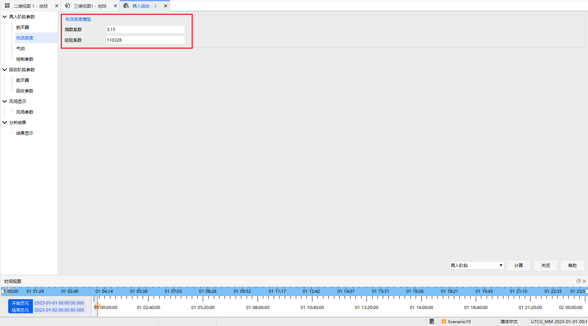
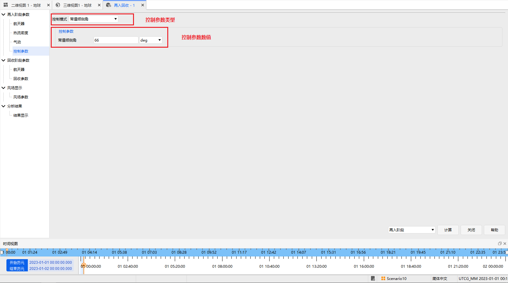
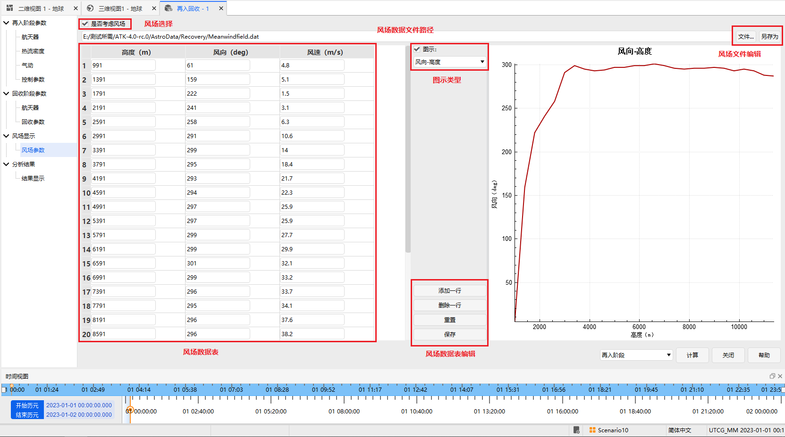
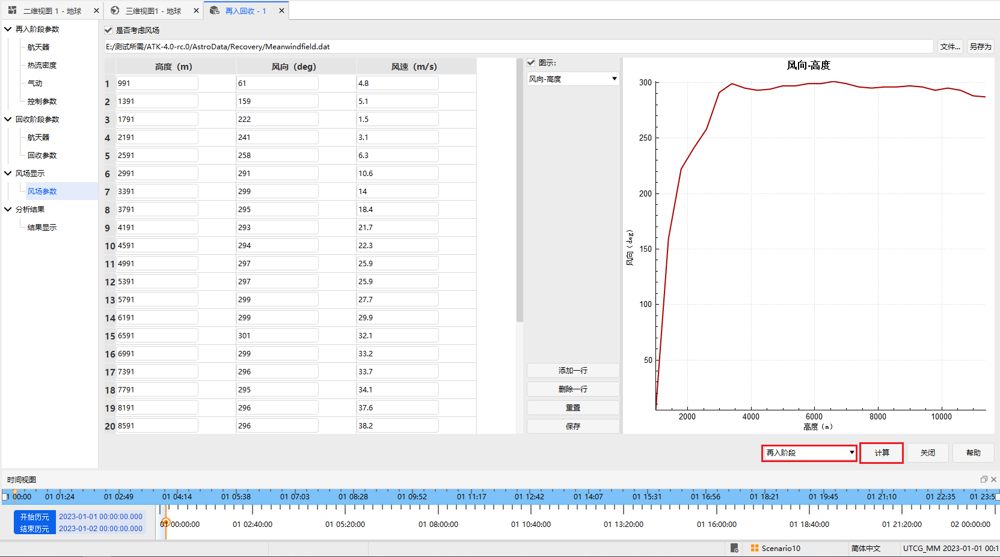
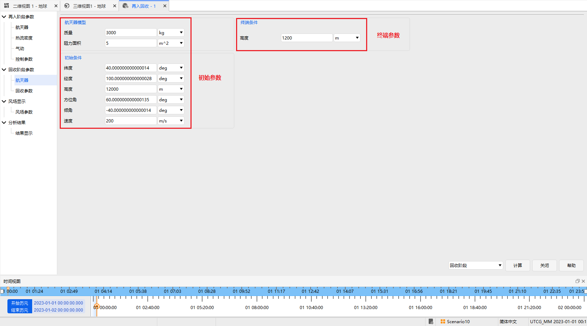
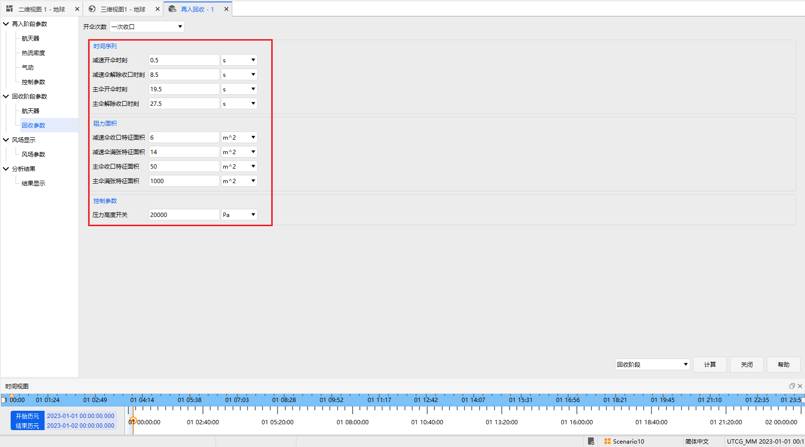
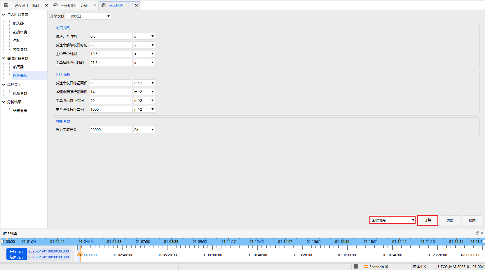
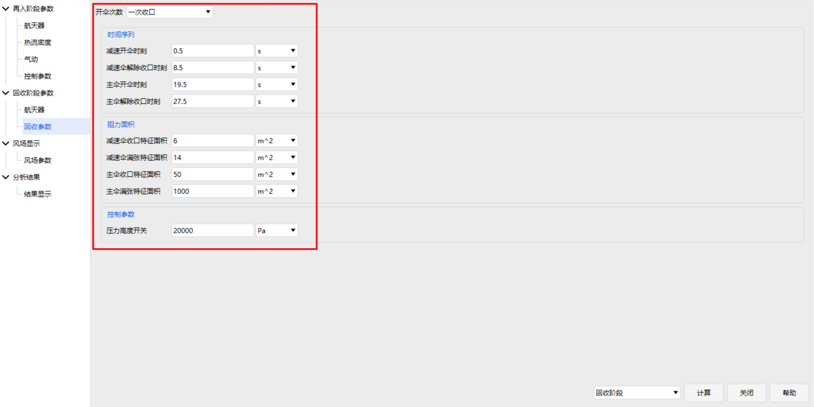

# 再入回收分析

## 功能介绍

再入回收分析模块用于对返回式卫星、载人飞船、返回舱等航天器的再入段和伞降回收段进行飞行动力学仿真分析。模块可分别完成再入阶段飞行仿真、伞降回收阶段飞行仿真，也可进行再入—回收一体化飞行仿真。

该模块可用于分析航天器从高空高速再入大气层到低空开伞回收过程中的轨迹、速度、高度、热流、气动受力、落点位置等关键参数，为再入轨迹设计、返回安全性评估、回收区预测和任务方案验证提供计算支撑。

本模块主要适用于以下场景：

- 返回式卫星再入轨迹仿真；
- 载人飞船返回舱再入与回收过程分析；
- 再入热流与气动环境评估；
- 倾侧角控制对再入轨迹的影响分析；
- 降落伞开伞时序与落点偏差分析；
- 风场影响下的回收区预测。

## 基本概念说明

1. **再入阶段**
    再入阶段是指航天器从高空进入稠密大气层，并在气动力、重力和控制作用下减速下降的飞行过程。该阶段通常具有速度高、热流强、气动环境变化剧烈等特点。

2. **回收阶段**
    回收阶段通常指航天器完成高速再入后，在低空通过降落伞系统进一步减速，并最终下降至指定高度或着陆区域的过程。

3. **再入回收一体化仿真**
    再入回收一体化仿真将再入阶段和伞降回收阶段作为连续过程进行计算。系统先完成再入段仿真，再将再入终端状态作为回收段初始状态，继续完成伞降回收过程仿真。

4. **倾侧角**
    倾侧角是再入飞行控制中的重要参数，通常用于描述航天器升力方向相对于局部垂直平面的偏转角。通过调整倾侧角，可以改变航天器升力方向，从而影响再入航程、横向偏移和落点位置。

    本模块支持两种倾侧角设置方式：

    | 倾侧角模式 | 含义 |
    |---|---|
    | 常值倾侧角 | 再入全过程采用固定倾侧角 |
    | 插值倾侧角 | 根据时间、高度或其他变量通过数据表插值得到变化的倾侧角 |

    常值倾侧角适合快速方案验证；插值倾侧角适合模拟更复杂的再入控制规律。

5. **热流密度**
    热流密度用于描述航天器再入过程中单位面积所承受的气动加热强度。再入速度越高、大气密度越大，热流通常越强。

    热流密度分析可用于评估航天器防热系统设计是否满足要求。模块中的热流计算采用经验模型，用户可通过设置**指数系数**和**经验系数**调整热流计算特性。

6. **气动参数**
    气动参数用于描述航天器在大气飞行过程中受到的阻力和升力特性，主要包括阻力系数和升力系数。

    本模块支持两种气动参数设置方式：

    | 气动模式 | 含义 | 适用场景 |
    |---|---|---|
    | 常值气动 | 阻力系数和升力系数在再入过程中保持不变 | 快速仿真、初步方案评估 |
    | 插值气动 | 阻力系数和升力系数由数据表插值得到 | 精细化仿真、不同马赫数或攻角下气动变化分析 |

    插值气动模式更接近实际飞行过程，但需要用户提供较完整的气动数据表。

7. **风场**
    风场用于描述大气中的风速和风向分布。风场会影响航天器在再入末段和伞降回收阶段的横向漂移，尤其在低空伞降过程中对落点位置影响较大。

    本模块支持两种风场配置方式：

    | 风场配置方式 | 含义 |
    |---|---|
    | 风场文件导入 | 通过替换或加载外部风场文件添加风场数据 |
    | 界面数据表配置 | 在界面中手动配置风场数据表 |

### 功能位置

该功能位于 ATK 工具栏目中，具体打开位置如图所示。

### 界面介绍

本模块分为三部分功能：**再入阶段飞行仿真**、**伞降回收阶段飞行仿真**、**再入回收一体化飞行仿真**。
仿真主界面如图所示。

## 使用方法

### 再入阶段飞行仿真

#### 初始参数设置

配置再入飞行仿真的初始参数，包括：航天器模型参数、再入初始条件、轨道参数、仿真结束高度设置等。
地球引力模式也可选择**圆球模式**或更高精度的**J2项模型**

#### 热流参数设置

配置再入飞行仿真时的热流计算参数：**指数系数**和**经验系数**。

#### 气动参数设置

配置航天器的气动参数，包括**常值气动**和**插值气动**两种模式。常值气动配置时将再入飞行过程中航天器的阻力系数和升力系数设置为常值，如图所示。

插值气动配置时将再入飞行过程中航天器的阻力系数和升力系数配置为可插值的数据表，如下图所示，可通过界面对气动数据表进行添加和删除操作，以适应不同气动参数的航天器再入仿真。

#### 控制参数设置

配置航天器的控制参数，包括**常值倾侧角**和**插值倾侧角**两种模式。常值倾侧角配置时将再入飞行过程中航天器的倾侧角设置为常值，如图所示。

插值倾侧角配置时将再入飞行过程中航天器的倾侧角配置为可插值的数据表，如下图所示，可通过界面对倾侧角数据表进行添加和删除操作，以适应变化倾侧角参数的航天器再入仿真。

#### 风场参数设置

再入飞行仿真可考虑风场的影响，风场可以通过直接替换配置风场文件的形式添加，也可通过界面配置风场数据表，如图所示。

#### 再入仿真模式设置

再入阶段飞行仿真参数配置完毕后，选择界面右下角的再入阶段，点击<kbd>计算</kbd>按钮，如下图所示，即可完成再入飞行阶段的仿真。

#### 再入仿真结果显示

再入飞行计算结果可以通过选择下拉框显示不同参数，可选择显示仿真终点航天器的位置信息，如图所示。

### 回收阶段飞行仿真

#### 初始参数设置

配置回收飞行仿真的初始参数，包括：**航天器模型参数**、**回收初始条件**、**仿真结束高度设置**等，如图所示。

#### 回收参数设置

配置伞降回收阶段的降落伞开伞时序、降落伞阻力特征面积、开伞控制参数等，如图所示。
注意：可以根据需求选择相应的开伞次数：未收口、一次收口、二次收口，并设置相应的参数。

#### 风场参数设置

参考再入阶段飞行仿真风场参数配置。

#### 回收仿真模式设置

回收阶段飞行仿真参数配置完毕后，选择界面右下角的回收阶段，点击<kbd>计算</kbd>按钮，如下图所示，即可完成回收飞行阶段的仿真。

#### 回收仿真结果显示

如图所示，相关设置与再入阶段相同。

 

### 再入回收飞行仿真

#### 再入回收阶段初始参数设置

#### 再入回收阶段回收参数设置

回收阶段只需配置降落伞相关的回收参数，如图所示
**注意**：回收的初始条件是再入的终端条件。

 

#### 再入回收阶段风场参数设置

#### 再入回收仿真模式设置

 

#### 再入回收仿真结果显示

 

## 结果

最终仿真结果以曲线形式展示航天器再入与回收过程中的状态变化，包括高度、纵程、纬度、速度等参数随时间变化的曲线，用于直观分析飞行轨迹、减速过程和回收阶段特性。
