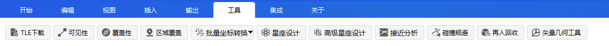
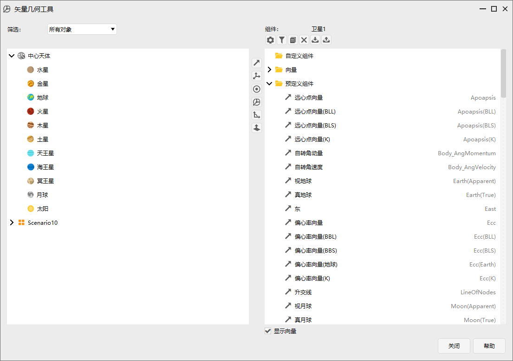
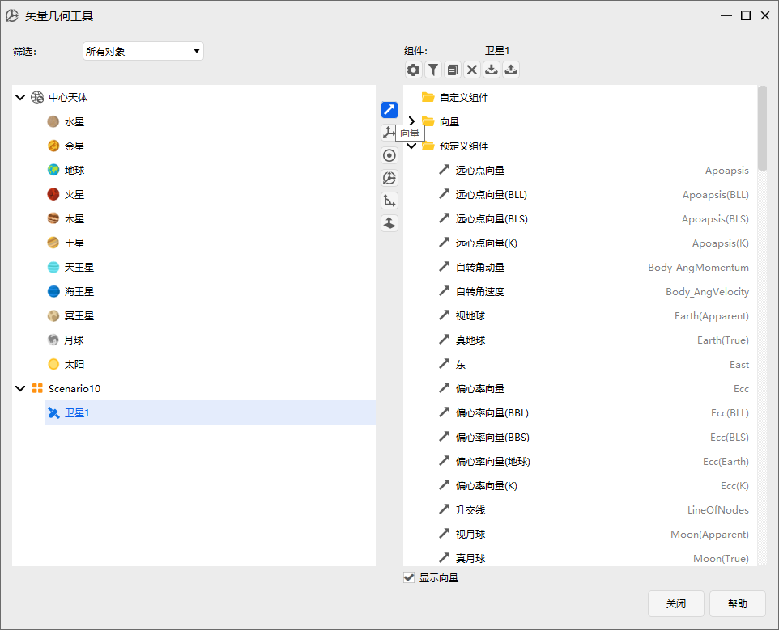
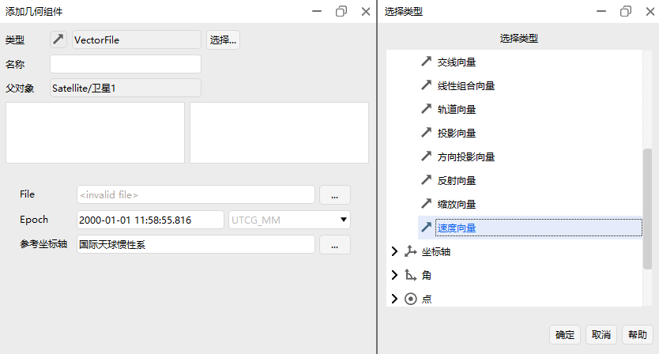
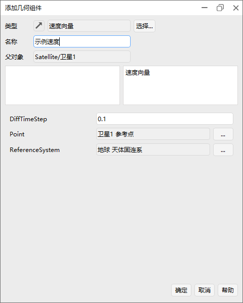
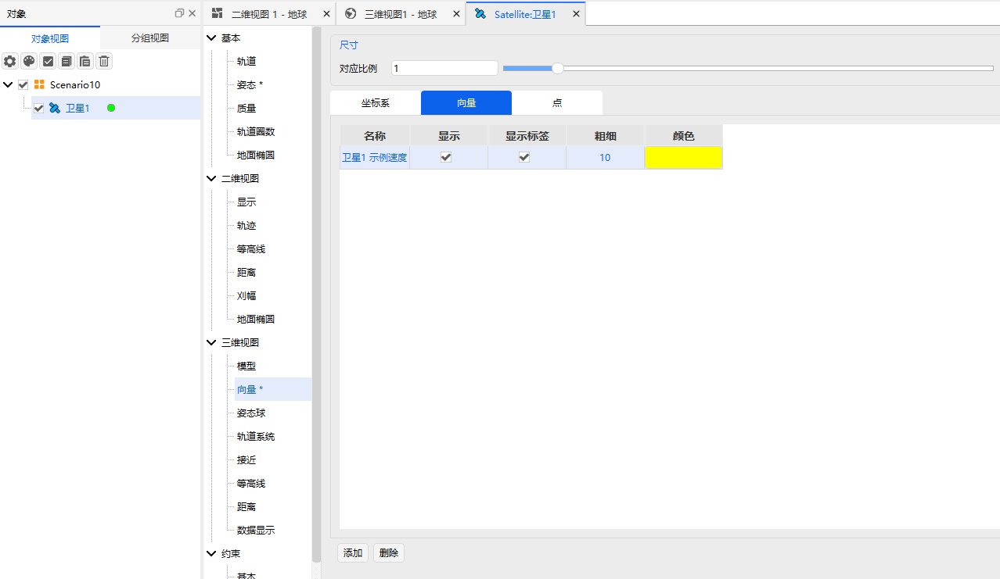
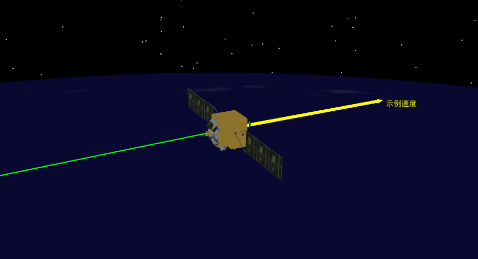

# 矢量几何工具

## 功能介绍

本功能模块实现Point、Axes、Vector、Angle、Plane、System展示，Vector、Axes可以选择矢量元素。

## 功能位置

该功能位于 ATK 菜单-工具栏中，具体打开位置如图所示。

## 界面介绍

左侧为对象选择界面，右侧为组件添加界面，可以按需选择矢量元素。

## 使用方法

以添加速度矢量为例，显示速度矢量。（在其他功能模块，矢量几何工具也可提供较为灵活的坐标系选取。）

1.点击【矢量几何工具】；

2.左侧对象选中卫星1，点击【向量】按钮；

3.窗口“添加几何组件”中选择速度矢量，点击【确定】；

4.定义组件的名称为：“示例速度”；

5.在卫星1的属性中-三维视图-向量中选择添加，在自定义组件中选择预设的向量（前面的示例速度），点击显示，选择显示标签，自定义要显示的颜色；

结果如下图所示：

