# 机动分析功能模块

<PathViewer
  :relative-paths="files"
/>

## 功能介绍

本功能模块有“机动检测”和“机动可达域”两个功能，前者可检测卫星的机动飞行，用于观察卫星是否进行机动以及进行何种机动；后者可计算出在给定的机动能力下卫星可到达的所有位置。

### 功能位置

该功能位于 ATK 工具栏目中，具体打开位置如图所示。

### 界面介绍

本功能模块分为两个部分：机动检测和机动可达域。界面上半部分为参数设置区域，下半部分为结果展示区域，如图所示。

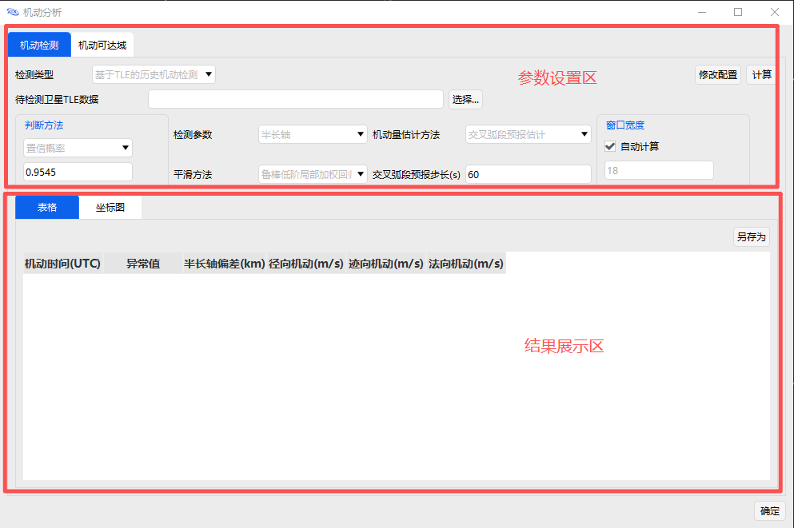

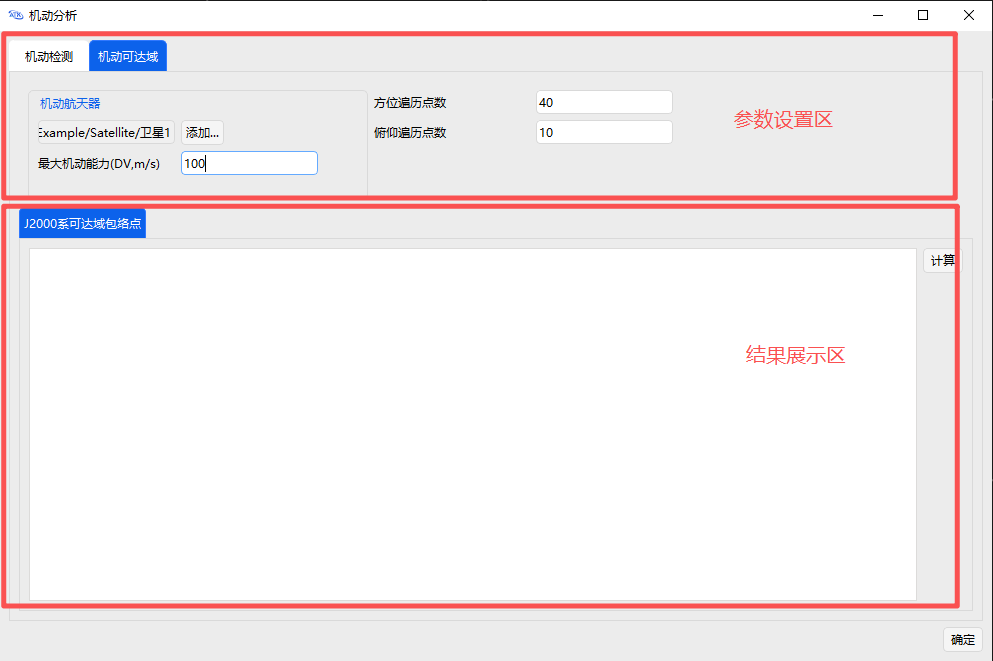

## 使用方法

### 创建场景

首先在 <kbd>开始</kbd> 中点击 <kbd>新建</kbd> ，创建场景，如图所示。

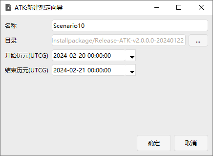

### 添加一颗默认的卫星

在场景中添加一颗卫星，点击 <kbd>插入</kbd> ，选择 **卫星-插入默认类型** ，点击右下方 <kbd>插入...</kbd> ，如图所示。

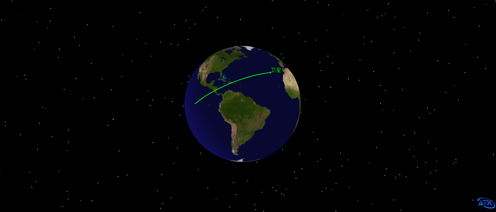

### 机动检测

#### 基于TLE的历史机动检测

检测类型选择【基于 TLE 的历史机动检测】。在【待检测卫星 TLE 数据】栏目中选择<PathCopy :entry="TLE_FILE" />，如图所示。其他配置数据选择默认，点击 <kbd>计算</kbd> ，在数据输出展示区显示计算结果。

::: tip
TLE（Two-Line Element）是用于描述空间物体轨道的标准格式，广泛应用于卫星轨道计算和预测。
:::

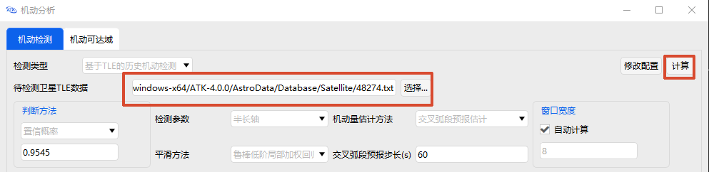

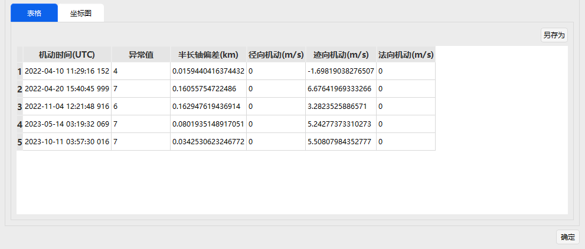

#### 基于定轨数据的机动检测

检测类型选择【基于定轨数据的机动检测】。预报模型分为：Vinti模型、二体、J2长期项。本次计算选择 Vinti模型，其余参数使用默认参数，如图所示。点击 <kbd>计算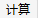</kbd> ，在数据输出展示区显示计算结果，如图所示。

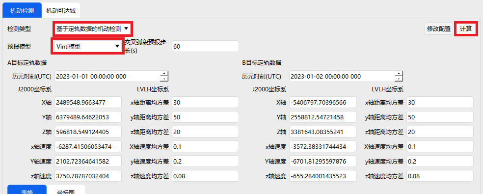

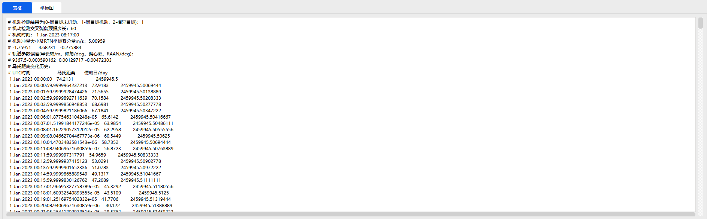

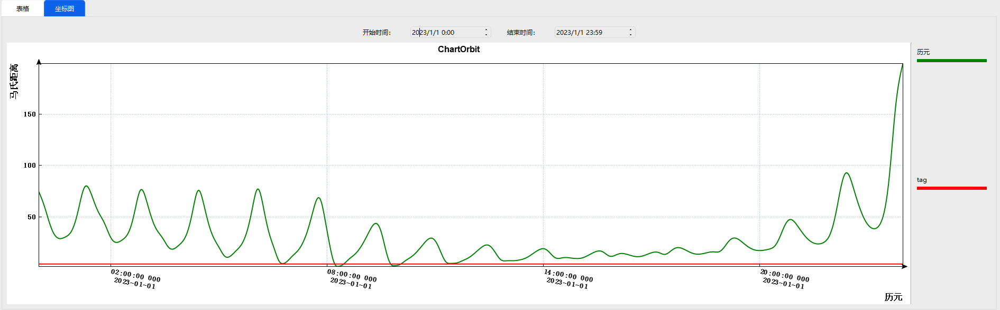

### 机动可达域计算

在本页面，点击 **机动航天器-添加...** ，会出现【机动航天器】页面，如图所示。

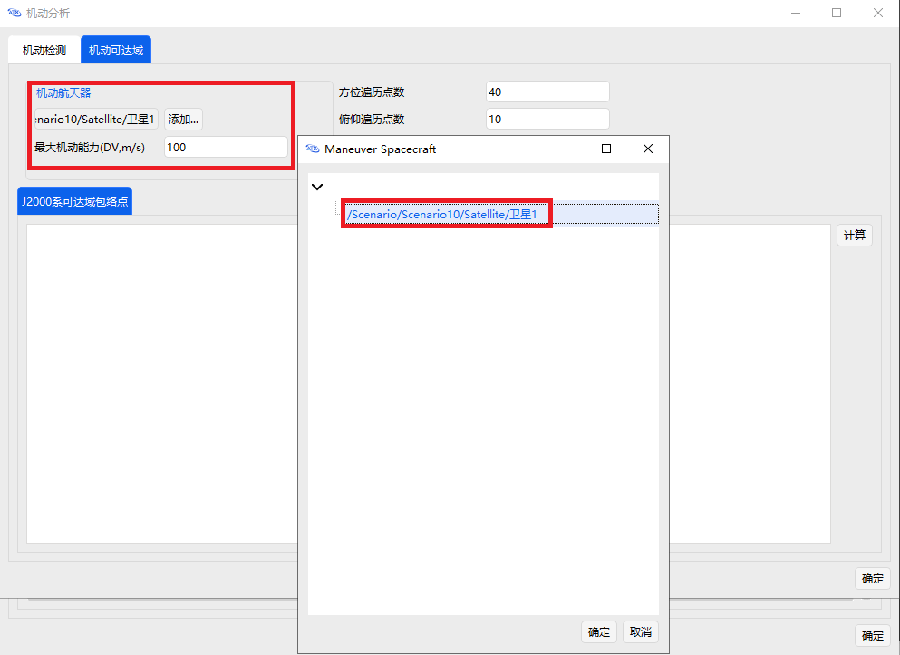

选择在场景中的 卫星1，点击 <kbd>确定</kbd> 。点击 <kbd>计算</kbd> ，在数据显示区展示计算结果，如图所示。

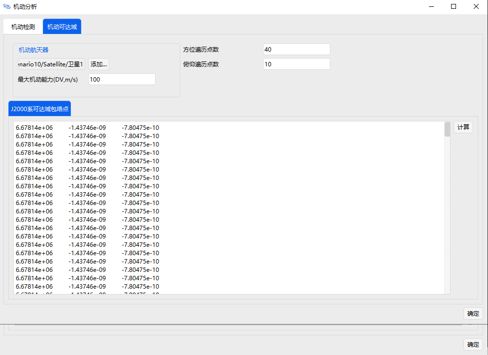

