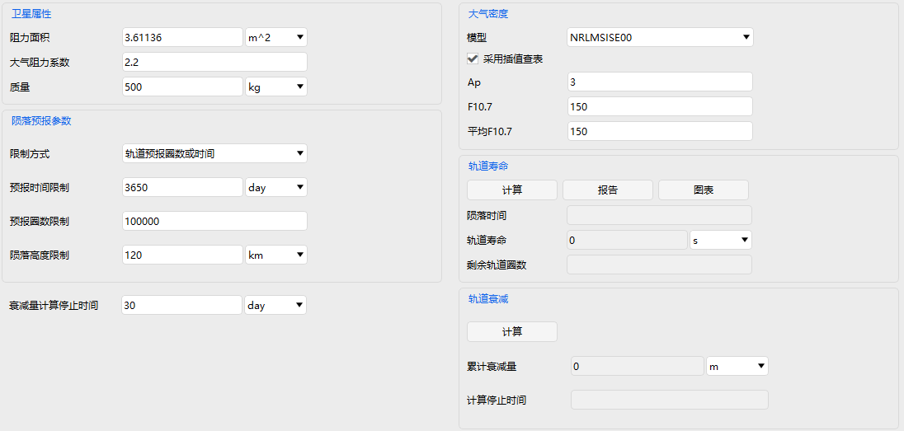

# Lifetime Prediction Module

## Functional Description

This module performs orbital lifetime prediction and orbital decay computation for low‑Earth orbit satellites (altitude **120 km ~ 800 km**).  
**Note**: When the orbital altitude exceeds 800 km, the lifetime will be as long as 100 years or more (making lifetime prediction meaningless). In such cases, the module will automatically stop the computation once the predicted lifetime exceeds 100 years.

### Function Location

This function is located in the ATK Satellite toolbar (it is only visible when a satellite is selected in the Object Browser). The specific opening position is shown in the figure below.

### Interface Introduction

The interface consists of five areas: Satellite Property Settings, Decay Prediction Parameter Settings, Atmospheric Density Settings, Orbital Lifetime Prediction, and Orbital Decay Computation, as shown below.

### Lifetime Prediction Usage

After creating a scenario, add a satellite to the scenario, and select "Lifetime Prediction" from the Satellite dynamic toolbar. Note that the scenario time settings should cover the prediction period.

- Set the satellite property parameters according to the satellite's physical characteristics; these reflect the satellite's ability to resist drag.

- Decay Prediction Parameter Settings: The Limit Method defines the stopping condition for the module computation, with three modes: Orbit Count & Duration, Duration, and Orbit Count.  
  - Duration Limit: the time for natural satellite decay.  
  - Orbit Count Limit: the number of orbital revolutions the satellite makes.  
  - Decay Altitude Limit: the altitude at which the satellite re‑enters the dense atmosphere, typically defined as 60‑120 km.

- Atmospheric Density Settings: Provides two methods: using standard atmospheric density models and entering preset values. When **Use flux file** is checked, the standard atmospheric models are used (including Exponential, 1976StdAtm, NRLMSISE00, MSISE90, MSIS86, Harrispriester, JacchiaRoberts, etc.). If unchecked, you need to manually enter preset values for Ap, F10.7, and Average F10.7.

- Click **Compute** under Orbital Lifetime Prediction to obtain the current satellite's decay time (decay to 120 km dense atmosphere), orbital lifetime, and remaining orbital revolutions.

- Click **Report** or **Chart** to view detailed reports and graphical curves of the satellite's decay.

| Area | Main Settings / Functions | Description |
| :--- | :--- | :--- |
| **Satellite Property Settings** | Drag Area, Drag Coefficient (Cd), Mass | Reflects the satellite's physical characteristics that affect atmospheric drag. |
| **Decay Prediction Parameter Settings** | Limit Method (Orbit Count or Duration), Duration Limit, Orbit Count Limit, Decay Altitude Limit, Stop Time Limit for Decay Computation | Sets the stopping conditions for the orbital decay computation, including time, revolution count, or altitude limits. |
| **Atmospheric Density Settings** | Atmospheric Density Model (e.g., NRLMSISE00), whether to use flux file, preset Ap / F10.7 / Average F10.7 values | Selects a standard atmospheric model or manually inputs solar activity parameters for density computation. |
| **Orbital Lifetime Prediction** | Compute, Report, Chart; displays Orbital Lifetime, Decay Time, Remaining Orbit Count | Computes the satellite's lifetime from the current time until decay to the preset altitude, and outputs the results. |
| **Orbital Decay Computation** | Stop Time Limit for Decay Computation, Compute button; displays accumulated decay | Computes the accumulated orbital decay over a specified number of days (e.g., 30 days). |

### Orbital Decay Computation Usage

The preliminary steps are the same as for Orbital Lifetime Prediction. Enter the desired number of days for the orbital decay computation (e.g., 30 days) in the **Stop Time Limit for Decay Computation** field, then click the adjacent **Compute** button to obtain the accumulated decay over 30 days.

[Lifetime Prediction Case Study](../../02-案例教程/15-寿命预报案例.md)