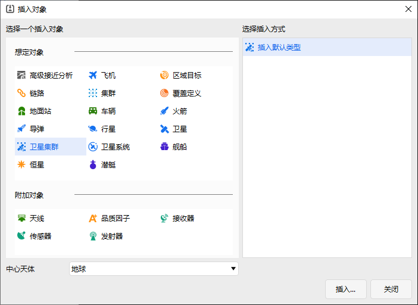
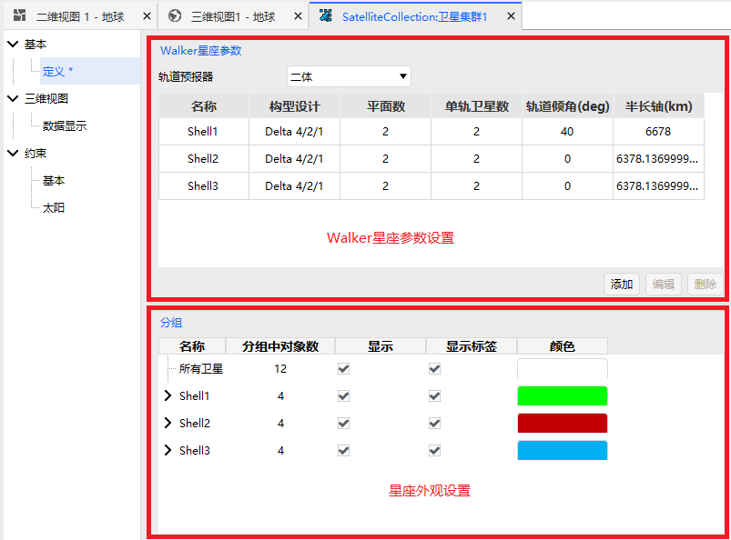
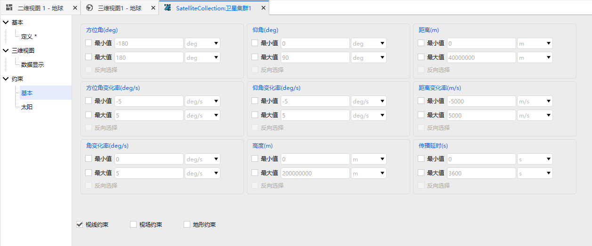
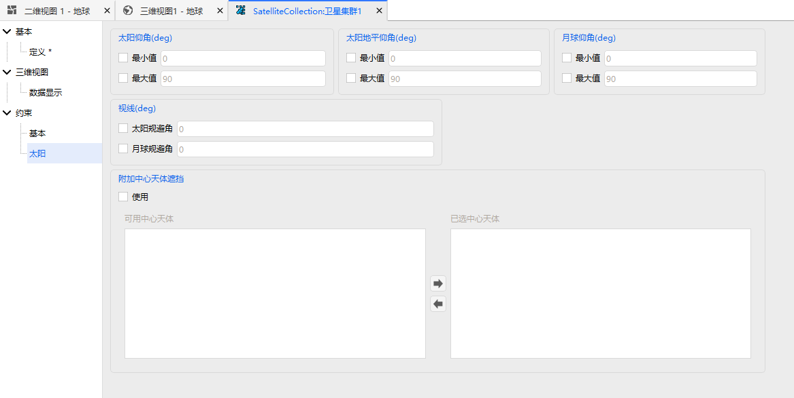
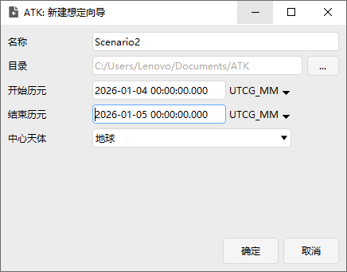
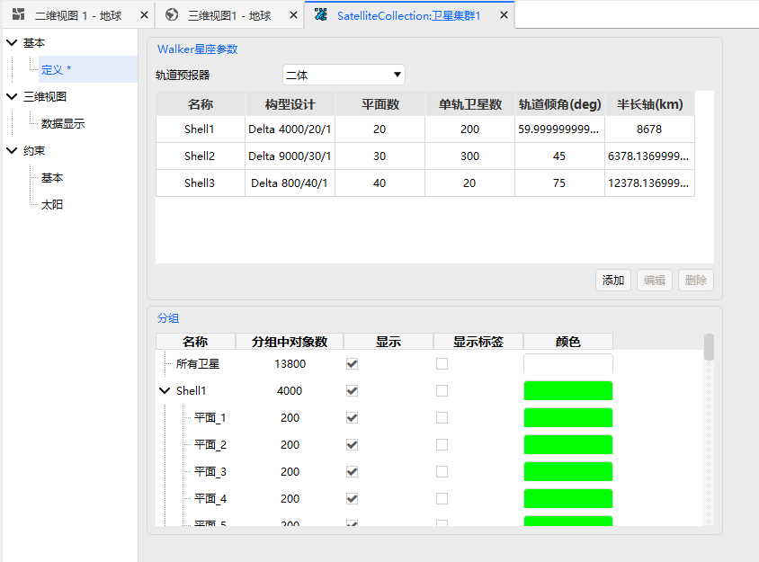
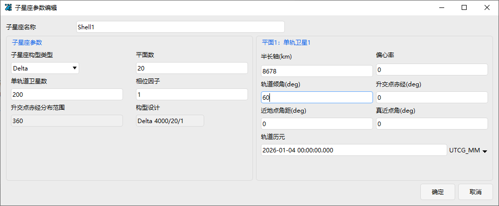
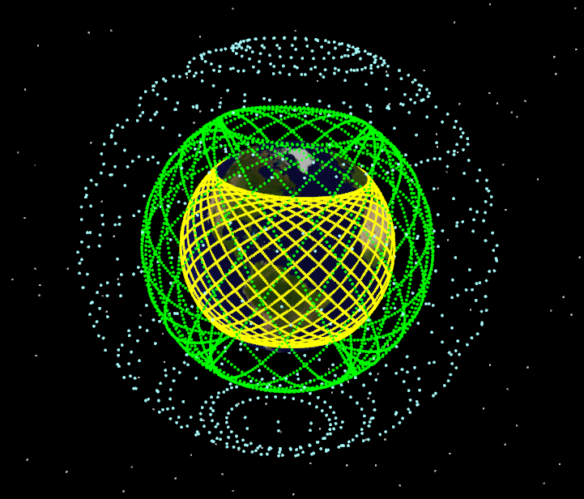

# Mega Constellation Design Module

## Functional Description

The Mega Constellation Design module is used to rapidly create, manage, and analyze large‑scale satellite clusters consisting of hundreds to thousands of satellites. Users can generate satellite objects in batches using Walker constellation parameters and manage multiple sub‑constellations as a unified **Satellite Cluster** object for display, saving, loading, and subsequent analysis.

Compared to creating satellite objects one by one, the Satellite Cluster object offers the following advantages:

1. **High batch modeling efficiency** – large‑scale constellations can be generated at once using parameters such as number of orbital planes, satellites per plane, and phasing factors.

2. **Lower memory footprint** – the satellite cluster is managed as a single object, reducing the memory overhead associated with numerous independent satellite objects.

3. **Convenient unified analysis** – the created satellite cluster can be used for coverage analysis, joint access assessment, communication link analysis, illumination condition screening, and other tasks.

4. **Suitable for multi‑layer constellation design** – supports adding multiple Walker sub‑constellations, enabling the construction of multi‑shell mega constellations with different altitudes, inclinations, and orbital plane configurations.

### Function Location

This function is accessed via **Home → Insert Object → Satellite Cluster**.

### Interface Introduction

The interface consists of two parts: **Basic Property Settings** and **Constraint Settings**.

- Basic Property Settings include: **Walker Constellation Parameters** and **Appearance Settings**, as shown below.

- Constraint Settings include: **Basic Constraints** and **Sun Constraints**, as shown below.

## How to Use

### Create a Scenario

First, click <kbd>New</kbd> under the <kbd>Home</kbd> tab to create a scenario.

### Create a Mega Constellation

Click <kbd>Insert</kbd> and select **Satellite Cluster → Insert Default Type**.

Double‑click **Satellite Cluster 1** in the object tree on the left side of the main window. The property settings page will appear in the right panel, as shown below.

In the **Walker Constellation Parameters** section at the top of the property page, you can use the <kbd>Add</kbd> button to add multiple Walker sub‑constellations. Double‑clicking a shell opens the **Shell Properties** editing window, as shown below.

In the **Subsets** section at the bottom of the property page, you can set the display color for each sub‑constellation, and choose whether to show individual planes or labels. After configuration, the scenario display is shown below.

## Output Description

After completing the above steps, the user should obtain the following outputs:

- A Satellite Cluster object.
- Spatial distribution of each Walker sub‑constellation.
- Satellite arrangement across different orbital planes.
- Different shells displayed in distinct subset colors.
- Optional satellite labels and orbital plane display.

These outputs are used to visually verify whether the constellation scale, orbital plane distribution, and sub‑constellation configuration meet the design expectations.

[Mega Constellation Design Case Study](../02-案例教程/9-巨型星座设计案例.md)