# 偏差分析

## 功能介绍

当前偏差分析模块支持基于蒙特卡洛（Monte Carlo，MC）、混沌多项式展开（Polynomial Chaos Expansions，PCE）等偏差演化方法分析航天器的偏差分布特性，并且能够考虑轨道的大气阻力、地球扁率、太阳辐射、三体引力、太阳光压等保守或非保守摄动，实现高精度的摄动轨道偏差演化分析。

### 功能位置

本功能入口在“卫星-属性-轨道预报器”下拉菜单“偏差分析”中。

### 界面介绍

本功能界面包括飞行序列和序列属性设置两个区域，如图所示。

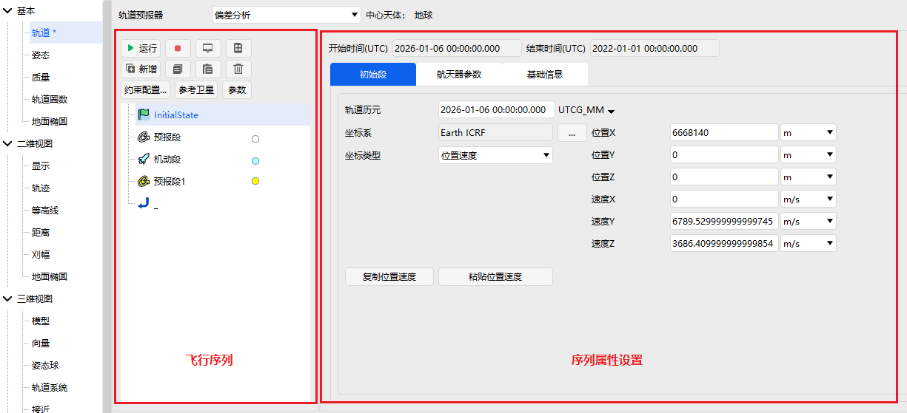

## 使用方法

创建场景后，在场景中添加一颗卫星，在卫星基本属性-轨道预报器中选择【偏差分析】，如图所示。

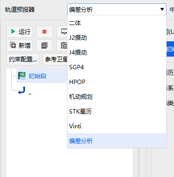

点击下方的【新增】，在序列中增加“偏差分析段”，如图所示。

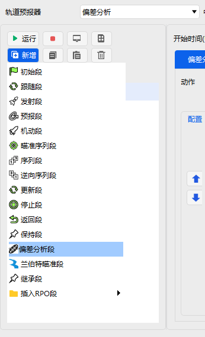

删除原有“初始段”，选中“偏差分析段”，点击【新增】，在序列中增加“初始段”和“预报段”，如图所示。

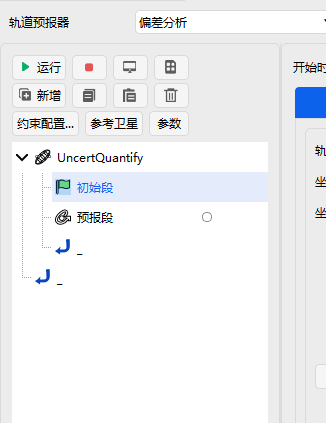

“初始段”设置如图所示，并复选位置速度（勾选位置速度后面的选项）。

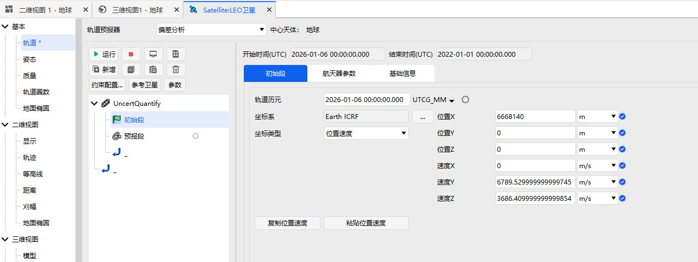

在“预报段”中使用默认的停止条件“CAsStopDuration”（若不是则新建停止条件，添加“CAsStopDuration”）。

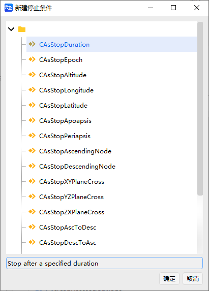

触发值填写 86400，误差值填写 0.0001，如图所示。

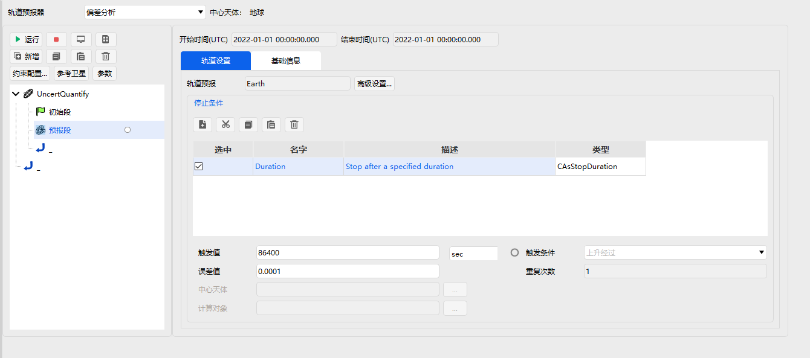

选中“预报段”，点击“约束配置”，选择“笛卡尔坐标”下的位置和速度约束，添加到右侧并点击【确定】，如图所示。

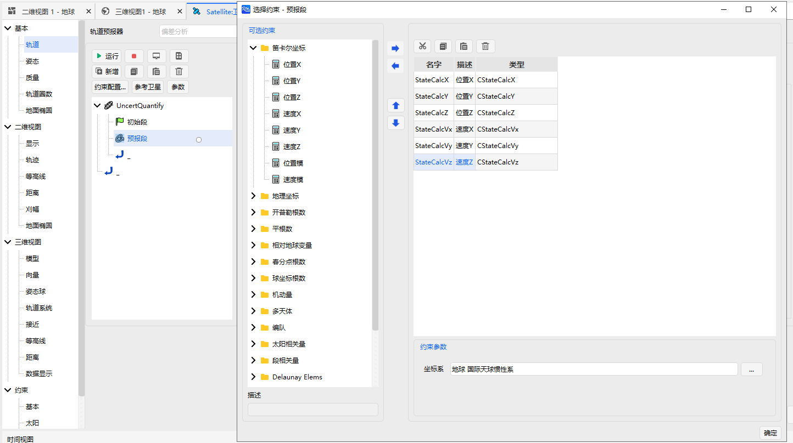

选择“偏差分析段”，在“配置”中添加“蒙特卡洛”、“多项式混沌”，如图所示。

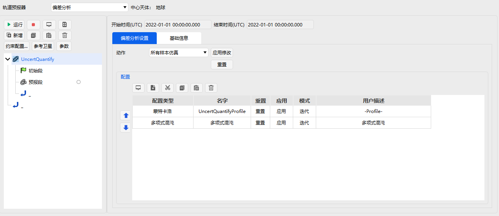

两个配置项详细设置如图所示。

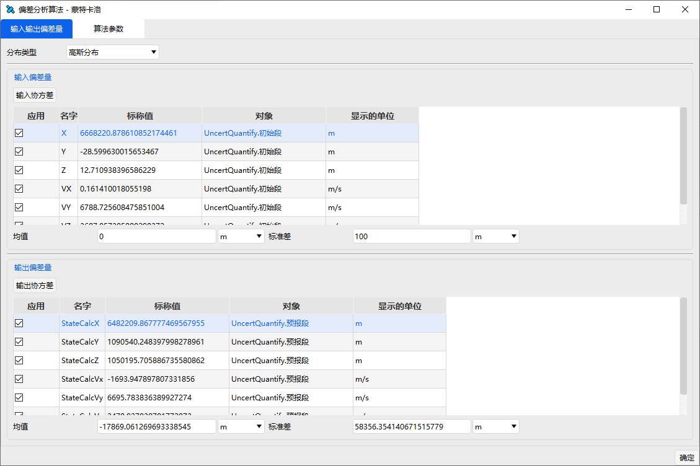

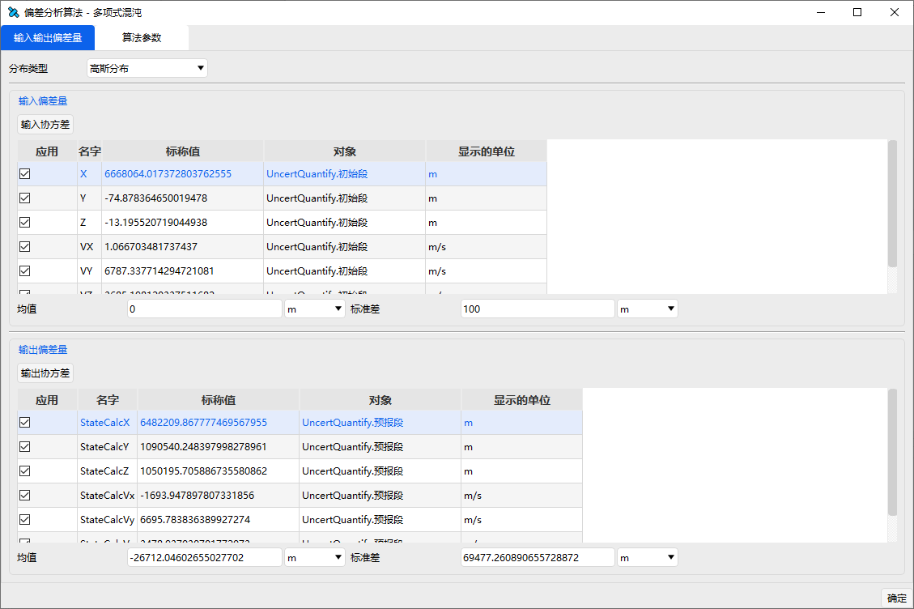

点击【运行】，出现如图所示窗口进行拟合运算。

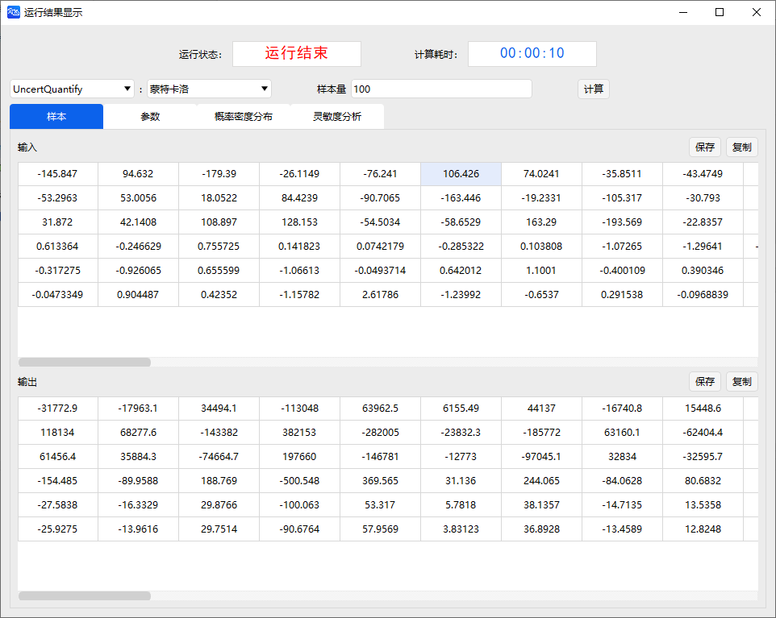

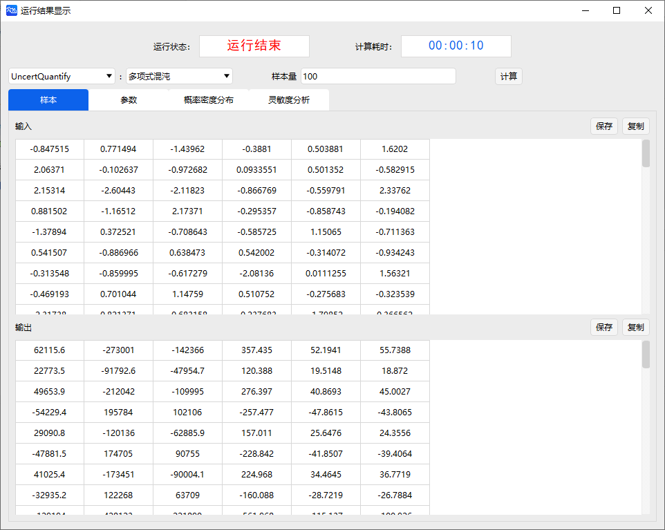

运算结束后，在场景中卫星展示如图所示。

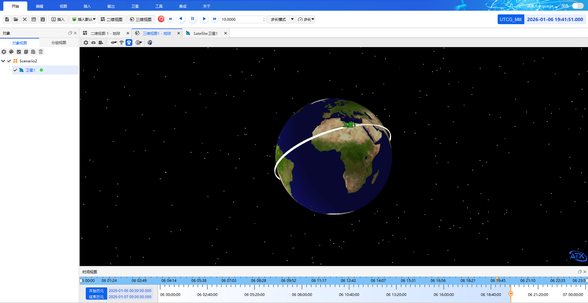