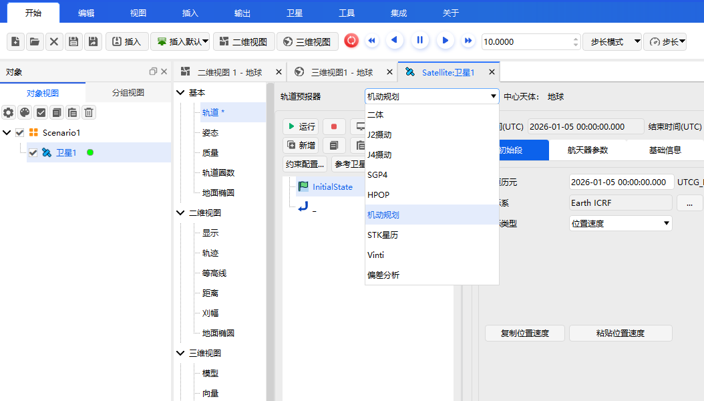
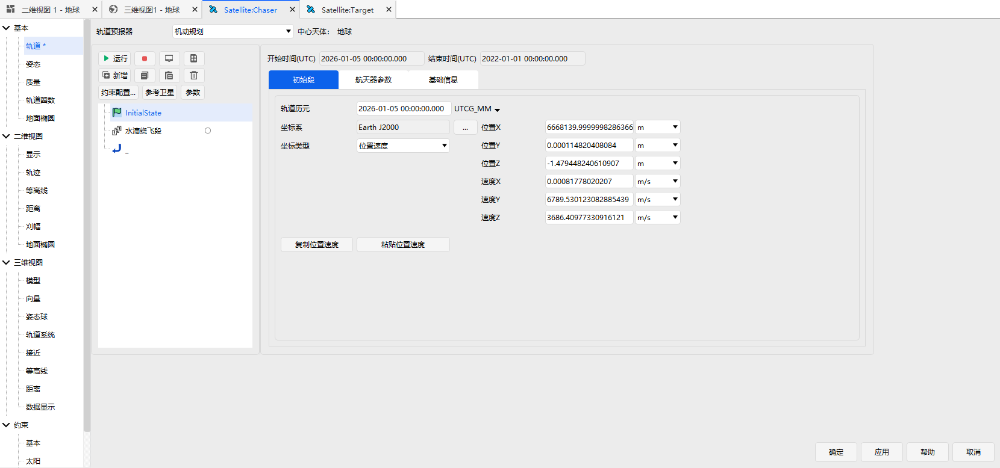
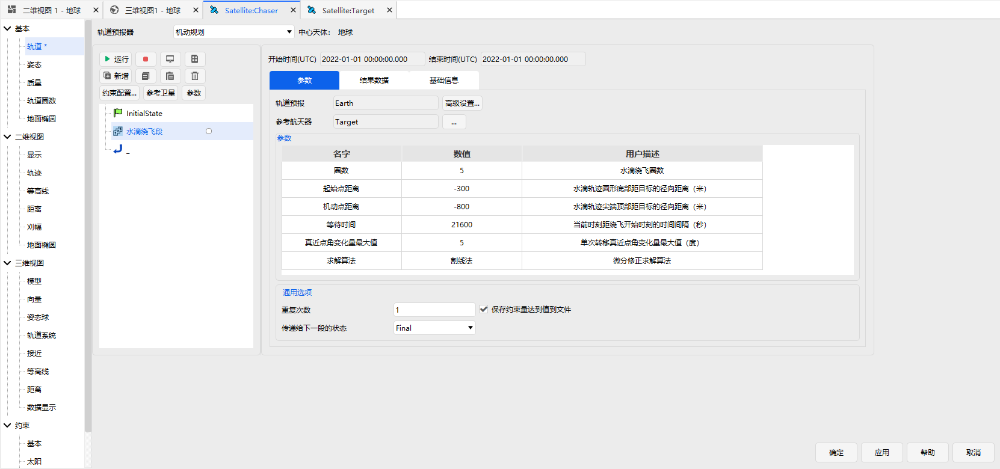
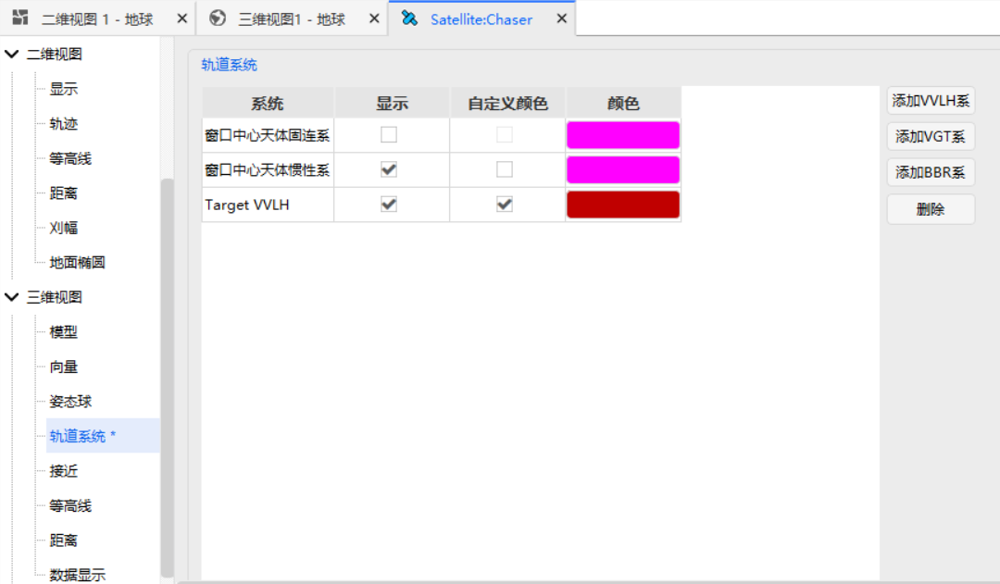
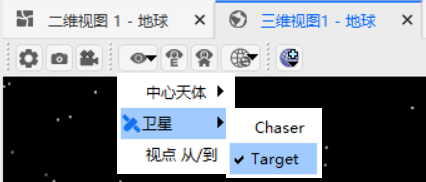
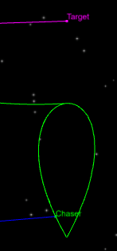

# RPO Functional Module

## Functional Description

ATK software encapsulates typical orbital planning algorithms, categorized according to natural relative motion orbits, controlled relative motion orbits, and rendezvous, proximity, and departure operations. The preset RPO sequences are listed in the table below.

| Relative Motion | Preset RPO Segment |
| --------------- | ------------------ |
| Circumnavigation | Forced Motion Circumnavigation |
| Circumnavigation | Perch (Station Keeping) |
| Circumnavigation | Tear Drop Circumnavigation |
| Circumnavigation | Sun‑Synchronous Circumnavigation |
| Circumnavigation | Natural Motion Circumnavigation |
| Departure | GEO Exit |
| Proximity | Straight‑Line Approach |
| Proximity | Single Hop |
| Rendezvous | GEO Rendezvous |
| Rendezvous | GEO Drift and Rendezvous |

### Function Location

This section uses the **Tear Drop Circumnavigation** segment as an example to explain the RPO module. The function entry is located in **Satellite → Properties → Propagator** dropdown under **Maneuver Planning**, as shown below.

### How to Use

After creating a scenario, insert a default satellite and name it "Target". Duplicate the first satellite and paste it as a second satellite named "Chaser". In the "Chaser" satellite's propagator, select **Maneuver Planning**. Use the default **InitialState** segment, and set the initial conditions as shown below. Also, click the **Reference Satellite** button and set "Target" as the reference satellite.

Click **Add ** → **Insert RPO Segment** sequentially, and select **Circumnavigation → Tear Drop Circumnavigation**. In the Tear Drop segment properties, select "Target" as the Reference Spacecraft. The flight sequence is shown below.

In **Chaser → Properties → 3D View → Orbit System**, click **Add VVLH System**, select the "Target" spacecraft, and enable **Show** and **Custom Color** for the added VVLH orbital system (choose a color distinct from the trajectories of the two spacecraft). The detailed settings are shown below.

Click **Run**. After execution, in the **3D View** window, click **Local View** and select the "Target" satellite to fix the view on "Target" for easier observation. The specific operation is shown below.

After configuration, the Tear Drop circumnavigation trajectory is shown below.

