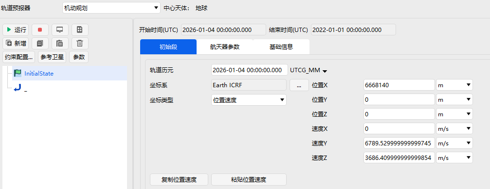
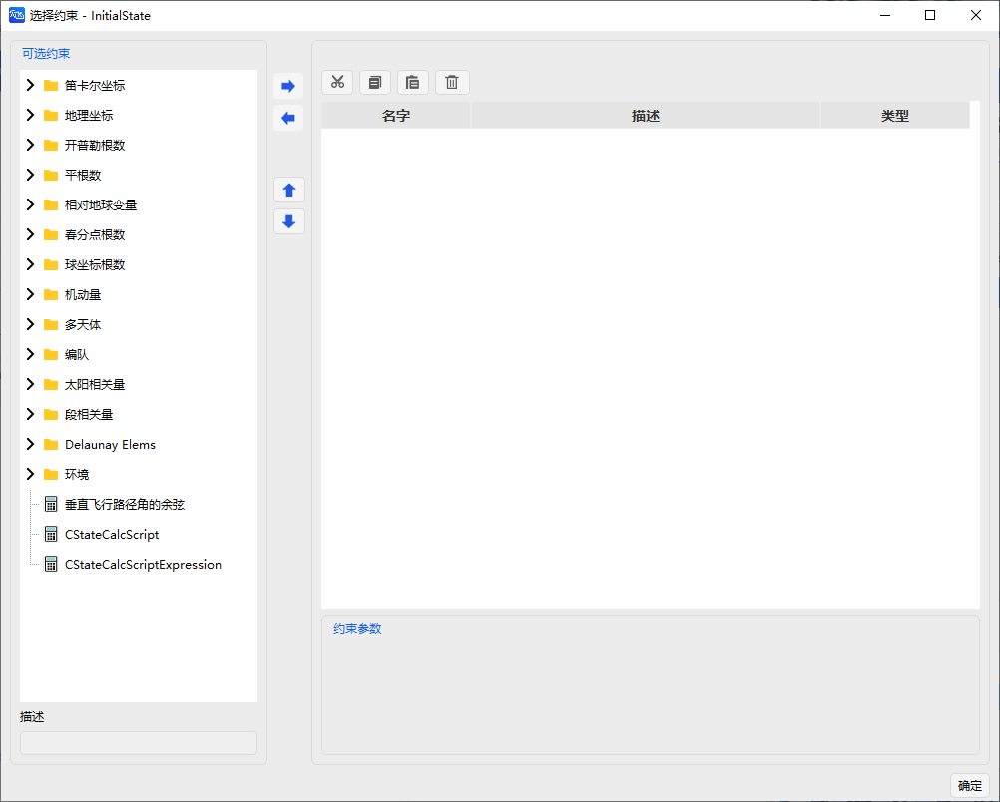

# Orbit Maneuver Planning Tool

## Functional Description

Maneuver Planning is a functional module developed for space mission analysis and spacecraft orbit design. The Orbit Maneuver Planning Tool divides spacecraft trajectories into different mission segments, using various graphical blocks to identify specific mission phases. Users can select different modules as needed to construct their own mission sequences, complete orbit planning and computation tasks, and generate satellite ephemeris. The Orbit Maneuver Planning Tool provides both impulsive and finite‑thrust maneuver modes, and supports high‑precision orbit propagation computation models. To implement mission planning functions, the Maneuver Planning module offers optimizers such as the Differential Corrector, Sequential Quadratic Programming, and intelligent optimization algorithms, which can meet the planning and analysis requirements for launch windows, rendezvous and docking, orbit transfer, and other missions.

When the user selects **Maneuver Planning** as the **Propagator**, the Orbit Maneuver Planning interface becomes available.

On the left side of the Orbit Maneuver Planning module interface is the tree structure of the Mission Control Sequence (MCS), which describes the relationships between the various mission sequence segments. The toolbar is located above the tree structure, and its functions are described in the table below.

|                        Button                       |          Function Description          |
|:---------------------------------------------------:|:--------------------------------------:|
|          |          Run the mission sequence          |
|          |          Stop the computation          |
|          |          Display computation results          |
|          |          Mission summary          |
|          |          Add a new mission sequence segment          |
|          |          Copy a mission sequence segment          |
|       |          Paste a mission sequence segment          |
|       |          Delete a mission sequence segment          |
|          |          Open the constraints configuration          |
|      |          Select a reference satellite          |
|  |          Parameter settings          |

The window to the right of the tree structure is the parameter settings interface for each sequence segment. For example, the Initial State segment allows setting parameters such as orbit epoch, coordinate system, coordinate type, and initial state. For constraint configuration, you need to click the **Constraints Configuration…** button in the toolbar to enter the constraint configuration interface.

The process of constructing a Mission Control Sequence mainly involves inserting and adjusting different mission segments, defining the characteristics of each phase, setting specific constraints and stopping conditions, and selecting an appropriate optimizer to complete the orbit maneuver planning task.

## Maneuver Planning Mission Sequence Segments

The Orbit Maneuver Planning Tool allows users to freely select and organize mission sequence segments to generate desired trajectories. Depending on their mission requirements, users can choose different Mission Control Sequence segments to plan the corresponding orbit. The current ATK software mainly supports 15 types of mission sequence segments:

|     Mission Sequence Segment     |
|:--------------------------------:|
|        Initial State        |
|           Follow           |
|           Launch           |
|          Propagate          |
|        Set DeltaV        |
|      Target Sequence      |
|         Sequence         |
|     Backward Sequence     |
|           Update           |
|           Stop            |
|           Return           |
|           Hold            |
|      Lambert Target      |
|         Inherit         |
|        Insert RPO        |

In each sequence segment, corresponding constraints, design variables, and other parameters can be freely configured.