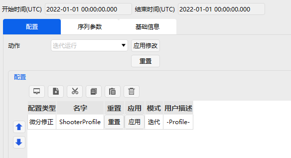
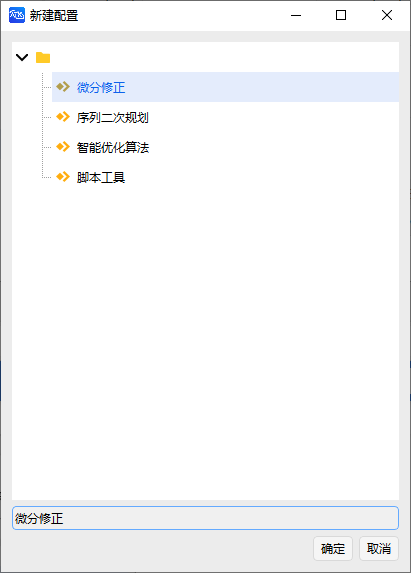
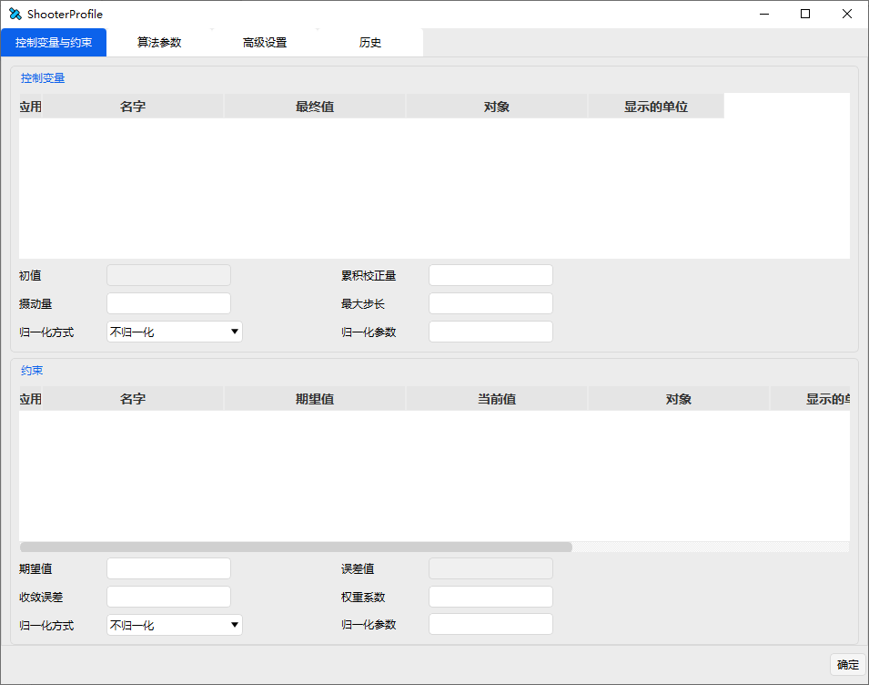

# 瞄准序列段

瞄准序列段通过定义一系列机动段和预报段构成一个子任务序列段，以实现特定目标任务。实现一个瞄准序列段通常可以分为 3 步完成。

1）新增基本段到瞄准序列段。

2）定义瞄准序列段的属性。

3）配置瞄准序列段。

**（1）新增基本段到瞄准序列段**

任何任务控制序列段都可以嵌套在瞄准序列段中，一个瞄准序列段也可以嵌套在另一个瞄准序列段中。用户可以根据自己的任务需求，增加自己需要的基本任务控制序列段。

**（2）定义瞄准序列段的属性**

选中【瞄准序列段】后，点击【配置】栏下的【新增】按钮，对瞄准序列段属性进行设置。

当前软件版本的迭代算法包括微分修正算法、序列二次规划算法和智能优化算法，此外用户还可使用脚本工具自定义迭代算法。选中迭代算法后，双击即可进入设置界面定义算法参数。

**（3）配置瞄准序列段**

在完成属性设置后，再次进入瞄准序列段设置界面，进行瞄准序列段【动作】参数的配置。动作类型包括迭代运行、不迭代运行、应用迭代结果运行。

其中，迭代运行对应的动作为执行目标序列，直到达到最优化目标，运行过程中，目标序列不断重复迭代，选择的优化变量也会不断更新，不迭代运行动作则与之相反。应用迭代结果运行指的是，根据用户输入的变量值，执行目标序列，运行过程中通常不涉及优化解算。

用户在使用过程中，可以根据自己的需要选择相应的【动作】参数。【动作】参数旁边的【应用修改】按钮的主要功能是将当前修改后的设置赋给目标序列，而【重置】按钮则是重置目标序列。
