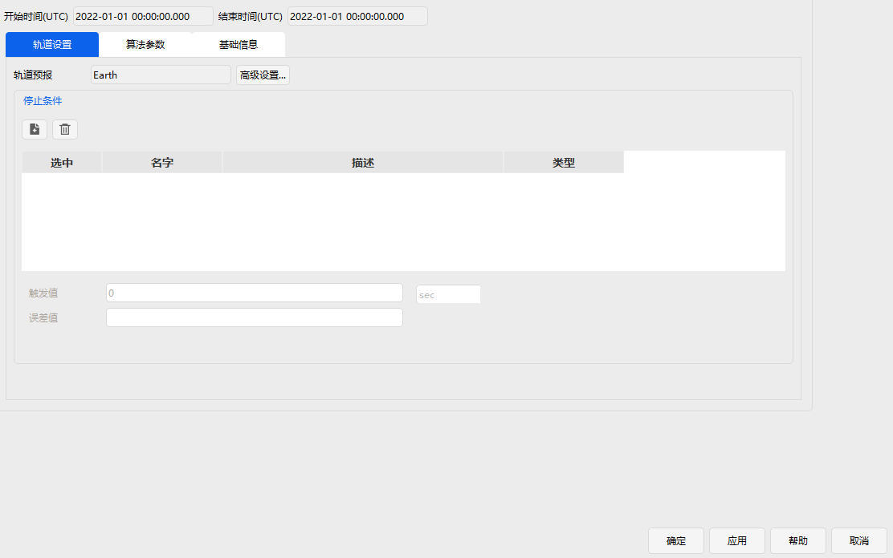
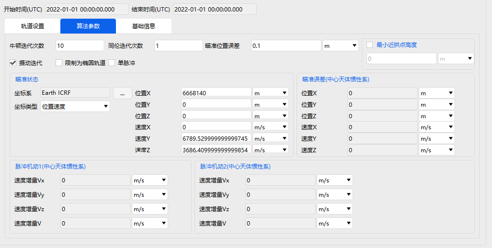

# 兰伯特瞄准段

**兰伯特瞄准段**：根据用户设定的期望时间与期望末状态，求解从当前状态出发的的转移轨道。从功能上说，其大致等同于末状态约束下的目标序列段{机动段——预报段——机动段}。

兰伯特转移问题在实际物理条件下可能存在多解或无解。本模块能够求解总速度脉冲（即燃料消耗）最小的转移轨道。兰伯特瞄准段的初始状态继承自前一序列段，其轨道设置页面接近预报段，算法参数页面可以设置目标状态，即瞄准状态。运行后能够计算出始末时刻的脉冲机动及瞄准状态的误差。并将实际末时刻状态向下传递。

兰伯特瞄准段能在算法参数页面设置是否考虑摄动，是否实现单脉冲机动，是否限制为椭圆轨道。这是兰伯特瞄准段功能上的一些分支，而更上方的瞄准误差属于用户的可容忍误差。
- 勾选考虑摄动，则摄动力学环境由轨道设置页面的轨道预报-高级设置决定；不勾选考虑摄动，则计算出的脉冲机动1和脉冲机动2均为二体解，瞄准误差由于考虑摄动力学环境会存在较大误差。
- 勾选单脉冲机动，则脉冲机动2并不会施加，即实际末时刻状态与瞄准状态存在较大的速度误差并向下传递。
- 勾选限制为椭圆轨道，则转移轨道被限制为椭圆轨道，不勾选椭圆轨道，则转移轨道可能存在抛物线双曲线等轨道。