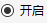

# Return Segment

The Return Segment is used to return control variables to its parent segment, thereby controlling the execution of the entire Mission Control Sequence. If the execution mode of the Mission Control Sequence segment is set to iterative execution, no further segments will be executed after this segment. The Return Segment has two state options, represented by  and , which can be selected by clicking the circular buttons. When the enabled state is selected, this segment is active. When the disabled state is selected, the segment has no effect during execution of the entire Mission Control Sequence.