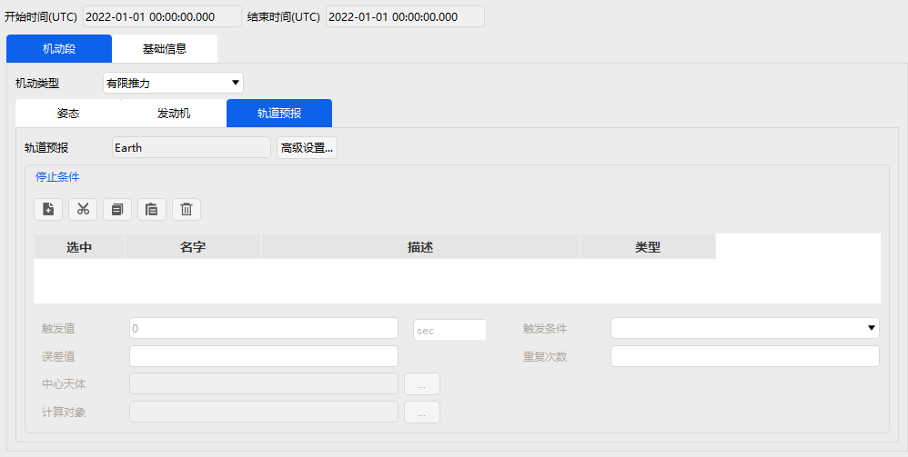

# Maneuver Segment

The main function of the Maneuver Segment is to model the spacecraft's orbital maneuver process. The current software provides two operating modes: Impulsive Maneuver and Finite Thrust Maneuver.

**(1) Impulsive Maneuver Mode**

The Impulsive Maneuver mode updates the spacecraft state by adding a velocity increment to the final velocity of the previous mission sequence segment. The configuration of an impulsive maneuver is divided into two parts: Attitude and Engine. The parameter settings interface for the Maneuver Segment is shown below.

In Impulsive Maneuver mode, the thrust axes can be selected from various coordinate systems such as VVLH, J2000, VNC, etc. The application method can be either Cartesian (velocity components) or Spherical (azimuth, elevation, and magnitude). Taking VVLH thrust axes as an example, enter the values in the corresponding velocity increment input fields. A positive value represents the positive direction along the coordinate axis, while a negative value represents the opposite direction.

The Engine requires setting the specific impulse and choosing whether to update the mass based on fuel consumption. Users simply enter the variable values in the corresponding input fields.

**(2) Finite Thrust Maneuver Mode**

The Finite Thrust Maneuver mode uses a defined propagator to predict the state parameters based on the specified thrust acceleration. The thrust magnitude depends on the user‑defined engine model, and the thrust direction is determined by attitude control. Therefore, in this mode, the user needs to configure the following three parts:

| Setting | Description |
| :--- | :--- |
| Attitude | Controls the thrust direction |
| Engine | Defines the thrust magnitude |
| Propagation | Predicts the state parameters |

The interface layout is shown below.

The Attitude settings are basically the same as those in Impulsive mode, except that the coordinate inputs in Finite Thrust mode are no longer velocity increments but unit vectors or angles in different directions. Users only need to enter the desired direction. The Engine section adds a thrust value (N) setting compared to Impulsive mode. The Propagation part is consistent with the Propagate Segment settings, i.e., adding stopping conditions and entering the corresponding parameter values.