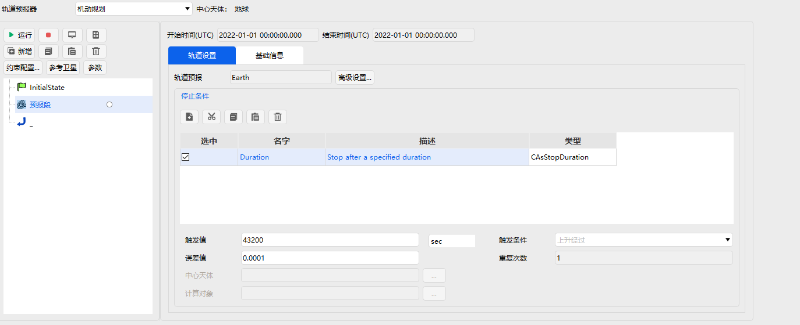
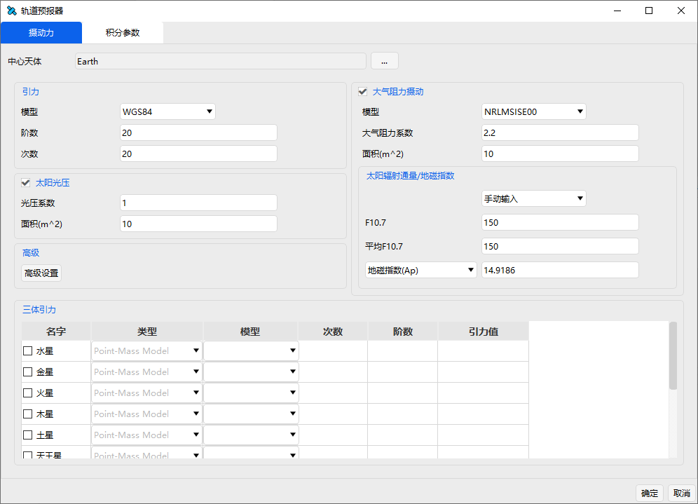

# Propagate Segment

The main function of the Propagate Segment is to simulate and compute the orbital motion state of the spacecraft based on given parameters such as the force model, initial conditions, and stopping conditions.

The interface properties and parameters of the Propagate Segment are shown in the figure, including three main parts: Start/Stop Time, Propagator, and Stopping Conditions.

The Propagator settings can be accessed via the **Advanced Settings…** button, which opens the parameter configuration interface, as shown below.

The Stopping Conditions section includes five main tool buttons, whose names and functions are described in the following table.

| Button | Name | Function |
|------------------------------------------------|:----:|:--------------------------:|
|  | New | Creates a new stopping condition |
|  | Cut | Cuts the current condition to the clipboard |
|  | Copy | Copies the current condition to the clipboard |
|  | Paste | Inserts a stopping condition from the clipboard |
|  | Delete | Deletes a stopping condition |

After selecting a stopping condition, the user can set the desired stopping condition in the corresponding parameter interface, such as propagation duration, error tolerance, and other trigger conditions. The stopping condition components supported in the current version are listed in the following table.

|  Stopping Condition Component |                     Description                     |
|:-----------------------------:|:---------------------------------------------------:|
|           Duration            |           Stops after a specified duration          |
|             Epoch             |              Stops at a specified epoch             |
|           Altitude            | Stops when the object reaches a specified altitude relative to the reference central body |
|           Longitude           |           Stops when the object reaches a specified longitude          |
|            Latitude           |           Stops when the object reaches a specified latitude           |
|           Apoapsis            |             Stops at the orbit's apoapsis             |
|           Periapsis           |             Stops at the orbit's periapsis            |
|        AscendingNode          |             Stops at the ascending node            |
|        DescendingNode         |             Stops at the descending node            |
|         XYPlaneCross          |            Stops when the object crosses the X‑Y plane            |
|         YZPlaneCross          |            Stops when the object crosses the Y‑Z plane            |
|         ZXPlaneCross          |            Stops when the object crosses the Z‑X plane            |
|          AscToDesc            |            Stops at the maximum northern latitude            |
|          DescToAsc            |            Stops at the maximum southern latitude            |
|          RMagnitude           |          Stops at a specified distance from the initial position          |
|         TrueAnomaly           |           Stops at a specified true anomaly           |
|         MeanAnomaly           |           Stops at a specified mean anomaly           |
|           ArgLat              |           Stops at a specified argument of latitude           |
|          StateCalc            |      Stops when the object reaches a specified state computation value      |

When using the Propagate Segment, users can define the corresponding stopping conditions according to mission requirements. After selecting a stopping condition, simply enter the desired value in the corresponding input field.