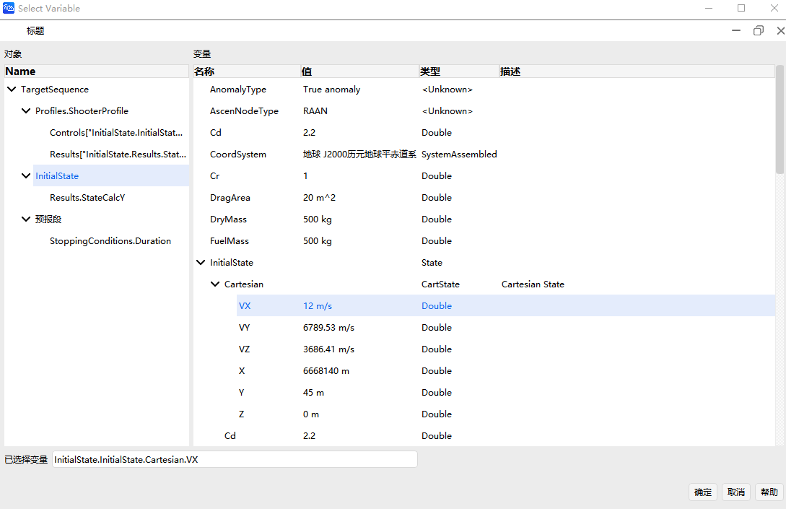

# 脚本工具

## 功能介绍

本功能模块可以实现调用内置的[ATK脚本语言解释器](2-ATK脚本.md)或外部脚本语言来扩展ATK软件的计算能力。

ATK脚本支持基本运算符与流程控制语句，**能直接访问ATK算法组件的属性**，扩展了**绑定赋值运算符**`=&`来支持脚本变量与ATK算法组件属性的绑定。

外部脚本语言的调用功能支持**动态加载计算机中已有的计算环境**，目前支持Python、Matlab、Lua。

## 功能位置

- 机动规划的序列段、瞄准序列段。

- 机动规划计算结果/约束配置的脚本计算量，可以通过脚本自定义段的计算结果。

- 集成选项卡中的客户端，采用ATK脚本作为解释器引擎。

- 集成选项卡中的控制台，可选择ATK脚本解释器进行运行。

- 运行`ATKConsole` 程序，windows 下为 `ATKConsole.exe`，在linux下请运行`ATKConsole.sh`。

## 使用方法

### 绑定属性

在机动规划的序列段、瞄准序列段中，选择【序列参数】，勾选【运行脚本】，点击 <kbd>脚本编辑器</kbd>。


在编程工作区的变量表中，新建一个变量后，点击变量行的 <kbd>Edit</kbd>，可以跳转到如下的【变量绑定】窗口。



【变量绑定】窗口的左侧为ATK对象树，右侧为当前所选对象的属性树，在右侧选择变量后，即可将变量与ATK对象的属性相绑定。

::: note 注意
对于ATK脚本，工作区里的变量是采用[绑定赋值](2-ATK脚本.md#基本运算符)定义的。所以在ATK脚本运行时，变量的值与所绑定的算法模型属性**是始终同步的**。

对于外部脚本，工作区里的变量不是在运行时同步的，而是运行结束后同步的。所以在外部脚本运行时，变量的值与所绑定的算法模型属性**不是始终同步的**。
:::

### 编写与执行脚本

点击 <kbd>脚本编辑器</kbd>，跳转到脚本编辑界面，在脚本编辑器中编写代码，并选择脚本执行器，目前的脚本执行器有`ATK脚本`、`Python`、`Matlab`、`Lua`。


编写完成后，点击 <kbd>运行</kbd> 即可触发脚本执行，并会在脚本执行结束后更新工作区变量的值。

如果勾选了【运行脚本】，则在序列段、瞄准序列段每次执行时都会自动触发脚本执行。

## 调用外部Python环境

### 选择Python动态库

在执行Python脚本时，会提示需要选择一个Python环境，可以选择电脑中已安装的Python动态库。

例如在windows下选择`python38.dll`、`python311.dll`，linux下选择`libpython.so`


### Python脚本环境内置函数

`ATKExecuteCommand`函数可以执行[ATK Connect命令](../../二次开发教程/2-二次开发CONNECT模式/README.md)，例如

```atks
ATKExecuteCommand("Astrogator */Satellite/卫星1 ApplyCorrections MainSequence.SegmentList.瞄准序列段")
```
