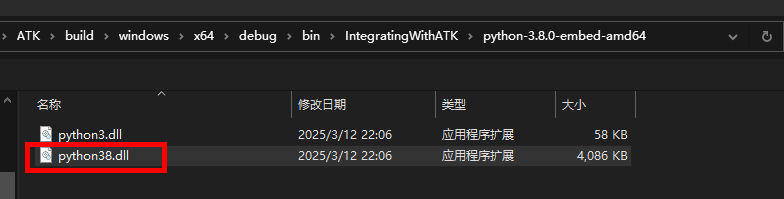

# Script Tools

## Functional Overview

This module lets you extend ATK's computational capabilities by calling the built-in [ATK script language interpreter](2-ATK脚本.md) or external scripting languages.

ATK Script supports basic operators and flow control statements, and **can directly access the properties of ATK algorithm components**. It extends the **binding assignment operator** `=&` to support binding script variables to the properties of ATK algorithm components.

The external scripting language support can **dynamically load computing environments already installed on the computer**, currently supporting Python, Matlab, and Lua.

## Function Entry

- The sequence segments and aiming sequence segments of maneuver planning.

- Script-computed quantities for maneuver planning calculation results / constraint configurations, so you can define a segment's computation results via scripts.

- The client in the Integration tab, which uses ATK Script as its interpreter engine.

- The console in the Integration tab, where you can select the ATK Script interpreter to run.

- Run the `ATKConsole` program — `ATKConsole.exe` on Windows, and `ATKConsole.sh` on Linux.

## Usage

### Binding Properties

In the sequence segments or aiming sequence segments of maneuver planning, select 【Sequence Parameters】, check 【Run Script】, and click <kbd>Script Editor</kbd>.


After creating a new variable in the variable table of the programming workspace, click <kbd>Edit</kbd> on the variable row to open the 【Variable Binding】 window shown below.


The left side of the 【Variable Binding】 window shows the ATK object tree, and the right side shows the property tree of the currently selected object. After selecting a property on the right, you can bind the variable to that property of the ATK object.

::: note Note
For ATK Script, variables in the workspace are defined using [binding assignment](2-ATK脚本.md#basic-operators). Therefore, during script execution, the value of a variable **always stays synchronized** with the bound algorithm model property.

For external scripts, variables in the workspace are not synchronized during execution but only after execution finishes. Therefore, during external script execution, the value of a variable is **not always synchronized** with the bound algorithm model property.
:::

### Writing and Executing Scripts

Click <kbd>Script Editor</kbd> to jump to the script editing interface, write code in the script editor, and select a script executor. The current script executors are `ATK Script`, `Python`, `Matlab`, and `Lua`.


After writing, click <kbd>Run</kbd> to trigger script execution; the workspace variables are updated after execution finishes.

If 【Run Script】 is checked, the script is automatically executed every time the sequence segment or aiming sequence segment runs.

## Calling an External Python Environment

### Selecting a Python Dynamic Library

When executing a Python script, you are prompted to select a Python environment; you can choose a Python dynamic library already installed on your computer.

For example, select `python38.dll` or `python311.dll` on Windows, and `libpython.so` on Linux.



### Built-in Functions of the Python Script Environment

The `ATKExecuteCommand` function can execute [ATK Connect commands](../../二次开发教程/2-二次开发CONNECT模式/README.md), for example:

```atks
ATKExecuteCommand("Astrogator */Satellite/卫星1 ApplyCorrections MainSequence.SegmentList.瞄准序列段")
```
