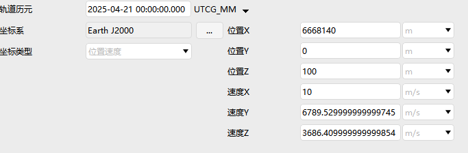
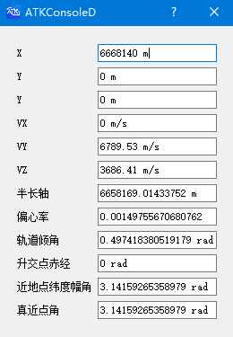

# ATK脚本

ATK脚本定位为一种**领域专用语言**，目前支持基本运算符、流程控制语句等，并原生支持**绑定ATK对象与算法组件的属性**。

ATK脚本扩展了一些专有功能，例如支持直接访问ATK算法组件的属性，并新增了绑定赋值运算符`=&`与延迟赋值运算符`:=`来支持脚本变量与ATK算法组件属性的绑定。

支持通过[reactive 关键词](6-界面函数/reactive关键词.md)创建响应式变量，并通过声明式语法调用界面函数构建自定义界面。

ATK脚本的语法主要参考了Julia语言，并实现了基础矩阵运算、基础数学函数、基础绘图函数、界面函数以及ATK引擎相关函数等来支撑对ATK计算能力与界面能力的扩展。

::: note 注意
ATK脚本解释器并未进行JIT优化，其**解释执行效率不高**，不建议应用于计算密集型任务，推荐用于以下场景：

- 打通仿真计算时的场景对象之间的数据流。

- 执行自动化场景构建。

- 执行重复性的数据报告输出。

- 在不升级软件的情况下扩展ATK尚不具备的计算能力。
:::

## 功能位置

- 运行`ATKConsole` 程序，在 Windows 下为 `ATKConsole.exe`，在Linux下请运行`ATKConsole.sh`。

- 打开集成选项卡中的客户端，采用ATK脚本作为解释器引擎。

- 打开集成选项卡中的控制台，可选择ATK脚本解释器进行运行。

## 数据类型

支持的基础数据类型有：浮点数(`Double`)、整型(`Interger`)、布尔值(`Boolean`)。

## 基本运算符

1. **赋值运算符**

|运算符  |描述                                                                                  | 备注                       |
|:---:  |:---                                                                               |:---                        |
|`=`    |直接赋值运算符，将右侧表达式的计算结果赋给左侧操作数                                   |`c = a + b`                |
|`:=`   |延迟赋值运算符，将右侧表达式赋给左侧操作数<br>在每次访问左侧操作数时会重新进行一次求值   |`a = 1`，`b := a + 1`，此时获取`b`的值为`2` <br> 更改`a`的值`a = 3`，此时获取`b`的值为`4` <br> 如果对`b`重新赋值`b = 2`，变量`b`将不再具备延迟计算特性|
|`=&`   |绑定赋值运算符，将左侧操作数与右侧表达式绑定<br>变量的取值与直接赋值将与右侧表达式绑定| `a=1`，`b =& a`，此时获取`b`的值为`1`<br> 更改`a`的值`a = 3`，此时获取`b`的值为`3` <br> 更改`b`的值`b = 5`，此时获取`a`的值为`5`<br>绑定赋值运算符可以用于绑定ATK算法组件的属性 |
|`+=` | 加且赋值运算符 | `a += 2` |
|`-=` | 减且赋值运算符 | `a -= 2`|
|`*=` | 乘且赋值运算符 | `a *= 2`|
|`/=` | 除且赋值运算符 | `a /= 2`|

2. **算术运算符**

|表达式  |描述                        | 备注                       |
|:---:  |:---                        |:---                        |
| `+x` | 取正运算符                   |                             |
| `-x` | 取负运算符                   |                             |
| `++x` | 先自增运算符                |                             |
| `x++` | 后自增运算符                |                             |
| `--x` | 先自减运算符                |                             |
| `x--` | 后自减运算符                |                             |
| `x + y` | 加法运算符                |                             |
| `x - y` | 减法运算符                |                             |
| `x * y` | 乘法运算符                |                             |
| `x / y` | 除法运算符                |                             |

3. **逻辑运算符**

|表达式     |描述                        | 备注                        |
|:---:     |:---                        |:---                         |
| `!x`     | 取非运算符                  | 否定                            |
| `x && y` | 短路与运算符                | 在`x && y`中，子表达式`y`仅当`x`为`true`时才会被执行 |
| `x \|\| y` | 短语或运算符              | 在`x \|\| y`中，子表达式`y`仅当`x`为`false`时才会被执行 |

4. **比较运算符**

|运算符     |描述              |
|:---:     |:---               |
| `==`     | 相等              |
| `!=`     | 不等              |
| `<`      | 小于              |
| `<=`      | 小于等于         |
| `>`      | 大于              |
| `>=`      | 大于等于          |

比较运算符支持链式比较，例如`1 < 2 == 2 <= 6`相当于`(1 < 2) && (2 == 2) && (2 <= 6)`。

链式比较也具有短路特性。

## 基础数学函数

ATK脚本支持的基础数学函数请参考[数学函数](3-数学函数/README.md)。

## 绘图相关函数

ATK脚本支持的绘图相关函数请参考[绘图函数](5-绘图函数/README.md)。

## ATK相关函数

ATK脚本支持的ATK相关函数请参考[ATK函数](4-ATK函数/README.md)。

## 界面控件函数

ATK脚本支持的界面控件函数请参考[界面函数](6-界面函数/README.md)。

## 流程控制

1. **条件语句**

```atks
if x < y

elseif x > y

else

end
```

2. **循环语句(for)**

从`1`遍历到`9`(包含`1`和`9`)

```atks
for i=1:9

end
```

从`1`遍历到`9`，间隔步长为`2`

```atks
for i=1:2:9

end
```

3. **循环语句(while)**

```atks
while i <= 5
   i += 1
end
```

`while`、`for`循环语句均支持`break`和`continue`

## 绑定ATK算法组件属性

如下图，在机动规划中插入序列段，序列段中插入初始段。


按照[使用方法](#编写与执行脚本)进入脚本编辑器，编写ATK脚本。

```atks
初始段.InitialState.Cartesian.Z = 100

VX =& 初始段.InitialState.Cartesian.VX
VX = 10
```

- 第1行：在ATK脚本中直接访问算法组件的属性。

- 第3行：使用`=&`绑定赋值运算符将脚本变量与算法组件的属性相绑定。

- 第4行：修改变量的值，与其绑定的ATK算法组件的属性也会被更改。

点击 <kbd>执行脚本</kbd>，然后返回初始段的配置界面，可以看到算法组件的相关属性已被ATK脚本更改。



::: note 注意
在ATK脚本中，算法组件属性的更改将会同步更改与其相关的其他属性。

例如更改位置速度属性，将会同步更改轨道根数属性。

那么，如果两个脚本变量所绑定的算法组件属性具有联系，则更改其中一个变量的值将会同步影响另一个变量的值。

```atks
VX =& 初始段.InitialState.Cartesian.VX
Ecc =& 初始段.InitialState.Keplerian.Ecc

VX = 10
```

例如，在上面的ATK脚本中，在更改`VX`变量的值后，将同步影响`Ecc`变量的值。
:::

## 声明式语法创建响应式界面

```atks
# 新建初始段模型
initState = NewObject("SegmentInitialState")

# 通过reactive关键词创建响应式变量，且与初始段算法模型属性进行双向绑定

reactive x_ref      =&  initState.InitialState.Cartesian.X
reactive y_ref      =&  initState.InitialState.Cartesian.Y
reactive z_ref      =&  initState.InitialState.Cartesian.Z
reactive vx_ref     =&  initState.InitialState.Cartesian.VX
reactive vy_ref     =&  initState.InitialState.Cartesian.VY
reactive vz_ref     =&  initState.InitialState.Cartesian.VZ
 
reactive a_ref      =&  initState.InitialState.Keplerian.SmajAx
reactive e_ref      =&  initState.InitialState.Keplerian.Ecc
reactive i_ref      =&  initState.InitialState.Keplerian.Inc
reactive raan_ref   =&  initState.InitialState.Keplerian.RAAN
reactive argper_ref =&  initState.InitialState.Keplerian.ArgPeri
reactive truea_ref  =&  initState.InitialState.Keplerian.TrueA

# 创建界面
CreateDialog(
    Grid(
        ("X",              InputField(x_ref )    ),
        ("Y",              InputField(y_ref )    ),
        ("Y",              InputField(z_ref )    ),
        ("VX",             InputField(vx_ref)    ),
        ("VY",             InputField(vy_ref)    ),
        ("VZ",             InputField(vz_ref)    ),
   
        ("半长轴",         InputField(a_ref)      ),
        ("偏心率",         InputField(e_ref)      ),
        ("轨道倾角",       InputField(i_ref)      ),
        ("升交点赤经",     InputField(raan_ref)   ),
        ("近地点纬度幅角", InputField(argper_ref) ),
        ("真近点角",       InputField(truea_ref)  )
    )
)


# 进入事件循环

while(true)
    pause(100)
end
```


