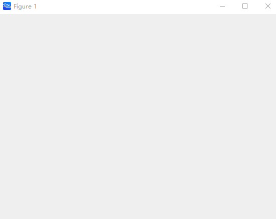

# figure

## Description

Create a figure window

## Syntax

```atks
figure()
```

## Additional Notes

- `figure()`: Creates a new figure window using default property values, and the resulting figure becomes the current figure.

## Example

::: details open **Create a figure**

```atks
    figure()
    show()
```



:::
