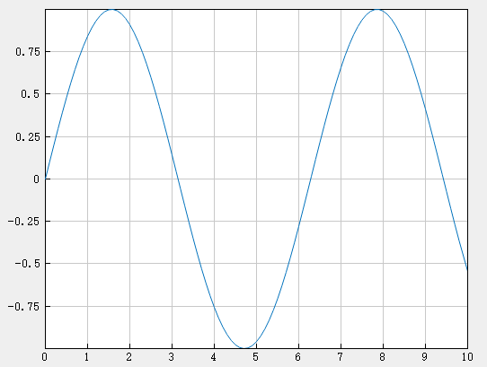

# grid

## 作用

显示或隐藏坐标区网格线

## 语法

```atks
grid("on")
grid("off")
grid(true)
grid(false)
```

## 补充说明

- `grid("on")` / `(true)` ：显示 gca 命令返回的当前坐标区或图的主网格线，主网格线从每个刻度线延伸。
- `grid("off")` / `(false)` ：删除当前坐标区或图上的所有网格线。

## 示例

::: details open **显示网格线**

```atks
    x = linspace(0, 10, 100);
    y = sin(x);
    plot(x, y)
    grid("on")
    show()
```



:::
