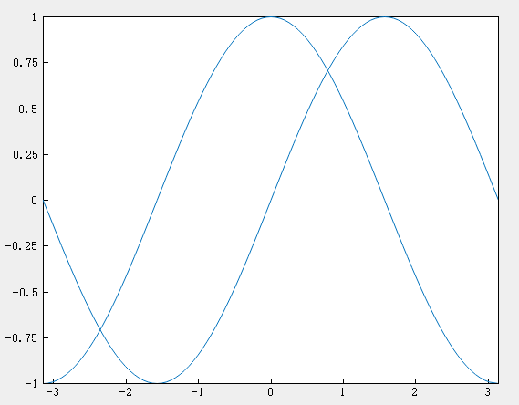
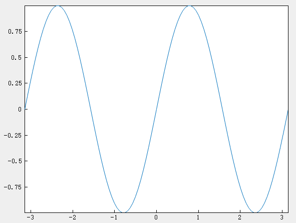

# hold

## Description

Retain the current plot when adding new plots

## Syntax

```atks
hold("on")
hold("off")
hold(true)
hold(false)
```

## Additional Notes

- `hold("on")` / `(true)`: Retains plots in the current axes, so that new plots added to the axes do not delete existing plots.
- `hold("off")` / `(false)`: Causes new plots added to the axes to clear existing plots and reset all axes properties.

## Example

::: details open **Add a line plot to existing axes**

Create a line plot. Use `hold("on")` to add a second line plot without deleting the existing one. Then reset the hold state to `"off"`.

```atks
    x = linspace(-pi, pi, 100);
    y1 = sin(x);
    plot(x, y1)

    hold("on")
    y2 = cos(x);
    plot(x, y2)
    hold("off")
```



:::

::: details open **New plot deletes the existing plot**

When the hold state is `"off"`, a new plot deletes the existing plot. The new plot starts at the beginning of the color order and line style order.

```atks
    y3 = sin(2 * x);
    plot(x, y3)
```



:::
